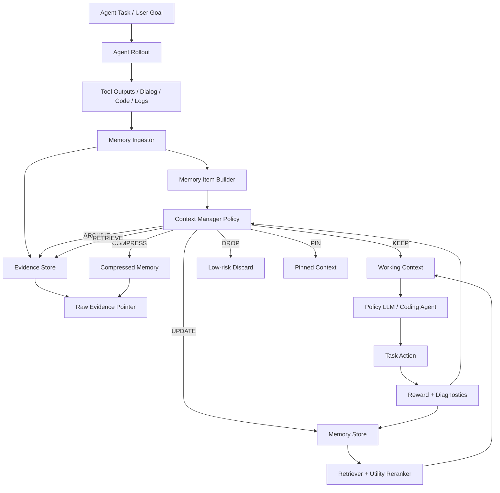

# 可迁移 RL Context Manager 研发计划

目标：先把 context manager 做成一个外部记忆操作系统，再让 RL 学操作策略；不训练大模型记忆所有内容，而是训练轻量 policy 管理证据生命周期。后期 RL 训练流程基于 [THUDM/slime](https://github.com/THUDM/slime) 部署。

日期：2026-05-16

## 1. 一句话目标

构建一个面向长链路多工具 agent 的 **Evidence-Preserving Context Manager**：

```text
长轨迹 / 工具输出 / 代码片段
-> 类型化 memory item
-> summary + metadata + raw evidence pointer
-> policy 决定 KEEP / COMPRESS / ARCHIVE / RETRIEVE / UPDATE / DROP / PIN
-> 任务结束后用 reward 更新 memory utility
-> 后期用 slime 做 SFT / GRPO 训练
```

核心不是让模型背住历史，而是让系统学会：

- 什么时候保留；
- 什么时候压缩；
- 什么时候归档；
- 什么时候回读；
- 什么时候更新旧记忆；
- 如何保留原始证据避免 summary-only memory 失真。

## 2. 设计原则

1. **先系统，后 RL**  
   第一阶段不训练大模型，先实现可用的外部记忆操作系统，积累轨迹和监督信号。

2. **压缩 working context，不删除 evidence**  
   摘要只用于导航；原始工具输出、文件片段、失败日志必须有 `raw_pointer` 可回读。

3. **训练轻量 context policy，而不是大 agent policy**  
   优先训练一个小模型或分类器来决策 memory action，目标 LLM 可以冻结。

4. **动作空间要可迁移**  
   动作使用通用 memory lifecycle 操作，而不是某个 benchmark 的私有步骤。

5. **评测必须防泄漏**  
   使用 `covered / uncovered / unseen` split，避免记忆系统只是记住训练集。

## 3. 系统总架构



## 4. Memory Item 数据结构

每个进入系统的信息块都统一成 memory item。

```json
{
  "id": "mem_000001",
  "episode_id": "ep_2026_05_16_001",
  "turn": 17,
  "type": "test_failure",
  "source": "pytest",
  "summary": "test_auth_expired_token failed because middleware returned 200 instead of 401.",
  "raw_pointer": "archives/ep_2026_05_16_001/tool_pytest_003.txt",
  "metadata": {
    "files": ["src/auth/middleware.py", "tests/test_auth.py"],
    "symbols": ["AuthMiddleware", "test_auth_expired_token"],
    "tool_call_id": "tool_003",
    "token_count": 1842,
    "has_error": true,
    "has_test_name": true,
    "has_user_constraint": false
  },
  "state": "working",
  "utility": 0.0,
  "created_at": "2026-05-16T10:00:00+08:00",
  "last_used_at": null
}
```

### 必备字段

| 字段 | 目的 |
|---|---|
| `id` | 稳定引用 |
| `type` | 类型化压缩和策略决策 |
| `summary` | 进入 working context 的短表示 |
| `raw_pointer` | 原文回读 |
| `metadata.files` | coding evidence recall |
| `metadata.symbols` | symbol recall |
| `state` | lifecycle 管理 |
| `utility` | MemRL 风格运行时价值 |

## 5. Memory 类型体系

第一版先支持 10 类。

| 类型 | 例子 | 默认处理 |
|---|---|---|
| `user_constraint` | 用户要求、禁止事项、输出格式 | `PIN` |
| `task_goal` | 当前任务目标 | `KEEP` |
| `code_slice` | 文件片段、函数、类 | `COMPRESS + ARCHIVE` |
| `repo_structure` | 目录、依赖、调用关系 | `COMPRESS` |
| `tool_output` | shell、rg、ls 输出 | `COMPRESS + ARCHIVE` |
| `test_failure` | pytest、CI、lint 失败 | `KEEP important spans + ARCHIVE` |
| `patch_diff` | 当前修改 | `KEEP / PIN` |
| `debug_attempt` | 已尝试方案及结果 | `COMPRESS + ARCHIVE` |
| `design_decision` | 架构判断、长期约束 | `UPDATE / PIN` |
| `retrieved_doc` | 外部文档、论文片段 | `COMPRESS + ARCHIVE` |

## 6. 动作空间

第一版动作空间保持小而可解释。

```text
KEEP      保留在当前 working context
COMPRESS  生成 summary + metadata，原文进入 archive
ARCHIVE   从 working context 移出，但保留 raw_pointer
RETRIEVE  从 archive 回读原文或片段
UPDATE    合并、修正或替换旧 memory
DROP      丢弃低风险内容
PIN       固定关键内容，不参与自动淘汰
```

### DROP 的限制

以下内容第一阶段禁止直接 DROP：

- 用户最新要求；
- 当前任务目标；
- 当前 patch diff；
- 失败测试名；
- stack trace 顶部和底部；
- 文件路径与行号；
- 函数、类、API 签名；
- reviewer / CI 反馈；
- 安全、权限、隐私相关约束。

这类内容最多 `ARCHIVE`，并保留 `raw_pointer`。

## 7. 检索与 Utility 更新

### 7.1 检索分数

检索不只看 embedding similarity，而是融合语义、符号、时间和 utility。

```text
score(memory, query) =
  w_semantic * semantic_similarity
+ w_symbol   * symbol_overlap
+ w_utility  * utility
+ w_recency  * recency_score
+ w_pin      * pinned_bonus
- w_stale    * stale_penalty
```

### 7.2 Utility 更新

参考 MemRL，把 memory 的使用价值作为外部状态更新，而不是更新 LLM 权重。

```text
utility <- (1 - alpha) * utility + alpha * reward_contribution
```

第一版 `reward_contribution` 可以用近似归因：

- 被检索并在最终答案/patch 中使用：正贡献；
- 被检索但无用：轻微负贡献；
- 导致错误修改或幻觉：强负贡献；
- 帮助测试通过或定位文件：强正贡献。

## 8. 奖励设计

总奖励：

```text
R = task_success
  + evidence_recall_bonus
  + symbol_recall_bonus
  + retrieve_precision_bonus
  + memory_write_quality_bonus
  - token_budget_penalty
  - latency_penalty
  - memory_pollution_penalty
  - repeated_tool_call_penalty
  - hallucinated_memory_penalty
```

### 具体指标

| 指标 | 计算方式 |
|---|---|
| `task_success` | 测试通过、答案正确、patch 被验收 |
| `evidence_recall` | 关键原文证据是否可回读 |
| `symbol_recall` | 文件名、函数名、测试名、类名是否保留 |
| `retrieve_precision` | 回读内容是否被后续行动使用 |
| `memory_write_quality` | 写入是否无重复、无矛盾、可复用 |
| `token_budget_penalty` | 超预算或 token 使用过高扣分 |
| `memory_pollution` | 写入错误事实或过期假设扣分 |
| `repeated_tool_call` | 重复无效搜索、重复失败测试扣分 |

## 9. 分阶段路线图

### Phase 0：规则版 Context Manager

目标：先跑通系统，不训练。

任务：

- 实现 memory item schema。
- 实现 raw evidence archive。
- 实现类型化 ingestor。
- 实现规则 policy。
- 实现 BM25 / embedding 检索。
- 实现 utility 字段但先不学习。

产物：

```text
context_manager/
├── memory_schema.py
├── ingestors/
├── archive_store.py
├── rule_policy.py
├── retriever.py
└── evaluator.py
```

退出标准：

- 支持至少 5 类 memory type；
- 每个 compressed item 都能回读原文；
- 能在 10 个长链路任务上记录完整 trace；
- 能导出训练样本 jsonl。
- 能导出 Hugging Face Datasets 兼容的 `DatasetDict`。

### Phase 1：数据采集与 Teacher Policy

目标：用规则版系统生成 SFT / offline RL 数据。

任务：

- 记录每一步 observation、memory item、rule action、最终 reward。
- 对失败案例人工或 LLM judge 修正动作标签。
- 生成 `context_action_sft.jsonl`。
- 生成 `context_rl_prompts.jsonl`。
- 生成 `hf_dataset/` 本地数据集目录，支持 `load_from_disk`。
- 生成可上传 Hugging Face Hub 的 `dataset_card.md`。

SFT 数据格式：

```json
{
  "prompt": [
    {
      "role": "user",
      "content": "Given task state and memory item, choose one action."
    }
  ],
  "label": "ARCHIVE",
  "metadata": {
    "item_type": "tool_output",
    "has_error": false,
    "token_count": 2200,
    "budget_pressure": 0.82
  }
}
```

退出标准：

- 至少 1k 条 action 样本；
- 每类 action 至少 50 条；
- 包含 successful 和 failed trajectories；
- 有 covered / uncovered / unseen split。
- `train / validation / test / unseen` 四个 split 可直接被 HF datasets 加载。

### Phase 2：轻量 Learned Policy

目标：先训练或拟合小策略模型，不动主 LLM。

候选实现：

- Logistic Regression / XGBoost；
- MiniLM / BERT classifier；
- Qwen2.5-0.5B / 1.5B instruction model；
- API model few-shot classifier。

输入特征：

```text
item_type
source_tool
age_turns
token_count
has_error
has_file_path
has_test_name
has_user_constraint
symbol_overlap
semantic_similarity_to_goal
last_utility
budget_pressure
was_retrieved_before
```

输出：

```text
KEEP / COMPRESS / ARCHIVE / RETRIEVE / UPDATE / DROP / PIN
```

退出标准：

- learned policy 超过 rule policy 或至少持平并降低 token；
- 在 unseen split 上不过拟合；
- 可解释错误样例被记录。

### Phase 3：Runtime Utility Learning

目标：引入 MemRL 风格外部 utility 更新。

任务：

- 每次任务结束后根据 reward 更新被用到的 memories。
- 检索时加入 utility rerank。
- 记录 utility drift 与 memory pollution。

退出标准：

- 相比纯 embedding 检索，retrieve precision 提升；
- task success 不下降；
- token 使用下降；
- utility 高的 memory 具有可解释性。

### Phase 4：slime SFT / GRPO 训练

目标：当 Phase 0-3 积累足够数据后，使用 slime 训练 context action policy。

训练对象：

优先训练轻量 context manager model，而不是完整 coding agent。

```text
输入: task state + memory item + budget + recent context summary
输出: action + optional rationale / retrieval query
```

可选模型：

- Qwen2.5-0.5B / 1.5B / 3B；
- Qwen2.5-7B 作为资源更充裕时的实验；
- API model 只用于 judge / teacher，不作为训练对象。

## 10. slime 部署设计

### 10.1 为什么选 slime

slime 是 LLM RL post-training 框架，核心由三部分组成：

- training：Megatron 负责参数更新；
- rollout：SGLang + router 生成数据、计算 reward / verifier 输出；
- data buffer：连接 prompt 初始化、自定义数据和 rollout 生成。

它支持：

- SGLang rollout；
- 自定义 rollout function；
- 自定义 reward model；
- GRPO / PPO / GSPO / REINFORCE++；
- 训练与推理资源分离；
- 多模型 SGLang serving；
- 通过 metadata 传入自定义字段。

因此适合后期把 context manager 的 action policy 接成 RL 训练流程。

### 10.2 slime 数据格式

slime 默认读取 `.jsonl`，每行一个 JSON object。我们的训练样本建议：

```json
{
  "prompt": [
    {
      "role": "system",
      "content": "You are a context manager. Choose memory actions for long-horizon agents.",
      "step_loss_mask": 0
    },
    {
      "role": "user",
      "content": "{task_state_and_memory_item_json}",
      "step_loss_mask": 1
    }
  ],
  "label": "ARCHIVE",
  "metadata": {
    "episode_id": "ep_001",
    "memory_id": "mem_034",
    "gold_evidence_ids": ["raw_003"],
    "split": "unseen",
    "budget": 16000
  }
}
```

注意：

- `metadata` 用于 custom rollout 和 custom reward。
- 多轮任务中要保留 `loss_mask`，只训练 action 输出，不训练环境文本。
- 如果采用 chat template，必须做 Render-Twice-Diff 或等价 token 对齐检查。

### 10.3 自定义 Rollout Function

slime 支持用 `--rollout-function-path` 完全替换 rollout。计划实现：

```text
slime_plugins/context_manager_rollout.py
```

职责：

1. 从 data source 读取任务与初始 memory state。
2. 调 SGLang router 让 policy model 输出 action。
3. 调本地 context manager env 执行动作。
4. 更新 working context / archive / memory store。
5. 继续多步 rollout 直到任务结束或预算耗尽。
6. 返回 `Sample(tokens, response_length, reward, status, loss_mask)`。

伪代码：

```python
def generate_rollout(args, rollout_id, data_source, evaluation=False):
    task = data_source.get_next()
    env = ContextManagerEnv(task)

    while not env.done:
        prompt = env.render_policy_prompt()
        action_text = sglang_generate(prompt)
        action = parse_action(action_text)
        env.step(action)

    sample = env.to_slime_sample()
    sample.reward = env.compute_reward()
    return sample
```

### 10.4 自定义 Reward Model

slime 支持 `--custom-rm-path`。计划实现：

```text
slime_plugins/context_manager_reward.py
```

函数签名：

```python
async def custom_rm(args, sample) -> float:
    ...
```

奖励来源：

- task success；
- evidence recall；
- symbol recall；
- token budget；
- retrieve precision；
- memory pollution；
- repeated action penalty。

### 10.5 GRPO 配置

首选 GRPO，因为不需要 critic，资源压力低。

关键参数：

```bash
--advantage-estimator grpo
--n-samples-per-prompt 4
--normalize-advantages
--eps-clip 0.2
--rollout-function-path slime_plugins.context_manager_rollout:generate_rollout
--custom-rm-path slime_plugins.context_manager_reward:custom_rm
```

训练/rollout 资源按 slime 文档配置：

```bash
--actor-num-nodes 1
--actor-num-gpus-per-node 2
--rollout-num-gpus 2
--rollout-num-gpus-per-engine 1
```

资源不足时使用 colocate：

```bash
--colocate
--sglang-mem-fraction-static 0.35
```

实际参数需根据模型大小和机器调试。

### 10.6 slime 接入目录

建议新增：

```text
research-automation/slime-context-manager/
├── data/
│   ├── sft_context_actions.jsonl
│   ├── rl_context_prompts.jsonl
│   └── eval_unseen.jsonl
├── slime_plugins/
│   ├── context_manager_rollout.py
│   ├── context_manager_reward.py
│   ├── context_manager_env.py
│   └── action_parser.py
├── scripts/
│   ├── run_sft.sh
│   ├── run_grpo.sh
│   └── eval_policy.sh
└── configs/
    ├── qwen2_5_1_5b_context_policy.sh
    └── sglang_multi_model.yaml
```

## 11. Hugging Face Datasets 推理评测流程

### 11.1 为什么要先兼容 HF Datasets

后期无论是规则版、轻量 learned policy，还是 slime-GRPO policy，都应该吃同一份数据、吐同一种预测文件。这样才能避免每换一种训练方式就重写评测。

目标是让下面几种流程都成立：

```text
本地 jsonl -> datasets.load_dataset("json")
本地 DatasetDict -> datasets.load_from_disk(...)
HF Hub dataset -> datasets.load_dataset("org/context-manager-bench")
slime jsonl -> 同源转换
预测 jsonl -> 统一 evaluator
```

### 11.2 HF Dataset Schema

建议统一成两类数据：`context_action` 和 `episode_eval`。

#### A. `context_action`：训练/评估 context policy

每条样本对应一次 memory action 决策。

```json
{
  "sample_id": "act_ep001_t017_mem034",
  "episode_id": "ep001",
  "turn": 17,
  "split": "train",
  "task_type": "test_failure_diagnosis",
  "task_goal": "Fix failing auth middleware test.",
  "budget": 16000,
  "budget_pressure": 0.82,
  "recent_context": "The agent has inspected auth middleware and tests.",
  "memory_item": {
    "id": "mem034",
    "type": "test_failure",
    "source": "pytest",
    "summary": "test_auth_expired_token failed because middleware returned 200 instead of 401.",
    "raw_pointer": "archives/ep001/tool_pytest_003.txt",
    "metadata": {
      "files": ["src/auth/middleware.py", "tests/test_auth.py"],
      "symbols": ["AuthMiddleware", "test_auth_expired_token"],
      "token_count": 1842,
      "has_error": true,
      "has_test_name": true
    }
  },
  "candidate_actions": ["KEEP", "COMPRESS", "ARCHIVE", "RETRIEVE", "UPDATE", "DROP", "PIN"],
  "gold_action": "COMPRESS",
  "gold_rationale": "Preserve failure summary in context and archive raw output for exact traceback recovery.",
  "gold_evidence_ids": ["raw_pytest_003"],
  "labels": {
    "must_preserve": ["test_auth_expired_token", "src/auth/middleware.py"],
    "forbidden_actions": ["DROP"]
  }
}
```

#### B. `episode_eval`：端到端推理评测

每条样本对应一个完整长链路任务。

```json
{
  "episode_id": "ep_eval_001",
  "split": "unseen",
  "task_type": "small_patch",
  "repo_id": "toy-auth-repo",
  "task_goal": "Fix expired-token behavior in auth middleware.",
  "initial_context": "User reports expired token returns 200.",
  "available_tools": ["read_file", "search", "run_tests", "edit_file"],
  "initial_memory": [],
  "raw_archive_manifest": [
    {
      "raw_id": "raw_issue_001",
      "path": "archives/ep_eval_001/issue.txt",
      "sha256": "..."
    }
  ],
  "gold": {
    "expected_files": ["src/auth/middleware.py"],
    "expected_tests": ["tests/test_auth.py::test_auth_expired_token"],
    "success_command": "pytest tests/test_auth.py::test_auth_expired_token"
  },
  "metadata": {
    "covered": false,
    "difficulty": "medium",
    "max_turns": 20,
    "max_context_tokens": 16000
  }
}
```

### 11.3 DatasetDict 切分

建议固定四个 split：

```text
train       用于 teacher/SFT/GRPO prompts
validation  用于调 action parser、reward、阈值
test        常规报告结果
unseen      跨任务/跨仓库/跨工具泛化
```

不要只用随机切分。coding 和 tool-use 场景建议同时保留：

```text
covered    训练中见过同类模板或同 repo
uncovered  训练没见过任务模板但见过领域
unseen     repo/tool/task family 都尽量隔离
```

### 11.4 本地目录布局

建议新增：

```text
research-automation/hf-eval/
├── data_builders/
│   ├── build_context_action_dataset.py
│   ├── build_episode_eval_dataset.py
│   └── export_to_hub.py
├── inference/
│   ├── run_context_policy.py
│   ├── run_episode_eval.py
│   └── backends.py
├── evaluators/
│   ├── action_metrics.py
│   ├── episode_metrics.py
│   └── evidence_metrics.py
├── schemas/
│   ├── context_action.schema.json
│   └── episode_eval.schema.json
└── configs/
    ├── local_json.yaml
    ├── hf_hub.yaml
    └── slime_outputs.yaml
```

### 11.5 推理命令设计

规则版 policy：

```bash
python research-automation/hf-eval/inference/run_context_policy.py \
  --dataset-path research-automation/datasets/context_actions \
  --split test \
  --policy rule \
  --output runs/rule_policy_predictions.jsonl
```

轻量模型 policy：

```bash
python research-automation/hf-eval/inference/run_context_policy.py \
  --dataset-path research-automation/datasets/context_actions \
  --split unseen \
  --policy model \
  --model-path checkpoints/context-policy-1.5b \
  --output runs/model_policy_unseen_predictions.jsonl
```

端到端 episode eval：

```bash
python research-automation/hf-eval/inference/run_episode_eval.py \
  --dataset-path research-automation/datasets/episode_eval \
  --split unseen \
  --context-policy checkpoints/context-policy-1.5b \
  --agent-backend openai \
  --output runs/episode_eval_predictions.jsonl
```

统一评测：

```bash
python research-automation/hf-eval/evaluators/episode_metrics.py \
  --predictions runs/episode_eval_predictions.jsonl \
  --dataset-path research-automation/datasets/episode_eval \
  --split unseen \
  --output runs/episode_eval_metrics.json
```

### 11.6 Prediction JSONL 格式

context action 预测：

```json
{
  "sample_id": "act_ep001_t017_mem034",
  "pred_action": "COMPRESS",
  "pred_rationale": "The item contains useful failure evidence but is too long for working context.",
  "retrieval_query": null,
  "confidence": 0.81,
  "latency_ms": 124,
  "tokens_in": 920,
  "tokens_out": 16
}
```

episode 预测：

```json
{
  "episode_id": "ep_eval_001",
  "success": true,
  "final_answer": "Patch applied and target test passes.",
  "actions": [
    {
      "turn": 1,
      "memory_id": "mem001",
      "context_action": "PIN"
    }
  ],
  "retrieved_raw_ids": ["raw_pytest_003"],
  "used_evidence_ids": ["raw_pytest_003"],
  "modified_files": ["src/auth/middleware.py"],
  "metrics": {
    "input_tokens": 10420,
    "output_tokens": 1310,
    "tool_calls": 8,
    "latency_ms": 48210
  }
}
```

### 11.7 指标计算

context action 指标：

```text
action_accuracy
macro_f1_by_action
forbidden_action_rate
must_preserve_violation_rate
drop_risk_rate
latency_ms
tokens_per_decision
```

episode 指标：

```text
task_success_rate
pass@k
compression_ratio
peak_context_tokens
total_input_tokens
evidence_recall
symbol_recall
retrieve_precision
memory_write_precision
memory_pollution_rate
repeated_tool_call_rate
latency
cost
```

### 11.8 与 slime 的关系

HF dataset 是源数据层，slime jsonl 是训练消费层。不要让二者割裂。

推荐转换链路：

```text
HF DatasetDict
-> export_slime_prompts.py
-> slime train jsonl
-> slime rollout outputs
-> convert_slime_predictions.py
-> HF-style predictions jsonl
-> unified evaluator
```

slime 样本里的 `metadata` 必须保留：

```text
sample_id
episode_id
split
task_type
memory_id
gold_evidence_ids
budget
covered/uncovered/unseen
```

这样 slime 训练结果可以无缝回到 HF evaluator 里比较。

### 11.9 上传 HF Hub 的注意事项

如果数据要公开上传：

- 不上传真实私有 repo、密钥、用户对话；
- raw evidence 可以只放 toy repo 或合成任务；
- 对真实工具输出，只保留 hash、metadata 和脱敏片段；
- dataset card 写清楚 split 逻辑、泄漏防护、评测命令；
- 给每条样本保留 `source_generation_config`，方便复现。

公开版可以只发：

```text
context_action 数据
toy episode_eval 数据
脱敏 archive manifest
评测脚本
```

私有版保留完整 raw archive。

## 12. ALFWorld / ScienceWorld / HotpotQA 适配方案

这三类数据可以适配，但形态不同：

```text
HotpotQA      静态多跳 QA 数据集，HF 原生加载最方便
ALFWorld      交互式 text-game / embodied instruction 环境，需要 rollout wrapper
ScienceWorld  交互式科学任务 text environment，需要 rollout wrapper
```

因此统一原则是：

```text
环境原生格式
-> dataset adapter
-> episode_eval DatasetDict
-> policy inference / environment rollout
-> prediction jsonl
-> unified evaluator
```

### 12.1 适配目标

所有数据集最终都要能导出两种视图：

| 视图 | 用途 | 来源 |
|---|---|---|
| `episode_eval` | 端到端推理评测 | 原始任务 / 环境 episode |
| `context_action` | 训练或评估 context manager action | 从 episode 每一步切分得到 |

这样同一套 context manager 可以在三类任务上比较：

- 长文本多跳检索；
- 长链路工具调用；
- 长轨迹环境探索；
- 记忆压缩与回读；
- 跨任务迁移。

### 12.2 HotpotQA 适配

HotpotQA 是最简单的起点。它是多跳 QA 数据集，Hugging Face 上有 `hotpotqa/hotpot_qa`，包含 question、context、answer、supporting facts 等字段。

HF 加载示例：

```python
from datasets import load_dataset

dataset = load_dataset("hotpotqa/hotpot_qa", "distractor")
```

适配为 `episode_eval`：

```json
{
  "episode_id": "hotpotqa_train_000001",
  "split": "train",
  "task_type": "multi_hop_qa",
  "repo_id": null,
  "task_goal": "Answer the multi-hop question using provided documents.",
  "initial_context": "question text",
  "available_tools": ["retrieve_doc", "read_context", "answer"],
  "initial_memory": [],
  "raw_archive_manifest": [
    {
      "raw_id": "ctx_doc_0",
      "path": "archives/hotpotqa/000001/context_0.txt",
      "sha256": "..."
    }
  ],
  "gold": {
    "answer": "gold answer",
    "supporting_facts": [["Page title", 3]]
  },
  "metadata": {
    "dataset": "hotpotqa",
    "level": "distractor",
    "max_turns": 8,
    "max_context_tokens": 16000
  }
}
```

如何构造 memory：

- 每个 paragraph / supporting document 是一个 `retrieved_doc` memory。
- supporting fact sentence 是 `gold_evidence`。
- context manager 要决定哪些段落 `KEEP / COMPRESS / ARCHIVE / RETRIEVE`。

奖励：

```text
answer_exact_match
answer_f1
supporting_fact_recall
evidence_recall
token_budget_penalty
```

适合验证：

- evidence-preserving compression；
- 多跳证据回读；
- summary-only vs pointer memory；
- utility rerank 是否优于纯 embedding。

### 12.3 ALFWorld 适配

ALFWorld 是交互式环境，不是单条静态 QA。官方仓库提供 environment API，可以通过 `get_environment` 创建环境并执行 step。它适合测长链路 tool-use / embodied planning。

适配方式：

```text
ALFWorld env
-> wrapper reset()
-> 每步 observation/action/admissible_actions/reward/done
-> context manager 管理历史 observation 和行动记忆
-> 导出 episode_eval + context_action
```

`episode_eval` 示例：

```json
{
  "episode_id": "alfworld_pick_and_place_000001",
  "split": "unseen",
  "task_type": "interactive_text_env",
  "repo_id": null,
  "task_goal": "Put a clean apple in the fridge.",
  "initial_context": "You are in the kitchen...",
  "available_tools": ["env_step", "inventory", "look", "examine"],
  "initial_memory": [],
  "raw_archive_manifest": [],
  "gold": {
    "success_reward": 1.0,
    "task_type": "pick_and_place"
  },
  "metadata": {
    "dataset": "alfworld",
    "game_file": "path_or_id",
    "max_turns": 50,
    "max_context_tokens": 16000
  }
}
```

每一步产生的 memory item：

| Env 信息 | Memory type | 默认策略 |
|---|---|---|
| 当前 observation | `tool_output` / `env_observation` | `KEEP recent + ARCHIVE` |
| admissible actions | `action_space` | `COMPRESS` |
| inventory | `state_fact` | `UPDATE` |
| failed action | `debug_attempt` | `COMPRESS + ARCHIVE` |
| achieved subgoal | `design_decision` / `state_fact` | `PIN / UPDATE` |

奖励：

```text
env_success_reward
progress_reward
subgoal_completion
repeated_action_penalty
invalid_action_penalty
context_token_penalty
state_fact_recall
```

适合验证：

- 长链路 planning 里的 memory lifecycle；
- 失败动作是否被记住，避免循环；
- external episodic memory 是否提升 unseen task；
- context manager 是否减少无效 observation 堆积。

### 12.4 ScienceWorld 适配

ScienceWorld 是交互式文本科学环境，任务涉及小学科学课程里的实验、观察、物体操作和推理。它比 ALFWorld 更强调科学状态、实验步骤和因果推理。

适配方式与 ALFWorld 相同，但 memory schema 应额外关注：

| 信息 | Memory type | 说明 |
|---|---|---|
| 实验目标 | `task_goal` | 必须 `PIN` |
| 观察结果 | `env_observation` | `KEEP recent + ARCHIVE` |
| 已知科学事实 | `state_fact` / `semantic_memory` | `UPDATE` |
| 实验步骤 | `debug_attempt` / `procedure_memory` | `COMPRESS + ARCHIVE` |
| 失败实验 | `debug_attempt` | 保留原因，避免重复 |
| 物体状态变化 | `state_fact` | 用 structured metadata 记录 |

`episode_eval` 示例：

```json
{
  "episode_id": "scienceworld_task_001_variation_03",
  "split": "test",
  "task_type": "interactive_science_env",
  "task_goal": "Determine whether the unknown substance dissolves in water.",
  "initial_context": "You are in a science lab...",
  "available_tools": ["env_step", "look", "inventory", "examine"],
  "gold": {
    "success_reward": 1.0,
    "task_name": "dissolve",
    "variation": 3
  },
  "metadata": {
    "dataset": "scienceworld",
    "max_turns": 80,
    "max_context_tokens": 16000
  }
}
```

奖励：

```text
env_score
task_success
scientific_fact_recall
procedure_reuse_bonus
invalid_action_penalty
repeated_experiment_penalty
token_budget_penalty
```

适合验证：

- procedural memory；
- 多步实验状态跟踪；
- 错误实验路径压缩；
- 科学推理中 evidence pointer 的价值。

### 12.5 三数据集统一 Adapter 接口

建议实现一个统一接口：

```python
class DatasetAdapter:
    name: str

    def load(self, split: str):
        ...

    def to_episode_eval(self, raw_item) -> dict:
        ...

    def reset_env(self, episode):
        ...

    def step_env(self, env, action: str) -> dict:
        ...

    def extract_memory_items(self, transition: dict) -> list[dict]:
        ...

    def compute_reward(self, episode, prediction) -> dict:
        ...
```

三类 adapter：

```text
HotpotQAAdapter      静态数据，无真实 env step，可模拟 retrieve/read/answer
ALFWorldAdapter      真实交互环境，需要 reset/step
ScienceWorldAdapter  真实交互环境，需要 reset/step
```

本地目录：

```text
research-automation/hf-eval/data_builders/adapters/
├── base.py
├── hotpotqa_adapter.py
├── alfworld_adapter.py
└── scienceworld_adapter.py
```

### 12.6 统一推理流程

静态 HotpotQA：

```bash
python research-automation/hf-eval/inference/run_episode_eval.py \
  --adapter hotpotqa \
  --dataset-name hotpotqa/hotpot_qa \
  --dataset-config distractor \
  --split validation \
  --context-policy rule \
  --output runs/hotpotqa_rule_predictions.jsonl
```

ALFWorld：

```bash
python research-automation/hf-eval/inference/run_episode_eval.py \
  --adapter alfworld \
  --env-config configs/alfworld/base_config.yaml \
  --split unseen \
  --context-policy checkpoints/context-policy-1.5b \
  --output runs/alfworld_policy_predictions.jsonl
```

ScienceWorld：

```bash
python research-automation/hf-eval/inference/run_episode_eval.py \
  --adapter scienceworld \
  --env-config configs/scienceworld/base_config.yaml \
  --split test \
  --context-policy checkpoints/context-policy-1.5b \
  --output runs/scienceworld_policy_predictions.jsonl
```

### 12.7 三数据集实验矩阵

| 数据集 | 首要目标 | 关键指标 | 主要风险 |
|---|---|---|---|
| HotpotQA | 多跳证据压缩与回读 | EM/F1、supporting fact recall、token cost | 过于静态，不能代表工具链 |
| ALFWorld | 长链路行动记忆 | success rate、invalid actions、repeated actions、context tokens | 环境安装和 rollout 稳定性 |
| ScienceWorld | 程序性/科学状态记忆 | score、task success、procedure recall、state fact recall | action space 长，奖励较稀疏 |

### 12.8 推荐适配顺序

```text
1. HotpotQA
   先跑通 HF dataset、证据回读、metrics。

2. ALFWorld
   再接交互式环境，验证长链路 action memory。

3. ScienceWorld
   最后接更复杂的科学实验任务，验证 procedural memory 和状态跟踪。
```

这样做的好处是：

- HotpotQA 快速验证数据/评测链路；
- ALFWorld 验证交互式 env wrapper；
- ScienceWorld 验证更复杂的长程状态管理。

## 13. Baseline 设计

### 13.1 Context 管理 baseline

| Baseline | 含义 |
|---|---|
| Full context | 不压缩，尽量塞全量 |
| Sliding window | 只保留最近 N tokens |
| Periodic summary | 每 K 步总结一次 |
| RAG memory | embedding/BM25 检索历史 |
| Headroom / CCR | 工具输出压缩 + 可回读 |
| Rule policy | 手写 context manager |
| Learned policy | 轻量训练 policy |
| Learned + utility | policy + runtime utility update |
| slime-GRPO policy | 后期 RL 训练版本 |

### 13.2 任务 baseline

| 任务 | 用途 |
|---|---|
| repo QA | 测记忆检索和 symbol recall |
| bug localization | 测文件/函数定位 |
| test failure diagnosis | 测失败日志压缩 |
| small patch task | 测实际修复 |
| multi-tool research task | 测长链路多工具 |
| airline/tool-use toy env | 测非 coding 迁移 |

## 14. 实验矩阵

### 14.1 主实验

| 方法 | Task success | Token ↓ | Evidence recall | Symbol recall | Latency | Notes |
|---|---:|---:|---:|---:|---:|---|
| Full context |  |  |  |  |  |  |
| Sliding window |  |  |  |  |  |  |
| Summary-only |  |  |  |  |  |  |
| RAG memory |  |  |  |  |  |  |
| Headroom / CCR |  |  |  |  |  |  |
| Rule policy |  |  |  |  |  |  |
| Learned policy |  |  |  |  |  |  |
| Learned + utility |  |  |  |  |  |  |
| slime-GRPO |  |  |  |  |  |  |

### 14.2 迁移实验

| 迁移类型 | 训练 | 测试 |
|---|---|---|
| 跨任务 | repo QA | bug localization / patch |
| 跨仓库 | train repos | unseen repos |
| 跨模型 | Qwen agent traces | Claude/Codex/API agent traces |
| 跨预算 | 16K | 8K / 32K |
| 跨工具 | search/read/test | git/CI/doc retrieval |

## 15. 风险与规避

| 风险 | 表现 | 规避 |
|---|---|---|
| summary 丢证据 | agent 修改错文件 | raw_pointer + retrieve-before-edit |
| memory pollution | 错误假设被长期保留 | conflict detection + utility decay |
| reward 稀疏 | GRPO 不稳定 | evidence recall / symbol recall 稠密奖励 |
| policy 过拟合 | unseen 失败 | covered/uncovered/unseen split |
| action collapse | 总是 KEEP 或总是 DROP | action entropy / dynamic sampling filter |
| retrieve 噪声 | 上下文更乱 | utility rerank + evidence gap 检测 |
| slime 接入复杂 | rollout token/loss mask 错 | 先 SFT + 单步 rollout，再多步 GRPO |
| HF schema 漂移 | 不同实验不可比 | 固定 schema version，所有预测走统一 evaluator |
| raw archive 不可公开 | 复现实验困难 | toy public archive + private full archive 双轨 |
| 交互环境不可复现 | ALFWorld/ScienceWorld 版本差异导致结果漂移 | 固定 env commit、config、seed、episode manifest |

## 16. 时间计划

### 第 1-2 周：规则系统

- Memory schema
- Archive store
- Type-specific compression
- Rule policy
- Basic retriever
- 10 条任务 trace
- HF dataset schema v0.1
- HotpotQA adapter 跑通

### 第 3-4 周：评测与数据

- Evidence recall / symbol recall evaluator
- covered / uncovered / unseen split
- 1k action labels
- baseline 跑通：full/sliding/summary/RAG/rule
- `load_dataset` / `load_from_disk` 推理评测跑通
- prediction jsonl + metrics json 固化
- ALFWorld wrapper 跑通 10 条 episode

### 第 5-6 周：轻量 policy

- 训练 action classifier
- 引入 runtime utility
- 做跨任务/跨仓库测试
- 输出第一版实验报告
- ScienceWorld wrapper 跑通 10 条 episode

### 第 7-8 周：slime SFT 接入

- 生成 slime jsonl
- HF DatasetDict -> slime jsonl 转换脚本
- 写 custom rollout skeleton
- 写 custom reward
- 单步 context action SFT
- 校验 loss_mask/token alignment
- slime 输出 -> HF prediction jsonl 转换脚本

### 第 9-12 周：slime GRPO

- 多步 rollout
- GRPO with `n_samples_per_prompt=4`
- reward ablation
- utility rerank ablation
- 写论文式报告

## 17. 最小可交付版本

最低成本也能完成的 MVP：

```text
SQLite memory store
Raw evidence archive
Rule context policy
BM25 + embedding retriever
Utility rerank
Evidence recall evaluator
HF datasets compatible eval flow
HotpotQA adapter
ALFWorld adapter skeleton
10-50 个 coding/tool-use tasks
```

MVP 成功标准：

- 相比 sliding window，task success 提升或持平；
- token 使用降低 30% 以上；
- evidence recall >= 95%；
- symbol recall >= 90%；
- 失败案例可归因。

## 18. 参考来源

- [THUDM/slime GitHub](https://github.com/THUDM/slime)
- [slime Usage Guide](https://raw.githubusercontent.com/THUDM/slime/main/docs/en/get_started/usage.md)
- [slime Quick Start](https://raw.githubusercontent.com/THUDM/slime/main/docs/en/get_started/quick_start.md)
- [slime Customization Guide](https://thudm.github.io/slime/get_started/customization.html)
- [Memory-R1](https://arxiv.org/abs/2508.19828)
- [MemRL](https://arxiv.org/abs/2601.03192)
- [Agentic Memory / AgeMem](https://arxiv.org/pdf/2601.01885)
- [AtomMem](https://arxiv.org/pdf/2601.08323)
- [Fine-Mem](https://arxiv.org/pdf/2601.08435)
- [CODEMEM](https://arxiv.org/pdf/2601.02868)
- [ALFWorld GitHub](https://github.com/alfworld/alfworld)
- [ALFWorld paper](https://arxiv.org/abs/2010.03768)
- [ScienceWorld GitHub](https://github.com/allenai/ScienceWorld)
- [ScienceWorld paper](https://arxiv.org/abs/2203.07540)
- [HotpotQA Homepage](https://hotpotqa.github.io/)
- [HotpotQA Hugging Face dataset](https://huggingface.co/datasets/hotpotqa/hotpot_qa)
