# Progressive Evidence Disclosure Slime Design

_本文档把 `Learning When to Expand: Progressive Evidence Disclosure for Long-Context Reasoning` 落成基于 slime 的工程设计。主线是 summary-first 长文本推理中的 `EXPAND / KEEP / DROP` 外部 disclosure policy，不是 agent memory、不训练主 LLM、首版不做 GRPO。_

---

## 1. 论文 Claim 到工程边界

核心研究问题：

```text
Given a summary-first view of long context, can a lightweight policy learn
when compressed summaries are insufficient and raw evidence should be disclosed?
```

工程上必须固定：

```text
main LLM
retriever / candidate span source
summary generator (fixed upstream component; not a trainable contribution)
prompt template
token budget
answer evaluator
dataset split
```

工程上只训练：

```text
disclosure policy
```

动作空间：

| Action | Rendered context | 含义 |
|---|---|---|
| `EXPAND` | `raw_text` | summary 信息不足，需要展开原文证据。 |
| `KEEP` | `summary_text` | summary 已足够支持当前推理。 |
| `DROP` | nothing | 当前 span 无关或预算不允许展示。 |

首版训练目标：

```text
L_disclosure = CE(target_action, policy_action)
```

推理时必须额外有一个确定性的 budget-aware renderer，负责把 per-span action scores 变成全局可行 prompt：

```text
policy scores over EXPAND/KEEP/DROP
-> budget-aware renderer
-> final rendered prompt under token_budget
```

不作为首版主线：

```text
GRPO
main LLM fine-tuning
long-term memory
memory write / forgetting / consolidation
teacher full raw long-context prompting
new self-distillation algorithm claim
```

## 2. 系统总览

```mermaid
flowchart LR
    accTitle: Progressive Disclosure Slime Pipeline
    accDescr: The pipeline builds cue-preserving summaries, runs disclosure rollouts, evaluates fixed-model answers, creates outcome-aware teacher targets, exports slime SFT samples, trains a lightweight policy, and evaluates held-out disclosure quality.

    D["HF datasets<br/>HotpotQA / 2Wiki / Qasper"]
    SEG["Span segmentation"]
    SUM["Cue-preserving summaries"]
    ROLL["K disclosure rollouts<br/>rule / random / HF policy"]
    REN["Budget-aware renderer<br/>EXPAND / KEEP / DROP"]
    LLM["Fixed main LLM"]
    EVAL["Answer evaluator"]
    TCH["Outcome-aware teacher review"]
    SFT["Slime SFT JSONL"]
    TRAIN["Slime SFT / local HF CE"]
    MET["Held-out metrics"]

    D --> SEG --> SUM --> ROLL --> REN --> LLM --> EVAL
    EVAL --> TCH
    SUM --> TCH
    REN --> TCH
    TCH --> SFT --> TRAIN --> MET
```



关键归因原则：

```text
same summaries
same candidate spans
same main model
same token budget
different disclosure policy
```

如果 `learned disclosure policy` 优于 `summary-only`、`rule expand` 和 `static SFT`，论文主 claim 才成立。

## 3. Target Layout

新增主线模块，不继续把新逻辑塞进 legacy `context_manager/`、`opd/` 或 `grpo_sdft/`：

```text
research-automation/slime-context-manager/
├── disclosure/
│   ├── __init__.py
│   ├── schemas.py
│   ├── summary_builder.py
│   ├── renderer.py
│   ├── budget_allocator.py
│   ├── rollout_policy.py
│   ├── teacher_review.py
│   ├── contrastive_builder.py
│   ├── slime_sft_builder.py
│   ├── slime_rollout.py
│   └── metrics.py
├── scripts/
│   ├── build_disclosure_dataset.py
│   ├── run_disclosure_rollouts.py
│   ├── build_disclosure_teacher_targets.py
│   ├── export_disclosure_slime_jsonl.py
│   ├── train_disclosure_hf_local.py
│   ├── train_disclosure_slime.py
│   ├── run_disclosure_slime_qwen3_0_6b.sh
│   └── evaluate_disclosure_policy.py
└── tests/
    ├── test_disclosure_schemas.py
    ├── test_summary_builder.py
    ├── test_renderer.py
    ├── test_budget_allocator.py
    ├── test_teacher_review.py
    ├── test_contrastive_builder.py
    ├── test_disclosure_slime_export.py
    └── test_disclosure_metrics.py
```

兼容策略：

| Legacy | 新主线 |
|---|---|
| `context_manager/` | 保留旧 rule / HF policy wrapper，逐步迁移到 `disclosure/`。 |
| `opd/` | 保留 OpenClaw-style OPD scaffold，不作为论文 identity。 |
| `grpo_sdft/` | 保留未来 RL 扩展，不进入首版实验主表。 |
| `context_actions_*.jsonl` | 新增 `disclosure_*.jsonl`，避免语义混用。 |

## 4. Data Contracts

### 4.1 Context Span

`ContextSpan` 是最小候选证据单元。它不是 memory item，也不带长期状态。

```json
{
  "task_id": "hotpotqa_0001",
  "span_id": "doc4_sent2",
  "source_id": "hotpotqa_doc4_sent2",
  "question": "What dosage was used?",
  "raw_text": "Dosage changed from 5mg to 50mg.",
  "summary_text": "Dosage changed; exact values omitted.",
  "summary_cues": ["dosage", "changed", "exact values omitted"],
  "span_type": "supporting_sentence",
  "split": "train"
}
```

`summary_text` 的要求：

```text
preserve entity cue
preserve relation cue
preserve omission signal
keep source_id traceable
```

注意：本文不研究如何训练 summary generator。summary 是固定输入表示，工程只做最小 cue audit，避免把论文重心拖回 summarization。

坏例子：

```text
Trial procedure changed.
```

好例子：

```text
Dosage changed; exact values omitted.
```

### 4.2 Disclosure Rollout

一个 task 生成 K 个 disclosure plan。K rollout 只是为了得到 outcome-aware / contrastive teacher targets，首版不做 GRPO advantage。

```json
{
  "rollout_id": "hotpotqa_0001_r02",
  "task_id": "hotpotqa_0001",
  "policy_name": "rule_expand_omission",
  "token_budget": 4096,
  "actions": [
    {"span_id": "doc1_sent1", "action": "KEEP"},
    {"span_id": "doc4_sent2", "action": "EXPAND"},
    {"span_id": "doc9_sent3", "action": "DROP"}
  ],
  "rendered_prompt": "Question: ...",
  "answer": "50mg",
  "answer_score": 1.0,
  "supporting_evidence_hit": true
}
```

### 4.3 Budget Allocation Record

per-span 分类只是 policy 输出，最终 prompt 由 budget allocator 统一裁决。这样可以处理多个 span 同时想 `EXPAND` 但预算不足的情况。

```json
{
  "rollout_id": "hotpotqa_0001_r02",
  "token_budget": 4096,
  "reserved_prompt_tokens": 420,
  "allocator": "greedy_margin_per_cost",
  "candidate_decisions": [
    {
      "span_id": "doc4_sent2",
      "policy_action": "EXPAND",
      "expand_logit": 4.2,
      "keep_logit": 1.7,
      "drop_logit": -0.4,
      "summary_tokens": 12,
      "raw_tokens": 31,
      "upgrade_cost": 19,
      "allocation_score": 0.132
    }
  ],
  "final_actions": [
    {"span_id": "doc4_sent2", "action": "EXPAND"}
  ],
  "budget_used": 3180,
  "budget_violation": false
}
```

首版支持两个 allocator：

| Allocator | 用途 |
|---|---|
| `greedy_margin_per_cost` | 默认实现，按 `EXPAND` over `KEEP` margin / upgrade cost 排序。 |
| `knapsack_analysis` | 小规模分析用，用 policy logits 做 utility、token cost 做 weight。 |

失败条件：

```text
budget_used > token_budget
final action not in EXPAND/KEEP/DROP
EXPAND selected but raw_text missing
KEEP selected but summary_text missing
```

### 4.4 Teacher Target

Teacher target 是 policy-improvement signal，不是客观 usefulness 真值。

```json
{
  "decision_id": "hotpotqa_0001_doc4_sent2_r02",
  "task_id": "hotpotqa_0001",
  "rollout_id": "hotpotqa_0001_r02",
  "span_id": "doc4_sent2",
  "source_id": "hotpotqa_doc4_sent2",
  "student_action": "KEEP",
  "target_action": "EXPAND",
  "label_source": "teacher_only",
  "quoted_summary": "Dosage changed; exact values omitted.",
  "quoted_raw": "Dosage changed from 5mg to 50mg.",
  "verifiable_reason": "The question asks exact dosage values.",
  "contrast_rollout_id": "hotpotqa_0001_r01",
  "accepted_for_training": true
}
```

进入训练的 target 必须满足：

```text
target_action in EXPAND/KEEP/DROP
quoted_summary non-empty
verifiable_reason non-empty
source_id traceable
accepted_for_training = true
```

若缺少 `quoted_raw`，允许进入诊断集；默认不进入高置信训练集，除非 `label_source = verifier_evidence` 或 `gold_support`。

### 4.5 Slime SFT Record

导出给 slime 的首版格式保持简单，训练 response action tokens。

```json
{
  "prompt": "Question: ...\nCandidate summary: Dosage changed; exact values omitted.\nSummary cues: dosage; changed; exact values omitted\nBudget left: 1220\nChoose one action: EXPAND, KEEP, DROP.",
  "response": "{\"action\":\"EXPAND\"}",
  "metadata": {
    "task_id": "hotpotqa_0001",
    "span_id": "doc4_sent2",
    "source_id": "hotpotqa_doc4_sent2",
    "label_source": "teacher_only",
    "target_action": "EXPAND",
    "summary_tokens": 12,
    "raw_tokens": 31,
    "upgrade_cost": 19,
    "token_budget": 4096
  }
}
```

`disclosure.slime_rollout` 在 slime 侧补齐：

```text
tokens
response_length
loss_mask
metadata
```

`loss_mask` 只覆盖 response JSON action，不训练 prompt。

## 5. Pipeline Phases

### Phase 0: Compatibility Audit

任务：

```text
1. 保留旧 context_actions pipeline，但 README 标记为 legacy。
2. 新增 disclosure/ 模块，不破坏旧 tests。
3. 新脚本默认读 data/disclosure/。
4. 新训练数据默认写 data/slime/disclosure_*.jsonl。
```

验收：

```bash
python -m unittest discover -s tests -v
```

### Phase 1: Summary-First Dataset

脚本：

```text
scripts/build_disclosure_dataset.py
```

典型输入：

```bash
python scripts/build_disclosure_dataset.py \
  --dataset hotpotqa/hotpot_qa \
  --config distractor \
  --split train \
  --max-rows 200
```

输出：

```text
data/disclosure/spans_train.jsonl
data/disclosure/summary_quality_train.json
```

验收：

```text
each row has raw_text and summary_text
summary_cues is non-empty
source_id can be traced back to original dataset item
cue_preservation_rate is reported as an audit metric
no training objective updates the summary generator
```

### Phase 2: Rendering And Rollouts

脚本：

```text
scripts/run_disclosure_rollouts.py
```

rollout policy：

```text
summary_only
full_raw_topk
rule_expand_omission
random_budget_perturbation
hf_policy_checkpoint
```

输出：

```text
data/disclosure/rollouts_train.jsonl
data/disclosure/budget_allocations_train.jsonl
data/disclosure/rendered_prompts_train.jsonl
data/disclosure/answers_train.jsonl
```

验收：

```text
same task has K rollout ids
each rollout has complete action map
rendered prompt obeys token_budget
main LLM is fixed across rollouts
allocator decision is reproducible from policy scores and token costs
```

### Phase 2.5: Budget-Aware Renderer

模块：

```text
disclosure/budget_allocator.py
```

输入：

```text
candidate spans
policy logits or action confidences
summary token counts
raw token counts
reserved prompt tokens
token_budget
```

输出：

```text
final_actions
budget_used
budget_violation
allocation_trace
```

默认策略：

```text
1. reserve system/task prompt tokens
2. include high-confidence KEEP summaries when possible
3. rank EXPAND upgrades by margin(EXPAND, KEEP) / upgrade_cost
4. apply upgrades while budget remains
5. DROP low-confidence or over-budget spans
```

分析策略：

```text
knapsack_analysis
```

验收：

```text
never exceeds token_budget
deterministic given same scores
greedy and knapsack traces can be compared
budget_violation_rate is reported
```

### Phase 3: Evaluation

脚本：

```text
scripts/evaluate_disclosure_policy.py
```

指标：

```text
answer_em_f1
supporting_evidence_recall
expansion_precision
expansion_recall
missed_expansion_rate
unnecessary_expansion_rate
cue_preservation_rate
token_budget_usage
budget_violation_rate
latency
teacher_tokens_per_correction
accepted_correction_rate
```

输出：

```text
runs/disclosure_eval/metrics.json
runs/disclosure_eval/analysis_report.md
runs/disclosure_eval/plots/*.svg
```

### Phase 4: Batched Teacher Review

脚本：

```text
scripts/build_disclosure_teacher_targets.py
```

teacher 输入：

```text
question
candidate summary
student action
model answer
gold/verifier outcome on train split
optional contrastive rollout difference
optional local raw_text for inspected span
```

禁止：

```text
teacher reads full raw long context
teacher writes ungrounded reflection
teacher label treated as objective truth
teacher sees held-out test gold answer
```

输出：

```text
data/disclosure/teacher_targets_train.jsonl
data/disclosure/teacher_targets_rejected_train.jsonl
data/disclosure/teacher_cost_train.json
```

teacher reviewer 类型：

| Reviewer | 用途 |
|---|---|
| `llm_teacher` | 默认自动标注，输入受 schema 限制。 |
| `human_audit` | 小样本人工核查 teacher 质量。 |
| `verifier_evidence` | 有 supporting facts / exact evidence 时生成高置信 target。 |

target validator 必须检查：

```text
target_action valid
source_id exists
quoted_summary appears in candidate summary
quoted_raw appears in raw span if provided
verifiable_reason non-empty
split is train or validation, never held-out test
```

成本日志：

```text
teacher_calls
teacher_prompt_tokens
teacher_completion_tokens
accepted_targets
rejected_targets
cost_per_accepted_target
```

### Phase 5: Slime SFT Export

脚本：

```text
scripts/export_disclosure_slime_jsonl.py
```

输出：

```text
data/slime/disclosure_train.jsonl
data/slime/disclosure_validation.jsonl
```

验收：

```text
response parses as JSON
action in EXPAND/KEEP/DROP
metadata includes task_id/span_id/source_id/label_source
metadata includes token_budget/summary_tokens/raw_tokens/upgrade_cost
local compatibility Sample can be built
```

### Phase 6: Local HF Training

脚本：

```text
scripts/train_disclosure_hf_local.py
```

命令：

```bash
python scripts/train_disclosure_hf_local.py \
  --model-path /public/huggingface-models/Qwen/Qwen3-0.6B \
  --train-jsonl data/slime/disclosure_train.jsonl \
  --eval-jsonl data/slime/disclosure_validation.jsonl \
  --output-dir checkpoints/disclosure_policy_qwen3_0_6b
```

验收：

```text
finite loss
action accuracy above random baseline
eval before/after checkpoint runs
```

### Phase 7: Slime Integration

新增：

```text
disclosure/slime_rollout.py
scripts/train_disclosure_slime.py
scripts/run_disclosure_slime_qwen3_0_6b.sh
```

slime hook：

```text
--rollout-function-path disclosure.slime_rollout.generate_rollout_disclosure
--loss-type sft_loss
```

远端命令：

```bash
cd /root/CM-OPD/research-automation/slime-context-manager
CONDA_PREFIX=/root/miniconda3/envs/slime bash scripts/run_disclosure_slime_qwen3_0_6b.sh
```

验收：

```text
slime rollout batch has samples
tokens / response_length / loss_mask aligned
metadata can reconstruct budget allocation
training starts on 3090
no NaN loss
eval before/after checkpoint runs
```

## 6. Main Experiments

首版数据集：

```text
HotpotQA
2WikiMultiHopQA
Qasper
```

Killer experiment 1：

```text
same summaries
same candidate spans
same main model
same token budget
compare: summary-only vs rule expand vs static SFT vs learned expand
```

Killer experiment 2：

```text
same selected spans
same summaries
same token budget
compare: KEEP summaries vs EXPAND raw evidence vs learned mixed rendering
```

主结果表：

| Method | HotpotQA EM/F1 | 2Wiki EM/F1 | Qasper F1 | Evidence recall | Token budget |
|---|---:|---:|---:|---:|---:|
| Summary-only | TBD | TBD | TBD | TBD | TBD |
| Full raw / top-k raw | TBD | TBD | TBD | TBD | TBD |
| BM25 / frozen dense top-k | TBD | TBD | TBD | TBD | TBD |
| LLMLingua / LongLLMLingua | TBD | TBD | TBD | TBD | TBD |
| ReSP-style control | TBD | TBD | TBD | TBD | TBD |
| SentGraph-style structure | TBD | TBD | TBD | TBD | TBD |
| Graph/decomposition RAG | TBD | TBD | TBD | TBD | TBD |
| Question-centric RAG | TBD | TBD | TBD | TBD | TBD |
| Rule expand | TBD | TBD | TBD | TBD | TBD |
| Static expansion SFT | TBD | TBD | TBD | TBD | TBD |
| Learned disclosure policy | TBD | TBD | TBD | TBD | TBD |
| Oracle supporting-fact expansion | TBD | TBD | TBD | TBD | TBD |

所有数字必须来自真实评测，文档和论文中保持 `TBD` 直到测量完成。

预算扫描：

| Budget | Required outputs |
|---:|---|
| 1k | answer metrics, evidence metrics, token usage, latency |
| 2k | answer metrics, evidence metrics, token usage, latency |
| 4k | answer metrics, evidence metrics, token usage, latency |
| 8k | answer metrics, evidence metrics, token usage, latency |

迁移测试：

```text
train HotpotQA -> test 2Wiki / Qasper
train 2Wiki -> test HotpotQA
train Qasper -> test HotpotQA
```

baseline 归一化原则：

```text
same retriever when possible
same candidate spans when possible
same token budget
report latency and token cost
if a baseline changes retrieval/decomposition, mark it as pipeline-level comparison
```

## 7. Slime Implementation Notes

首版不要依赖通用 `python -m slime` 入口存在。设计上分两层：

| Layer | Purpose |
|---|---|
| Local HF CE | 单卡快速验证数据、loss mask、checkpoint、action accuracy。 |
| Slime SFT | 生产训练路径，复用 slime rollout/sample/loss 机制。 |

`disclosure.slime_rollout.generate_rollout_disclosure` 负责把 JSONL record 转成 slime-compatible sample：

```text
prompt + response
-> tokenizer
-> tokens
-> response_length
-> loss_mask over response tokens
-> metadata passthrough
```

失败条件：

```text
response_length <= 0
loss_mask sum != response_length
target_action not in action set
missing task_id/span_id/source_id
missing budget metadata
non-finite loss
```

## 8. Test Plan

Unit tests：

```text
test_disclosure_schemas.py
test_summary_builder.py
test_renderer.py
test_budget_allocator.py
test_teacher_review.py
test_contrastive_builder.py
test_disclosure_slime_export.py
test_disclosure_metrics.py
```

关键断言：

```text
EXPAND / KEEP / DROP parser works
renderer maps actions deterministically
budget allocator never exceeds budget
greedy allocator deterministic
knapsack allocator matches brute-force result on small cases
summary_cues are present
teacher target has quoted_summary and verifiable_reason
teacher target cannot use held-out test gold answer
teacher cost logger records accepted/rejected counts
unaccepted teacher target is excluded from train JSONL
slime JSONL masks only response action tokens
K rollout diff finds changed actions
metrics compute expansion precision/recall
metrics compute budget sweep and cost fields
```

Integration tests：

```text
build 5 HotpotQA rows
generate cue-preserving summaries
run summary-only and rule-expand rollouts
evaluate fixed answers or mocked answers
build teacher targets from mocked outcomes
export slime JSONL
construct slime-compatible samples
train local HF CE for a few steps
evaluate before/after action accuracy
run budget sweep with mocked scores
```

## 9. Build Order

第一批：数据与渲染闭环。

```text
disclosure/schemas.py
disclosure/summary_builder.py
disclosure/renderer.py
disclosure/budget_allocator.py
disclosure/slime_sft_builder.py
scripts/build_disclosure_dataset.py
scripts/export_disclosure_slime_jsonl.py
tests/test_disclosure_schemas.py
tests/test_budget_allocator.py
tests/test_disclosure_slime_export.py
```

第二批：rollout、teacher target、对比样本。

```text
disclosure/rollout_policy.py
disclosure/teacher_review.py
disclosure/contrastive_builder.py
scripts/run_disclosure_rollouts.py
scripts/build_disclosure_teacher_targets.py
tests/test_teacher_review.py
tests/test_contrastive_builder.py
```

第三批：训练、slime、评测。

```text
disclosure/slime_rollout.py
disclosure/metrics.py
scripts/train_disclosure_hf_local.py
scripts/train_disclosure_slime.py
scripts/evaluate_disclosure_policy.py
scripts/run_disclosure_slime_qwen3_0_6b.sh
tests/test_disclosure_metrics.py
```

## 10. Future Extensions

这些是后续扩展，不进入首版主线：

| Extension | Condition |
|---|---|
| GRPO | 当 CE/SFT learned policy 已经强于 rule expand，再引入 K rollout reward。 |
| Token-level OPD | 当 action CE 不足以学习复杂 JSON/tool-call action，再接 teacher log-probs。 |
| Preference learning | 当 pairwise budget/rendering trade-off 比三分类 CE 更重要时再引入。 |
| Learned summarizer | 非本文重点；只有当 fixed summary cue audit 成为瓶颈时再考虑。 |
| Main LLM memory tool policy | 单独写另一条论文线，不能混入本实验归因。 |
| ALFWorld / ScienceWorld | 等 QA/document reasoning 主线跑通后再迁移到多轮环境。 |
| Coding agent traces | 作为 CodeHER-style specialization，而不是 Progressive Disclosure 首版必需项。 |

## 11. Terminology Lock

| 不再使用为主线 | 使用 |
|---|---|
| memory item | context span |
| visibility | disclosure |
| raw / summary / hidden | EXPAND / KEEP / DROP |
| useful information | expansion-worthy evidence |
| self-distillation | outcome-aware policy refinement |
| memory manager | disclosure policy |
