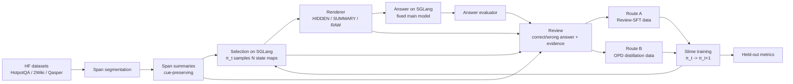

# Progressive Evidence Disclosure Slime Roadmap

_本文档把 `Learning When to Expand: Progressive Evidence Disclosure for Long-Context Reasoning` 落成基于 Slime + SGLang 的工程路线。主线是 summary-first 长文本推理中的外部 `selection policy`：原始数据先切成 span 并生成 summary，policy 在 SGLang 上多次为同一样本选择每个 span 的状态，renderer 拼接上下文，SGLang 主模型执行 answer，之后 policy 走两条训练路线：Review-SFT 和 OPD-style on-policy distillation。最终训练与正式评测都必须在 Slime 框架内运行；本地 HF 只作为可选 schema/debug 路径。_

---

## 1. 论文 Claim 到工程边界

核心研究问题：

```text
Given a summary-first view of long context, can a lightweight policy learn
when compressed summaries are insufficient and raw evidence should be disclosed?
```

工程上必须固定：

```text
main LLM
retriever / candidate span source
summary generator (fixed upstream component; not a trainable contribution)
prompt template
token budget
answer evaluator
dataset split
```

工程上只训练：

```text
selection policy
```

本文档后续统一使用工程术语：

| 工程术语 | 作用 | 对应论文动作 |
|---|---|---|
| `summary` | 对每个原始 span 生成 cue-preserving summary，作为 selection 的低分辨率输入。 | summary-first context |
| `selection` | policy model 为每个 span 选择状态：`HIDDEN / SUMMARY / RAW`。 | `DROP / KEEP / EXPAND` |
| `answer` | main model 读取 selection 渲染后的上下文并输出最终答案。 | fixed downstream reasoning |
| `review` | policy/reviewer 基于正确答案、错误答案和 selection 结果产生训练信号。 | outcome-aware refinement |
| `Review-SFT` | reviewer 直接输出新的 span 状态选择，训练 policy 做纯 SFT。 | corrected selection imitation |
| `OPD distillation` | 在原始 selection prompt/result 后追加正确答案和选择理由，构造 on-policy distillation 样本。 | OPD-style hindsight distillation |

状态空间在工程里写成：

| Span state | 渲染内容 | 论文动作 |
|---|---|---|
| `RAW` | 展示原始 span 文本 | `EXPAND` |
| `SUMMARY` | 只展示 summary | `KEEP` |
| `HIDDEN` | 不放入 answer prompt | `DROP` |

训练闭环不是一次性离线 SFT，而是迭代式 self-training：

```text
raw dataset -> span summary
-> selection policy π_t samples span states multiple times per task on SGLang
-> renderer builds answer prompt under fixed budget
-> fixed main model answers on SGLang
-> evaluator produces outcome
-> reviewer builds Review-SFT and OPD distillation data
-> Slime trains π_{t+1}
```

角色边界：

| Component | 是否训练 | 推理时可见信息 | 训练时额外权限 |
|---|---|---|---|
| `selection policy π` | 是 | question、summary view、budget state、previous selection trace | 无，训练样本来自自身 selection rollout |
| `fixed main LLM M` | 否 | rendered answer prompt | 无，只负责 answer |
| `self-reviewer T` | 否或弱更新 | 不参与部署 | train split outcome、gold answer/evidence、失败答案、局部 raw span |
| `validator` | 否 | teacher target schema | source grounding、leakage check、confidence gating |
| `replay buffer` | 否 | 历史 accepted targets | 防止迭代漂移和遗忘 |

论文动作空间与工程状态映射：

| Action | Rendered context | 含义 |
|---|---|---|
| `EXPAND` | `raw_text` | summary 信息不足，需要展开原文证据。 |
| `KEEP` | `summary_text` | summary 已足够支持当前推理。 |
| `DROP` | nothing | 当前 span 无关或预算不允许展示。 |

首版训练目标：

```text
L_selection = CE(target_state | selection_state_onpolicy)
            + λ_replay CE(target_state | selection_state_replay)
            + λ_opd L_OPD
            + λ_kl KL(π_{t+1} || π_ref)
```

其中 `selection_state_onpolicy` 必须来自当前 policy `π_t` 的真实 selection，而不是纯规则或 oracle 状态。`π_ref` 可以是初始 policy、上一轮 policy 或 EMA policy。首版不做 policy gradient；answer outcome 只用于生成 corrected state target 和 hindsight rationale。

推理时必须额外有一个确定性的 budget-aware renderer，负责把 per-span action scores 变成全局可行 prompt：

```text
policy scores over RAW/SUMMARY/HIDDEN
-> budget-aware renderer
-> final rendered prompt under token_budget
```

不作为首版主线：

```text
GRPO
main LLM fine-tuning
long-term memory
memory write / forgetting / consolidation
teacher full raw long-context prompting
new self-distillation algorithm claim
```

## 2. 系统总览



关键归因原则：

```text
same summaries
same candidate spans
same main model
same token budget
different selection policy
```

如果 `learned selection policy` 优于 `summary-only`、`rule selection` 和 `static SFT`，论文主 claim 才成立。

这里的一个样本多次 selection 有两种用途，不能混淆：

| 用途 | 是否必须 | 作用 |
|---|---|---|
| on-policy distillation | 必须至少 1 条来自当前 `π_t` 的 selection | 让 policy 在自己真实会遇到的状态上学习 corrected state map。 |
| contrastive review | 可选，建议 N>1 | 同题多个 selection 产生正确/错误 answer 差异，辅助 reviewer 判断哪个 span 应该 `RAW / SUMMARY / HIDDEN`。 |

因此不做 GRPO 时也可以运行：`N=1 current-policy selection -> answer -> review -> CE/OPD distillation`。多条 selection 只是提升 review 质量，不是训练算法的必要条件。

两条训练路线：

| Route | 输入 | 训练目标 | Slime 形式 |
|---|---|---|---|
| Route A: `Review-SFT` | correct answer、wrong answer、原始 span summaries、原始 selection、evaluator outcome | reviewer 直接输出新的 span state map，policy 学 `prompt -> corrected state map`。 | Slime SFT，response 只 mask corrected selection JSON。 |
| Route B: `OPD distillation` | 原始 selection prompt、policy 原始 selection 结果、answer 结果、正确答案、为什么这么选的 hindsight rationale | 在 on-policy 状态上蒸馏 reviewer/hindsight teacher 的分布或 corrected response。 | 参考 Slime examples 的 OPD 训练，优先 CE fallback，后续接 teacher log-probs / top-k loss。 |

最终交付口径：

```text
data preparation can run as normal scripts
selection rollout must be callable by Slime rollout function
answer rollout must call SGLang main-model endpoint
Review-SFT training must run through Slime SFT
OPD distillation must run through Slime OPD-style custom rollout/loss path
held-out evaluation must run through the same Slime selection -> answer pipeline
```

## 3. Target Layout

新增主线模块，不继续把新逻辑塞进 legacy `context_manager/`、`opd/` 或 `grpo_sdft/`：

```text
research-automation/slime-context-manager/
├── disclosure/
│   ├── __init__.py
│   ├── schemas.py
│   ├── summary_builder.py
│   ├── renderer.py
│   ├── budget_allocator.py
│   ├── selection_prompt.py
│   ├── selection_rollout.py
│   ├── answer_rollout.py
│   ├── rollout_policy.py
│   ├── teacher_review.py
│   ├── self_review.py
│   ├── on_policy_buffer.py
│   ├── review_sft_builder.py
│   ├── opd_distillation_builder.py
│   ├── slime_opd_loss.py
│   ├── contrastive_builder.py
│   ├── slime_sft_builder.py
│   ├── slime_rollout.py
│   └── metrics.py
├── scripts/
│   ├── build_disclosure_dataset.py
│   ├── run_selection_rollouts.py
│   ├── run_answer_rollouts.py
│   ├── build_review_sft_targets.py
│   ├── build_onpolicy_distillation_targets.py
│   ├── export_selection_review_sft_jsonl.py
│   ├── export_selection_opd_jsonl.py
│   ├── train_selection_review_sft_slime.py
│   ├── train_selection_opd_slime.py
│   ├── run_selection_answer_review_slime.sh
│   └── evaluate_disclosure_policy.py
└── tests/
    ├── test_disclosure_schemas.py
    ├── test_summary_builder.py
    ├── test_renderer.py
    ├── test_budget_allocator.py
    ├── test_selection_prompt.py
    ├── test_selection_answer_contract.py
    ├── test_teacher_review.py
    ├── test_self_review.py
    ├── test_on_policy_buffer.py
    ├── test_review_sft_builder.py
    ├── test_opd_distillation_builder.py
    ├── test_contrastive_builder.py
    ├── test_disclosure_slime_export.py
    └── test_disclosure_metrics.py
```

兼容策略：

| Legacy | 新主线 |
|---|---|
| `context_manager/` | 保留旧 rule / HF policy wrapper，逐步迁移到 `disclosure/`。 |
| `opd/` | 保留 OpenClaw-style OPD scaffold，不作为论文 identity。 |
| `grpo_sdft/` | 保留未来 RL 扩展，不进入首版实验主表。 |
| `context_actions_*.jsonl` | 新增 `disclosure_*.jsonl`，避免语义混用。 |

## 4. Data Contracts

### 4.1 Context Span

`ContextSpan` 是最小候选证据单元。它不是 memory item，也不带长期状态。

```json
{
  "task_id": "hotpotqa_0001",
  "span_id": "doc4_sent2",
  "source_id": "hotpotqa_doc4_sent2",
  "question": "What dosage was used?",
  "raw_text": "Dosage changed from 5mg to 50mg.",
  "summary_text": "Dosage changed; exact values omitted.",
  "summary_cues": ["dosage", "changed", "exact values omitted"],
  "span_type": "supporting_sentence",
  "split": "train"
}
```

`summary_text` 的要求：

```text
preserve entity cue
preserve relation cue
preserve omission signal
keep source_id traceable
```

注意：本文不研究如何训练 summary generator。summary 是固定输入表示，工程只做最小 cue audit，避免把论文重心拖回 summarization。

坏例子：

```text
Trial procedure changed.
```

好例子：

```text
Dosage changed; exact values omitted.
```

### 4.2 Selection Rollout

一个 task 由 SGLang 上的 policy model 生成 N 个 selection。每个 selection 是一个 span state map：`HIDDEN / SUMMARY / RAW`。首版不做 GRPO advantage，N 次采样主要用于产生 on-policy 训练状态和 correct/wrong answer 对比。

```json
{
  "selection_id": "hotpotqa_0001_sel02",
  "task_id": "hotpotqa_0001",
  "policy_checkpoint": "checkpoints/selection_policy_iter02",
  "policy_backend": "sglang",
  "sample_index": 2,
  "token_budget": 4096,
  "selection_prompt": "Question: ...\nSpan summaries: ...\nReturn span states.",
  "span_states": [
    {"span_id": "doc1_sent1", "state": "SUMMARY"},
    {"span_id": "doc4_sent2", "state": "RAW"},
    {"span_id": "doc9_sent3", "state": "HIDDEN"}
  ],
  "selection_text": "{\"doc1_sent1\":\"SUMMARY\",\"doc4_sent2\":\"RAW\",\"doc9_sent3\":\"HIDDEN\"}",
  "policy_logprobs": [-0.12, -0.37, -0.08]
}
```

状态映射：

```text
RAW     -> render raw_text
SUMMARY -> render summary_text
HIDDEN  -> omit span
```

### 4.3 Answer Rollout

selection 经过 renderer 拼接成 answer prompt，再交给 SGLang 上的主模型推理。主模型固定，不参与训练。

```json
{
  "answer_id": "hotpotqa_0001_sel02_ans",
  "task_id": "hotpotqa_0001",
  "selection_id": "hotpotqa_0001_sel02",
  "main_model": "Qwen3-0.6B-or-larger",
  "main_backend": "sglang",
  "rendered_prompt": "Question: ...\nContext: ...",
  "rendered_source_ids": ["doc1_sent1", "doc4_sent2"],
  "answer_text": "50mg",
  "answer_score": 1.0,
  "supporting_evidence_recall": 1.0,
  "token_budget": 4096,
  "budget_used": 3180
}
```

### 4.4 Budget Allocation Record

per-span state 只是 policy 输出，最终 prompt 由 budget allocator 统一裁决。这样可以处理多个 span 同时想 `RAW` 但预算不足的情况。

```json
{
  "selection_id": "hotpotqa_0001_sel02",
  "token_budget": 4096,
  "reserved_prompt_tokens": 420,
  "allocator": "greedy_margin_per_cost",
  "candidate_decisions": [
    {
      "span_id": "doc4_sent2",
      "policy_state": "RAW",
      "raw_logit": 4.2,
      "summary_logit": 1.7,
      "hidden_logit": -0.4,
      "summary_tokens": 12,
      "raw_tokens": 31,
      "upgrade_cost": 19,
      "allocation_score": 0.132
    }
  ],
  "final_actions": [
    {"span_id": "doc4_sent2", "state": "RAW"}
  ],
  "budget_used": 3180,
  "budget_violation": false
}
```

首版支持两个 allocator：

| Allocator | 用途 |
|---|---|
| `greedy_margin_per_cost` | 默认实现，按 `RAW` over `SUMMARY` margin / upgrade cost 排序。 |
| `knapsack_analysis` | 小规模分析用，用 policy logits 做 utility、token cost 做 weight。 |

失败条件：

```text
budget_used > token_budget
final state not in RAW/SUMMARY/HIDDEN
RAW selected but raw_text missing
SUMMARY selected but summary_text missing
```

### 4.5 Review-SFT Target

Review-SFT target 是第一条训练路线。reviewer 读取正确答案、错误答案、原始 selection 和 evidence outcome，直接输出新的 span state map。这个 target 是 policy-improvement signal，不是客观 usefulness 真值。

```json
{
  "decision_id": "hotpotqa_0001_doc4_sent2_r02",
  "task_id": "hotpotqa_0001",
  "selection_id": "hotpotqa_0001_sel02",
  "answer_id": "hotpotqa_0001_sel02_ans",
  "span_id": "doc4_sent2",
  "source_id": "hotpotqa_doc4_sent2",
  "student_state": "SUMMARY",
  "target_state": "RAW",
  "label_source": "review_sft",
  "quoted_summary": "Dosage changed; exact values omitted.",
  "quoted_raw": "Dosage changed from 5mg to 50mg.",
  "wrong_answer": "5mg",
  "correct_answer": "50mg",
  "verifiable_reason": "The answer requires the omitted exact value, so this span should be RAW instead of SUMMARY.",
  "contrast_selection_id": "hotpotqa_0001_sel01",
  "accepted_for_training": true
}
```

进入训练的 target 必须满足：

```text
target_state in RAW/SUMMARY/HIDDEN
quoted_summary non-empty
verifiable_reason non-empty
source_id traceable
accepted_for_training = true
```

若缺少 `quoted_raw`，允许进入诊断集；默认不进入高置信训练集，除非 `label_source = verifier_evidence` 或 `gold_support`。

### 4.6 Slime Review-SFT Record

导出给 Slime 的 Review-SFT 格式保持简单，训练 response selection JSON tokens。

```json
{
  "prompt": "Question: ...\nCandidate summary: Dosage changed; exact values omitted.\nWrong answer: 5mg\nCorrect answer: 50mg\nChoose one state: RAW, SUMMARY, HIDDEN.",
  "response": "{\"state\":\"RAW\"}",
  "metadata": {
    "task_id": "hotpotqa_0001",
    "selection_id": "hotpotqa_0001_sel02",
    "answer_id": "hotpotqa_0001_sel02_ans",
    "span_id": "doc4_sent2",
    "source_id": "hotpotqa_doc4_sent2",
    "label_source": "review_sft",
    "target_state": "RAW",
    "summary_tokens": 12,
    "raw_tokens": 31,
    "upgrade_cost": 19,
    "token_budget": 4096
  }
}
```

`disclosure.slime_rollout` 在 slime 侧补齐：

```text
tokens
response_length
loss_mask
metadata
```

`loss_mask` 只覆盖 response JSON state，不训练 prompt。

### 4.7 OPD-Style On-Policy Distillation Record

OPD-style distillation 是第二条训练路线。它不只是 reviewer 给一个离线标签，而是把当前 policy 真实生成的 selection prompt、selection 结果、answer outcome、正确答案和“为什么这么选”的 hindsight rationale 组成样本，参考 Slime examples 里的 OPD 训练方式做 on-policy 蒸馏。

```json
{
  "opd_sample_id": "hotpotqa_0001_sel02_opd",
  "task_id": "hotpotqa_0001",
  "selection_id": "hotpotqa_0001_sel02",
  "answer_id": "hotpotqa_0001_sel02_ans",
  "policy_checkpoint": "checkpoints/selection_policy_iter02",
  "student_selection_prompt": "Question: ...\nSpan summaries: ...\nReturn span states.",
  "student_selection_text": "{\"doc1_sent1\":\"SUMMARY\",\"doc4_sent2\":\"SUMMARY\"}",
  "hindsight_suffix": "The model answered 5mg, but the correct answer is 50mg. The summary said exact values were omitted, so doc4_sent2 should be RAW.",
  "teacher_prompt": "Question: ...\nSpan summaries: ...\nStudent selection: ...\nAnswer outcome: wrong...\nRationale: ...\nReturn corrected span states.",
  "teacher_selection_text": "{\"doc1_sent1\":\"SUMMARY\",\"doc4_sent2\":\"RAW\"}",
  "teacher_logprobs": null,
  "distill_mode": "ce_fallback",
  "accepted_for_distillation": true
}
```

首版实现两级：

| Mode | 训练方式 | Slime 接入 |
|---|---|---|
| `ce_fallback` | 用 `teacher_selection_text` 作为 response 做 SFT-style CE。 | 复用 Slime SFT loss，先跑通。 |
| `opd_logprob` | 在 hindsight teacher prompt 下计算 teacher log-probs / top-k，然后蒸馏到原始 selection prompt。 | 参考 Slime OPD examples 接 custom loss。 |

### 4.8 On-Policy Episode Record

`OnPolicyEpisodeRecord` 保存当前 policy 的真实 disclosure 行为、主模型答案和 evaluator outcome。它是 self-training 的核心数据，不是离线 oracle label。

```json
{
  "iteration": 2,
  "policy_checkpoint": "checkpoints/disclosure_policy_iter02",
  "task_id": "hotpotqa_train_0001",
  "selection_id": "hotpotqa_train_0001_pi02_s00",
  "policy_name": "current_policy",
  "token_budget": 4096,
  "actions": [
    {
      "span_id": "doc4_sent2",
      "source_id": "hotpotqa_doc4_sent2",
      "student_state": "SUMMARY",
      "student_state_logprob": -0.31,
      "summary_tokens": 12,
      "raw_tokens": 31,
      "budget_left_before": 1220
    }
  ],
  "rendered_prompt_id": "prompt_hotpotqa_train_0001_pi02_r00",
  "main_model_answer": "5mg",
  "outcome": {
    "answer_em": 0.0,
    "answer_f1": 0.0,
    "supporting_evidence_recall": 0.5
  }
}
```

关键要求：

```text
iteration and policy_checkpoint are mandatory
student_state must be produced by the current policy checkpoint
main_model_answer comes from fixed main LLM
held-out test records never include gold answer in review fields
```

### 4.9 Self-Review Target

`SelfReviewTarget` 是带 outcome 的 reviewer 对当前 policy state 的修正。它不是客观 useful evidence 真值，而是用于改进 `π_t` 的 distillation target。

```json
{
  "iteration": 2,
  "decision_id": "hotpotqa_train_0001_doc4_sent2_pi02",
  "task_id": "hotpotqa_train_0001",
  "selection_id": "hotpotqa_train_0001_pi02_s00",
  "span_id": "doc4_sent2",
  "source_id": "hotpotqa_doc4_sent2",
  "student_state": "SUMMARY",
  "target_state": "RAW",
  "reviewer_mode": "self_snapshot",
  "review_context": {
    "summary_view": "Dosage changed; exact values omitted.",
    "student_answer": "5mg",
    "outcome": "incorrect",
    "gold_answer": "50mg",
    "local_raw_inspected": true
  },
  "quoted_summary": "Dosage changed; exact values omitted.",
  "quoted_raw": "Dosage changed from 5mg to 50mg.",
  "verifiable_reason": "The summary signals omitted exact values, and the wrong answer used the old value.",
  "confidence": 0.86,
  "accepted_for_distillation": true
}
```

`reviewer_mode` 首版支持：

| Mode | 含义 |
|---|---|
| `self_snapshot` | 用当前 policy checkpoint 的 frozen copy 加 review prompt 生成 correction。 |
| `ema_snapshot` | 用 EMA policy 做 reviewer，减少单轮噪声。 |
| `strong_teacher` | 用 7B/14B/API reviewer 做上界或低资源 bootstrap。 |
| `verifier_rule` | 有 supporting facts 时由规则直接产生高置信 correction。 |

进入 on-policy distillation 的 target 必须满足：

```text
accepted_for_distillation = true
confidence >= threshold
source_id traceable
quoted_summary appears in summary_text
quoted_raw appears in raw_text if local_raw_inspected = true
review uses train/validation gold only, never held-out test gold
```

### 4.10 Policy Iteration Manifest

每轮 self-training 都要写 manifest，保证可复现和可回滚：

```json
{
  "iteration": 2,
  "student_policy_in": "checkpoints/disclosure_policy_iter02",
  "student_policy_out": "checkpoints/disclosure_policy_iter03",
  "reviewer_mode": "self_snapshot",
  "train_split": "hotpotqa_train",
  "num_onpolicy_episodes": 2000,
  "num_accepted_targets": 6140,
  "num_rejected_targets": 930,
  "replay_ratio": 0.25,
  "kl_reference": "checkpoints/disclosure_policy_iter02",
  "heldout_eval_file": "runs/disclosure_eval/iter03_hotpotqa_dev.json"
}
```

### 4.11 HotpotQA Selection-Answer-Review Example

针对 HotpotQA，一条训练样本的完整数据流是：

```text
1. Dataset row:
   question + context documents + supporting_facts + answer

2. Span builder:
   each document sentence -> ContextSpan(raw_text, summary_text, source_id)

3. Selection on SGLang by current policy π_t:
   input = question + span summary + budget state
   output = RAW / SUMMARY / HIDDEN for each span
   repeat N times for the same task to get multiple selection candidates

4. Budget-aware renderer:
   span states -> answer prompt under fixed token budget

5. Answer on SGLang by fixed main LLM:
   rendered prompt -> predicted answer

6. Evaluator:
   predicted answer vs gold answer
   rendered source_ids vs supporting_facts
   -> answer score + evidence recall

7. Review:
   sees summary view, student selection, wrong/correct answer, gold answer on train split,
   optional local raw span, and optional contrastive rollout
   -> corrected span states with grounded reason

8. Validator:
   filters ungrounded / low-confidence / leakage-risk corrections

9A. Route A Review-SFT export:
   prompt = question + summaries + wrong/correct answer + outcome
   response = corrected span state map
   loss_mask = response state JSON only

9B. Route B OPD export:
   prompt = original selection prompt + original policy selection
   hindsight suffix = correct answer + why this selection should change
   response/logprobs = corrected selection or hindsight teacher distribution

10. Slime train π_{t+1}:
   Review-SFT CE and/or OPD-style on-policy distillation
```

关键点：主模型只跑 answer 推理；policy model 先跑 selection，训练后再进入下一轮 selection。reviewer 只在训练阶段看到 outcome，不参与测试部署。

## 5. Pipeline Phases

### Phase 0: Compatibility Audit

任务：

```text
1. 保留旧 context_actions pipeline，但 README 标记为 legacy。
2. 新增 disclosure/ 模块，不破坏旧 tests。
3. 新脚本默认读 data/disclosure/。
4. 新训练数据默认写 data/slime/disclosure_*.jsonl。
```

验收：

```bash
python -m unittest discover -s tests -v
```

### Phase 1: Summary-First Dataset

脚本：

```text
scripts/build_disclosure_dataset.py
```

典型输入：

```bash
python scripts/build_disclosure_dataset.py \
  --dataset hotpotqa/hotpot_qa \
  --config distractor \
  --split train \
  --max-rows 200
```

输出：

```text
data/disclosure/spans_train.jsonl
data/disclosure/summary_quality_train.json
```

验收：

```text
each row has raw_text and summary_text
summary_cues is non-empty
source_id can be traced back to original dataset item
cue_preservation_rate is reported as an audit metric
no training objective updates the summary generator
```

### Phase 2: Selection Rollout On SGLang

脚本：

```text
scripts/run_selection_rollouts.py
```

输入：

```text
data/disclosure/spans_train.jsonl
policy checkpoint or SGLang policy endpoint
num_selection_samples_per_task = N
token_budget
selection temperature / top_p
```

输出：

```text
data/disclosure/selections_train.jsonl
```

验收：

```text
same task has N selection ids
each selection has complete span state map
state in RAW/SUMMARY/HIDDEN
selection prompt and policy response are saved for OPD
policy backend is SGLang in official runs
rule/random policies are only bootstrap baselines
```

### Phase 2.5: Budget-Aware Renderer

模块：

```text
disclosure/budget_allocator.py
```

输入：

```text
candidate spans
policy logits or action confidences
summary token counts
raw token counts
reserved prompt tokens
token_budget
```

输出：

```text
final_states
budget_used
budget_violation
allocation_trace
```

默认策略：

```text
1. reserve system/task prompt tokens
2. include high-confidence SUMMARY spans when possible
3. rank RAW upgrades by margin(RAW, SUMMARY) / upgrade_cost
4. apply upgrades while budget remains
5. keep low-confidence or over-budget spans HIDDEN
```

分析策略：

```text
knapsack_analysis
```

验收：

```text
never exceeds token_budget
deterministic given same scores
greedy and knapsack traces can be compared
budget_violation_rate is reported
```

### Phase 3: Answer Rollout On SGLang

脚本：

```text
scripts/run_answer_rollouts.py
```

输入：

```text
data/disclosure/selections_train.jsonl
data/disclosure/spans_train.jsonl
fixed main-model SGLang endpoint
answer prompt template
token_budget
```

输出：

```text
data/disclosure/budget_allocations_train.jsonl
data/disclosure/rendered_answer_prompts_train.jsonl
data/disclosure/answers_train.jsonl
data/disclosure/eval_train.jsonl
```

验收：

```text
rendered prompt obeys token_budget
main model is fixed across all selections
answer record links task_id and selection_id
answer score and evidence recall are computed
correct and wrong selections can be grouped by task_id
```

### Phase 4: Review And Two Training Data Routes

脚本：

```text
scripts/build_review_sft_targets.py
scripts/build_onpolicy_distillation_targets.py
```

review 输入：

```text
question
span summaries
student selection generated by π_t
rendered answer prompt
wrong answer / correct answer
answer score and evidence recall
optional contrastive correct selection for the same task
optional local raw_text for inspected span
```

禁止：

```text
reviewer reads full raw long context
reviewer writes ungrounded reflection
reviewer label treated as objective truth
reviewer sees held-out test gold answer
reviewer corrects actions that were not produced by current π_t unless marked as replay/bootstrap
```

输出：

```text
data/disclosure/review_sft_targets_train.jsonl
data/disclosure/onpolicy_targets_iterXX_train.jsonl
data/disclosure/review_targets_rejected_train.jsonl
data/disclosure/review_cost_train.json
data/disclosure/policy_iteration_iterXX.json
```

reviewer 类型：

| Reviewer | 用途 |
|---|---|
| `self_snapshot` | 默认 self-training reviewer，使用当前 policy 的 frozen copy 加 review prompt。 |
| `ema_snapshot` | 更稳定的 self-reviewer，减少单轮噪声。 |
| `llm_teacher` / `strong_teacher` | 自动标注上界或低资源 bootstrap，输入受 schema 限制。 |
| `human_audit` | 小样本人工核查 teacher 质量。 |
| `verifier_evidence` | 有 supporting facts / exact evidence 时生成高置信 target。 |

target validator 必须检查：

```text
target_state valid
source_id exists
quoted_summary appears in candidate summary
quoted_raw appears in raw span if provided
verifiable_reason non-empty
split is train or validation, never held-out test
student selection source is current π_t, unless replay/bootstrap flag is set
confidence >= threshold for self-review labels
```

成本日志：

```text
teacher_calls
teacher_prompt_tokens
teacher_completion_tokens
accepted_targets
rejected_targets
cost_per_accepted_target
```

Route A: Review-SFT

```text
reviewer sees correct/wrong answer and original selection
-> outputs corrected span state map
-> Slime SFT trains selection prompt -> corrected state map
```

Route B: OPD-style on-policy distillation

```text
original selection prompt
+ original policy selection result
+ answer result
+ correct answer
+ rationale: why these spans should be RAW/SUMMARY/HIDDEN
-> hindsight teacher / policy-review mode
-> CE fallback or teacher-logprob OPD distillation
```

### Phase 4.5: Selection Self-Training Loop

最小闭环：

```text
initialize π_0 from local model or rule-SFT checkpoint
for iteration t in 0..T-1:
  run selection with π_t on SGLang
  run answer with fixed main model on SGLang
  evaluate answers and evidence recall
  build Review-SFT targets
  build OPD distillation targets
  filter targets with validator
  train π_{t+1} inside Slime
  evaluate π_{t+1} by Slime selection -> SGLang answer on held-out dev
```

训练目标：

```text
L_route_A = CE(corrected_state_map | selection_prompt)
L_route_B = CE_or_OPD(teacher_selection | original_selection_prompt, hindsight)
L_total   = L_route_A + λ_opd L_route_B + λ_replay L_replay + λ_kl KL(π_{t+1} || π_ref)
```

其中：

| Term | 作用 |
|---|---|
| `L_route_A` | reviewer 直接给 corrected state map，做纯 SFT。 |
| `L_route_B` | 基于原始 selection prompt/result 加 hindsight 的 OPD-style on-policy distillation。 |
| `L_replay` | 混入 bootstrap / 高置信历史样本，防止 self-training 漂移。 |
| `L_kl` | 约束 `π_{t+1}` 不要突然偏离上一轮或初始 reference。 |

这一步叫 selection self-training。它不需要 group advantage，也不直接最大化 reward；reward/outcome 的作用是帮助 reviewer 产生 state-level 修正和 hindsight rationale。后续接 GRPO 时，selection/answer/eval 的 records 可以复用。

验收：

```text
each training record has policy_iteration and policy_checkpoint
accepted target must point to an on-policy selection_id
held-out eval never includes gold answer in reviewer input
iter t+1 state accuracy and downstream answer metrics are reported
replay ratio and KL reference are written to manifest
```

### Phase 5: Slime Data Export

脚本：

```text
scripts/export_selection_review_sft_jsonl.py
scripts/export_selection_opd_jsonl.py
```

输出：

```text
data/slime/selection_review_sft_iterXX_train.jsonl
data/slime/selection_opd_iterXX_train.jsonl
data/slime/selection_validation.jsonl
```

验收：

```text
response parses as JSON
state in RAW/SUMMARY/HIDDEN
metadata includes task_id/span_id/source_id/label_source
metadata includes token_budget/summary_tokens/raw_tokens/upgrade_cost
metadata includes policy_iteration/policy_checkpoint/selection_id/answer_id for on-policy records
local compatibility Sample can be built
```

### Phase 6: Slime Training

脚本：

```text
scripts/train_selection_review_sft_slime.py
scripts/train_selection_opd_slime.py
```

Review-SFT 命令：

```bash
python scripts/train_selection_review_sft_slime.py \
  --model-path /public/huggingface-models/Qwen/Qwen3-0.6B \
  --train-jsonl data/slime/selection_review_sft_iter00_train.jsonl \
  --eval-jsonl data/slime/selection_validation.jsonl \
  --output-dir checkpoints/selection_policy_review_sft_iter01
```

OPD-style distillation 命令：

```bash
python scripts/train_selection_opd_slime.py \
  --model-path checkpoints/selection_policy_review_sft_iter01 \
  --train-jsonl data/slime/selection_opd_iter01_train.jsonl \
  --replay-jsonl data/slime/selection_replay.jsonl \
  --eval-jsonl data/slime/selection_validation.jsonl \
  --kl-reference checkpoints/selection_policy_review_sft_iter01 \
  --output-dir checkpoints/selection_policy_opd_iter02
```

验收：

```text
finite loss
state accuracy above random baseline
eval before/after checkpoint runs
on-policy validation improves or failure analysis is generated
official training uses Slime; local HF is debug only
```

### Phase 7: Slime Runtime Integration

新增：

```text
disclosure/selection_rollout.py
disclosure/answer_rollout.py
disclosure/slime_rollout.py
disclosure/slime_opd_loss.py
scripts/run_selection_answer_review_slime.sh
```

slime hook：

```text
--rollout-function-path disclosure.selection_rollout.generate_selection_rollout
--answer-function-path disclosure.answer_rollout.generate_answer
--loss-type sft_loss
```

OPD distillation 接 Slime examples 的 OPD 风格扩展：

```text
--rollout-function-path disclosure.selection_rollout.generate_selection_rollout
--custom-loss-function-path disclosure.slime_opd_loss.compute_selection_opd_loss
--train-data data/slime/selection_opd_iterXX_train.jsonl
--eval-data data/slime/selection_validation.jsonl
```

远端命令：

```bash
cd /root/CM-OPD/research-automation/slime-context-manager
CONDA_PREFIX=/root/miniconda3/envs/slime bash scripts/run_selection_answer_review_slime.sh
```

验收：

```text
Slime selection rollout batch has samples
SGLang answer endpoint returns answer records
tokens / response_length / loss_mask aligned
metadata can reconstruct budget allocation
training starts on 3090
no NaN loss
eval before/after checkpoint runs
```

## 6. Main Experiments

首版数据集：

```text
HotpotQA
2WikiMultiHopQA
Qasper
```

Killer experiment 1：

```text
same summaries
same candidate spans
same main model
same token budget
compare: summary-only vs rule selection vs Review-SFT vs OPD-distilled selection
```

Killer experiment 2：

```text
same selected spans
same summaries
same token budget
compare: SUMMARY-only rendering vs RAW rendering vs learned mixed selection
```

主结果表：

| Method | HotpotQA EM/F1 | 2Wiki EM/F1 | Qasper F1 | Evidence recall | Token budget |
|---|---:|---:|---:|---:|---:|
| Summary-only | TBD | TBD | TBD | TBD | TBD |
| Full raw / top-k raw | TBD | TBD | TBD | TBD | TBD |
| BM25 / frozen dense top-k | TBD | TBD | TBD | TBD | TBD |
| LLMLingua / LongLLMLingua | TBD | TBD | TBD | TBD | TBD |
| ReSP-style control | TBD | TBD | TBD | TBD | TBD |
| SentGraph-style structure | TBD | TBD | TBD | TBD | TBD |
| Graph/decomposition RAG | TBD | TBD | TBD | TBD | TBD |
| Question-centric RAG | TBD | TBD | TBD | TBD | TBD |
| Rule selection | TBD | TBD | TBD | TBD | TBD |
| Review-SFT selection policy | TBD | TBD | TBD | TBD | TBD |
| OPD-distilled selection policy | TBD | TBD | TBD | TBD | TBD |
| Oracle supporting-fact expansion | TBD | TBD | TBD | TBD | TBD |

所有数字必须来自真实评测，文档和论文中保持 `TBD` 直到测量完成。

预算扫描：

| Budget | Required outputs |
|---:|---|
| 1k | answer metrics, evidence metrics, token usage, latency |
| 2k | answer metrics, evidence metrics, token usage, latency |
| 4k | answer metrics, evidence metrics, token usage, latency |
| 8k | answer metrics, evidence metrics, token usage, latency |

迁移测试：

```text
train HotpotQA -> test 2Wiki / Qasper
train 2Wiki -> test HotpotQA
train Qasper -> test HotpotQA
```

自训练迭代曲线：

| Iteration | Training route | Accepted targets | Answer EM/F1 | Evidence recall | Missed RAW | Token budget |
|---:|---|---:|---:|---:|---:|---:|
| 0 | bootstrap | TBD | TBD | TBD | TBD | TBD |
| 1 | Review-SFT | TBD | TBD | TBD | TBD | TBD |
| 2 | OPD fallback | TBD | TBD | TBD | TBD | TBD |
| 3 | OPD logprob | TBD | TBD | TBD | TBD | TBD |

必须报告：

```text
accepted_target_rate
reviewer_token_cost
policy_drift_from_reference
train-to-heldout gap
failure cases where self-review worsens expansion
```

baseline 归一化原则：

```text
same retriever when possible
same candidate spans when possible
same token budget
report latency and token cost
if a baseline changes retrieval/decomposition, mark it as pipeline-level comparison
```

## 7. Slime Implementation Notes

最终开发都以 Slime 为准。本地脚本只负责数据准备、schema 校验和小样本 debug，正式 selection rollout、answer rollout、Review-SFT、OPD distillation 和 held-out evaluation 都必须能通过 Slime 入口运行。

Slime 内部模块分工：

| Module | Purpose |
|---|---|
| `selection_rollout.py` | 调 SGLang policy endpoint，为每个样本生成 N 次 selection。 |
| `answer_rollout.py` | 调 SGLang main-model endpoint，对渲染后的 prompt 生成 answer。 |
| `review_sft_builder.py` | 把 correct/wrong answer review 转成 Review-SFT 样本。 |
| `opd_distillation_builder.py` | 把原始 selection prompt/result + hindsight suffix 转成 OPD 样本。 |
| `slime_sft_builder.py` | 构建 Slime SFT sample，mask response state JSON。 |
| `slime_opd_loss.py` | 参考 Slime examples OPD 路径，支持 teacher logprobs / top-k distillation。 |

`disclosure.slime_rollout` 负责把 Review-SFT / OPD JSONL record 转成 slime-compatible sample：

```text
prompt + response
-> tokenizer
-> tokens
-> response_length
-> loss_mask over response tokens
-> metadata passthrough
```

OPD-style record 需要额外携带：

```text
student_selection_prompt
student_selection_text
hindsight_suffix
teacher_selection_text
teacher_logprobs optional
teacher_topk_log_probs optional
teacher_topk_indices optional
```

失败条件：

```text
response_length <= 0
loss_mask sum != response_length
target_state not in RAW/SUMMARY/HIDDEN
missing task_id/span_id/source_id
missing budget metadata
missing selection_id or answer_id
non-finite loss
```

## 8. Test Plan

Unit tests：

```text
test_disclosure_schemas.py
test_summary_builder.py
test_renderer.py
test_budget_allocator.py
test_selection_prompt.py
test_selection_answer_contract.py
test_teacher_review.py
test_self_review.py
test_on_policy_buffer.py
test_review_sft_builder.py
test_opd_distillation_builder.py
test_contrastive_builder.py
test_disclosure_slime_export.py
test_disclosure_metrics.py
```

关键断言：

```text
RAW / SUMMARY / HIDDEN parser works
renderer maps span states deterministically
budget allocator never exceeds budget
greedy allocator deterministic
knapsack allocator matches brute-force result on small cases
summary_cues are present
Review-SFT target has quoted_summary and verifiable_reason
review cannot use held-out test gold answer
review cost logger records accepted/rejected counts
unaccepted teacher target is excluded from train JSONL
on-policy target must reference current policy_checkpoint
policy iteration manifest records input/output checkpoint
replay buffer mixes historical samples without overwriting on-policy metadata
low-confidence self-review is rejected
Slime JSONL masks only response state tokens
N selection diff finds changed states
OPD sample preserves original selection prompt and hindsight suffix
metrics compute expansion precision/recall
metrics compute budget sweep and cost fields
```

Integration tests：

```text
build 5 HotpotQA rows
generate cue-preserving summaries
run N SGLang-backed or mocked selection rollouts
render answer prompts
evaluate fixed answers or mocked answers
build Review-SFT targets from correct/wrong answers
build OPD targets from original selection prompt/result plus hindsight suffix
export Slime Review-SFT and OPD JSONL
construct slime-compatible samples
train one Slime Review-SFT iteration
train one Slime OPD fallback iteration
evaluate before/after state accuracy and answer metrics
run budget sweep with mocked scores
```

## 9. Build Order

第一批：数据、summary、selection prompt、渲染闭环。

```text
disclosure/schemas.py
disclosure/summary_builder.py
disclosure/selection_prompt.py
disclosure/renderer.py
disclosure/budget_allocator.py
disclosure/slime_sft_builder.py
scripts/build_disclosure_dataset.py
scripts/export_selection_review_sft_jsonl.py
tests/test_disclosure_schemas.py
tests/test_selection_prompt.py
tests/test_budget_allocator.py
tests/test_disclosure_slime_export.py
```

第二批：selection、answer、review 数据生产。

```text
disclosure/selection_rollout.py
disclosure/answer_rollout.py
disclosure/rollout_policy.py
disclosure/teacher_review.py
disclosure/self_review.py
disclosure/on_policy_buffer.py
disclosure/review_sft_builder.py
disclosure/opd_distillation_builder.py
disclosure/contrastive_builder.py
scripts/run_selection_rollouts.py
scripts/run_answer_rollouts.py
scripts/build_review_sft_targets.py
scripts/build_onpolicy_distillation_targets.py
scripts/run_selection_answer_review_slime.sh
tests/test_selection_answer_contract.py
tests/test_teacher_review.py
tests/test_self_review.py
tests/test_on_policy_buffer.py
tests/test_review_sft_builder.py
tests/test_opd_distillation_builder.py
tests/test_contrastive_builder.py
```

第三批：Slime Review-SFT / OPD 训练、评测。

```text
disclosure/slime_rollout.py
disclosure/slime_opd_loss.py
disclosure/metrics.py
scripts/train_selection_review_sft_slime.py
scripts/train_selection_opd_slime.py
scripts/evaluate_disclosure_policy.py
scripts/run_selection_answer_review_slime.sh
tests/test_disclosure_metrics.py
```

## 10. Future Extensions

这些是后续扩展，不进入首版主线：

| Extension | Condition |
|---|---|
| GRPO | 当 Review-SFT / OPD selection policy 已经强于 rule selection，再引入 K selection reward 和 group advantage。 |
| Token-level OPD | 当 action CE 不足以学习复杂 JSON/tool-call action，再接 teacher log-probs。 |
| Preference learning | 当 pairwise budget/rendering trade-off 比三分类 CE 更重要时再引入。 |
| Learned summarizer | 非本文重点；只有当 fixed summary cue audit 成为瓶颈时再考虑。 |
| Main LLM memory tool policy | 单独写另一条论文线，不能混入本实验归因。 |
| ALFWorld / ScienceWorld | 等 QA/document reasoning 主线跑通后再迁移到多轮环境。 |
| Coding agent traces | 作为 CodeHER-style specialization，而不是 Progressive Disclosure 首版必需项。 |

## 11. Terminology Lock

| 不再使用为主线 | 使用 |
|---|---|
| memory item | context span |
| visibility | disclosure |
| EXPAND / KEEP / DROP in engineering code | RAW / SUMMARY / HIDDEN span states |
| useful information | expansion-worthy evidence |
| self-distillation as paper identity | on-policy distillation as training mechanism |
| memory manager | selection policy |
