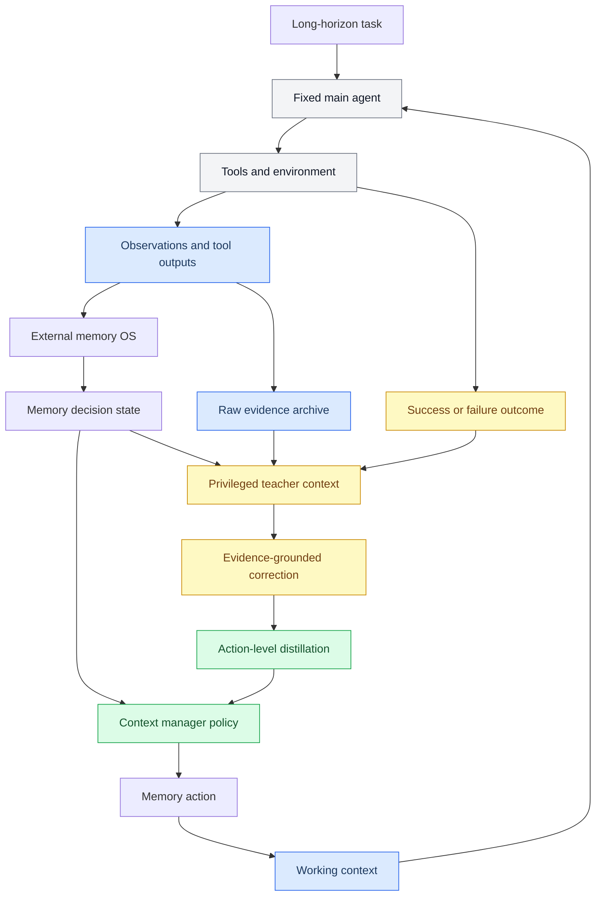

# FASD-Mem 外部上下文管理器论文蓝图

_版本 A：不更新主 agent 参数，只学习外部 context manager / memory policy。日期：2026-05-16。_

---

## 1. 不要混淆

| 维度 | 版本 A：外部上下文管理器 | 版本 B：主模型 memory-tool policy |
|---|---|---|
| 训练谁 | 外部 `context manager` / 轻量 `memory policy` | 主 agent backbone |
| 推理时谁做 memory action | 外部 policy | 主 agent 自己调用 memory tools |
| 主 claim | 只替换记忆管理策略也能提升长链路表现 | self-distillation 能教会主 agent 更好地使用 memory tools |
| 最强 baseline | RAG / rule policy / action SFT | vanilla SFT / ReAct SFT / tool-call SFT |
| 归因难度 | 低，因为主 agent 固定 | 高，因为主 agent 行为整体改变 |
| 资源需求 | 低，可用 classifier 或 0.5B-1.5B policy | 中高，通常需要 7B/14B 级 agent 微调 |

本文档只描述版本 A。它的实验必须固定主 agent、工具、环境、retriever 和 token budget，唯一被替换的是上下文管理器。

## 2. 论文定位

推荐标题是 `FASD-Mem: Failure- and Success-Aware Self-Distillation for Transferable Agent Memory Policies`。这篇论文的核心问题是：长链路 agent 是否需要昂贵的端到端强化学习才能改善记忆行为，还是可以先把上下文管理抽象成一个较小、可验证、可迁移的外部策略学习问题。

本文把 agent memory 建模为 evidence lifecycle control。主 agent 负责推理、调用任务工具和生成最终答案；外部 context manager 负责决定哪些历史信息进入当前 prompt，哪些被压缩，哪些进入 archive，哪些需要回读。这个设计的关键是，压缩不等于删除：每个摘要都必须保留 `raw_pointer`，从而让 agent 在需要精确信息时可以回到原始证据。

论文不把 GRPO 作为主线，也不把端到端 agent policy training 作为主线。最小闭环是：收集当前 context manager 产生的成功/失败轨迹，用 teacher 对 memory action 做 evidence-grounded correction，然后训练一个轻量 policy 学会 `state -> memory action`。

## 3. 一句话贡献

`FASD-Mem` 将长链路 agent 的记忆管理从端到端 RL 问题转化为外部 evidence lifecycle policy learning：成功轨迹提供 demonstration，失败轨迹提供 rich feedback，raw evidence pointer 提供可验证 grounding，轻量 context manager 学会在受限 token budget 下执行 `KEEP`、`COMPRESS`、`ARCHIVE`、`RETRIEVE`、`UPDATE`、`DROP` 和 `PIN`。

## 4. Abstract 草稿

Long-horizon language agents often fail because they lose, distort, or fail to retrieve evidence observed many turns earlier. Existing context management strategies such as sliding windows, periodic summaries, and retrieval-augmented memory either discard early evidence, compress away exact details, or retrieve information without understanding the current task phase. We introduce `FASD-Mem`, a failure- and success-aware self-distillation framework for learning transferable external memory policies. Instead of updating the main agent, `FASD-Mem` trains a lightweight context manager over evidence lifecycle actions including `KEEP`, `COMPRESS`, `ARCHIVE`, `RETRIEVE`, `UPDATE`, `DROP`, and `PIN`. Successful trajectories identify memory decisions that later proved useful, while failed trajectories provide rich feedback about missing evidence, repeated actions, and summary distortion. A privileged teacher observes trajectory outcomes, diagnostics, and raw evidence pointers to correct the current policy's memory decisions; a student context manager is then trained on these corrected actions. Under fixed-backbone and fixed-budget evaluations, this framework is designed to improve evidence recall, reduce token usage, and increase task success over sliding-window, summary-only, RAG, rule-based, and action-SFT baselines. The central claim is that many long-horizon memory failures can be addressed by learning an external, evidence-grounded context policy before expensive reinforcement learning is needed.

实验结果完成前，abstract 中所有效果表述都应保持为“is designed to / we evaluate whether”，不要提前写具体提升数字。

## 5. Research Questions

| 编号 | 问题 | 实验回答方式 |
|---|---|---|
| RQ1 | 在固定主 agent 和固定 token budget 下，学习型外部 context manager 是否优于 sliding window、summary-only、RAG 和 rule policy？ | 主实验 |
| RQ2 | success/failure-aware self-distillation 是否优于普通 action SFT 和 offline distillation？ | 训练方式对比 |
| RQ3 | raw evidence pointer 是否能降低 summary distortion 和 memory pollution？ | `w/o raw pointer` 消融 |
| RQ4 | 学到的 memory action policy 是否能跨任务、跨预算、跨环境迁移？ | transfer 与 budget stress test |

主实验要回答的最小命题是：在主 agent 不变的条件下，提升是否来自 memory manager，而不是来自更强模型、更多上下文或更多工具。

## 6. 核心贡献

### 6.1 Evidence lifecycle control

论文把上下文管理器输出定义为有限动作空间，而不是自由文本摘要器：

```text
KEEP      保留在 working context
COMPRESS  生成短表示，同时保留 raw pointer
ARCHIVE   移出 working context，但保持可回读
RETRIEVE  从 archive 回读原文或片段
UPDATE    合并、修正或替换旧 memory
DROP      丢弃低风险信息
PIN       固定关键约束、目标或证据
```

这个动作空间是任务无关的。HotpotQA 的 supporting facts、ALFWorld 的环境状态、ScienceWorld 的实验观察、coding agent 的测试失败日志都可以被映射到同一套 lifecycle 操作。

### 6.2 Evidence-grounded self-distillation

成功轨迹和失败轨迹都不直接变成普通 SFT 标签。当前 policy 必须先在自己的状态分布上提出 action，然后 teacher 才基于额外信息修正它。每条 correction 必须包含：

```text
turn_id
memory_id
raw_evidence_id
student_action
teacher_action
verifiable_reason
```

这个约束让方法区别于泛泛的 reflection。teacher 不是简单说“应该记住更多”，而是指出某个 memory decision 为什么导致证据缺失，以及哪条原始证据支持修正。

### 6.3 Fixed-backbone evaluation protocol

本文最重要的实验协议是固定所有 agent 能力来源，只替换 context manager：

```text
same main agent
same system prompt
same tools
same retriever
same token budget
same benchmark split
different context manager
```

这个协议让结果归因更干净。如果 `FASD-Mem` 超过强非 RL baseline，就可以说提升来自记忆动作策略，而不是来自主模型能力。

## 7. 方法总览



部署时 teacher 不存在。部署系统只包含固定主 agent、外部 memory OS 和训练好的 context manager policy。

## 8. 形式化定义

在 episode 的第 `t` 步，主 agent 看到 working context `C_t` 并调用任务工具。外部 memory OS 维护 memory store `M_t`。每个 memory item 定义为：

```json
{
  "id": "mem_034",
  "type": "test_failure",
  "summary": "The target auth test failed because the middleware returned 200 instead of 401.",
  "raw_pointer": "archives/ep001/tool_pytest_003.txt",
  "metadata": {
    "files": ["src/auth/middleware.py", "tests/test_auth.py"],
    "symbols": ["AuthMiddleware", "test_auth_expired_token"],
    "token_count": 1842,
    "has_error": true
  },
  "state": "working",
  "utility": 0.0
}
```

Context manager 的输入状态为：

```text
s_t = task_goal, recent_context_summary, memory_item, memory_inventory, budget_state, retrieval_state
```

输出动作是：

```text
a_t in {KEEP, COMPRESS, ARCHIVE, RETRIEVE, UPDATE, DROP, PIN}
```

Student policy 是：

```text
pi_theta(a_t | s_t)
```

Teacher 在训练数据生成阶段看到额外信息：

```text
z_t = final_outcome, success_trace, failure_feedback, raw_evidence, trajectory_diagnostics
```

Teacher correction 是：

```text
a_T = Teacher(s_t, z_t)
```

低资源训练目标使用 action-level cross entropy：

```text
L_action = - log pi_theta(a_T | s_t)
```

如果可以访问 teacher logits，则可扩展为 KL distillation：

```text
L_KL = KL(pi_T(. | s_t, z_t) || pi_theta(. | s_t))
```

首版建议使用 `L_action`，因为它实现简单、成本低，也便于用 classifier 或小模型训练。

## 9. 轨迹如何生成训练数据

### 9.1 成功轨迹

成功轨迹提供的是“哪些 memory decision 后来被证明有用”，而不是一个应当逐步复制的专家脚本。例如在 HotpotQA 中，某个段落在第 3 步被保留，并在第 8 步回答时作为 supporting fact 使用；在 ALFWorld 中，某个失败动作被压缩保存，后续避免了重复尝试。

训练数据生成流程为：

```text
successful episode
-> extract memory decision states
-> current policy proposes actions at those states
-> teacher sees successful trajectory and raw evidence
-> teacher corrects or confirms actions
-> keep only corrections with valid raw evidence ids
```

### 9.2 失败轨迹

失败轨迹提供 rich feedback。失败类型可以包括 missing evidence、over-compression、bad retrieval、repeated action、invalid action、state contradiction 和 memory pollution。teacher 的任务是把最终失败追溯到具体 memory decision，而不是生成泛泛总结。

示例 correction：

```json
{
  "turn_id": 4,
  "memory_id": "mem_017",
  "student_action": "ARCHIVE",
  "teacher_action": "KEEP",
  "raw_evidence_id": "doc_4_sent_2",
  "verifiable_reason": "The sentence contains the second supporting fact required by the question."
}
```

这条样本的训练输入是第 4 步 context manager 当时可见的状态，标签是 `KEEP`。

## 10. 数据格式

每条训练样本对应一次 memory action 决策。

```json
{
  "sample_id": "act_ep001_t004_mem017",
  "episode_id": "ep001",
  "split": "train",
  "policy_version": "rule_v0",
  "state": {
    "task_goal": "Answer the multi-hop question using provided documents.",
    "recent_context": "The agent has read one distractor paragraph and one likely supporting paragraph.",
    "budget": 8000,
    "budget_used": 6120
  },
  "memory_item": {
    "id": "mem017",
    "type": "retrieved_doc",
    "summary": "Paragraph about Person B's education.",
    "raw_pointer": "archives/ep001/doc_4.txt",
    "metadata": {
      "token_count": 912,
      "entities": ["Person B", "University C"]
    }
  },
  "student_action": "ARCHIVE",
  "teacher_action": "KEEP",
  "correction": {
    "raw_evidence_id": "doc_4_sent_2",
    "verifiable_reason": "This sentence provides a supporting fact used by the gold reasoning chain."
  },
  "metadata": {
    "task_family": "hotpotqa",
    "covered": false,
    "budget_pressure": 0.765
  }
}
```

所有公开实验都必须保留 `sample_id`、`episode_id`、`split`、`memory_id`、`raw_evidence_id` 和 `task_family`，以便和 HF Datasets evaluator 对齐。

## 11. 实验设计

### 11.1 主实验

主实验建议覆盖三类任务：

| 任务族 | 作用 | 首要指标 |
|---|---|---|
| HotpotQA | 多跳证据保留与回读 | EM/F1、supporting fact recall、evidence recall |
| ALFWorld | 长链路交互和避免重复动作 | success rate、invalid action rate、repeated action rate |
| ScienceWorld | 程序性记忆和状态跟踪 | score、state fact recall、procedure recall |

如果工程时间允许，可以加入 coding trace 作为第四类任务，专门测试 test failure、file path、symbol 和 stack trace 的保留能力。

### 11.2 Baseline

| 类别 | Baseline | 目的 |
|---|---|---|
| 无记忆 | No memory | 测无外部记忆下限 |
| 窗口 | Sliding window | 测最近上下文是否足够 |
| 摘要 | Summary-only | 测摘要失真问题 |
| 检索 | RAG top-k | 测普通相似度检索 |
| 规则 | Rule context manager | 测手写策略强度 |
| 学习 | Action SFT | 测普通监督学习 |
| 学习 | Offline distillation | 测非 on-policy teacher correction |
| 本文 | FASD-Mem | 主方法 |
| 本文增强 | FASD-Mem + utility rerank | 检验 runtime utility 是否有增益 |
| 上界 | Teacher direct | 测 teacher policy 上限 |
| 上界 | Full raw context oracle | 测不压缩理论上限 |

主结果至少要超过 `Rule context manager`、`RAG top-k` 和 `Action SFT` 中的两个，否则论文应降级为系统报告或 workshop 版本。

### 11.3 指标

| 指标 | 含义 |
|---|---|
| `task_success_rate` | 任务最终成功率 |
| `answer_em_f1` | QA 准确率 |
| `env_score` | 交互环境分数 |
| `evidence_recall` | 关键原文证据是否被保留或可回读 |
| `retrieve_precision` | 回读内容是否被后续行动使用 |
| `symbol_recall` | 实体、文件名、函数名、测试名、状态变量是否保留 |
| `compression_ratio` | 压缩比例 |
| `peak_context_tokens` | 峰值上下文长度 |
| `total_input_tokens` | 总输入 token 成本 |
| `memory_pollution_rate` | 错误或过期记忆进入上下文的比例 |
| `forbidden_action_rate` | 对必须保留内容执行 DROP 等危险动作的比例 |

### 11.4 主结果表模板

| Method | HotpotQA EM | SF Recall | ALFWorld SR | ScienceWorld Score | Evidence Recall | Tokens |
|---|---:|---:|---:|---:|---:|---:|
| No memory | TBD | TBD | TBD | TBD | TBD | TBD |
| Sliding window | TBD | TBD | TBD | TBD | TBD | TBD |
| Summary-only | TBD | TBD | TBD | TBD | TBD | TBD |
| RAG top-k | TBD | TBD | TBD | TBD | TBD | TBD |
| Rule policy | TBD | TBD | TBD | TBD | TBD | TBD |
| Action SFT | TBD | TBD | TBD | TBD | TBD | TBD |
| Offline distillation | TBD | TBD | TBD | TBD | TBD | TBD |
| FASD-Mem | TBD | TBD | TBD | TBD | TBD | TBD |
| FASD-Mem + utility | TBD | TBD | TBD | TBD | TBD | TBD |
| Teacher direct | TBD | TBD | TBD | TBD | TBD | TBD |
| Full raw context | TBD | TBD | TBD | TBD | TBD | TBD |

所有 `TBD` 必须在真实实验后替换，不能使用估计数字。

## 12. 消融实验

| 消融 | 回答的问题 | 预期观察 |
|---|---|---|
| w/o success trajectories | 成功 demonstration 是否有用 | action quality 与泛化下降 |
| w/o failure trajectories | 失败反馈是否有用 | failure recovery 下降 |
| w/o raw pointer | 可回溯证据是否必要 | summary distortion 和 hallucinated memory 上升 |
| w/o on-policy proposals | 是否只是普通 SFT | 部署状态分布上效果下降 |
| w/o utility rerank | runtime utility 是否有帮助 | retrieve precision 下降 |
| classifier vs 0.5B vs 1.5B | 小模型是否足够 | 动作空间窄时小模型可能接近 LLM |
| 4K vs 8K vs 16K budget | 预算越紧是否收益越大 | 低预算下相对提升更明显 |

其中 `w/o raw pointer` 和 `w/o on-policy proposals` 是最关键的两个消融，分别支撑“不是普通摘要”和“不是普通 SFT”。

## 13. Reviewer 可能会问什么

### 13.1 这是不是普通 RAG？

不是。RAG 主要决定检索哪些文本进入上下文，而本文学习的是 memory lifecycle action，包括何时保留、何时压缩、何时归档、何时回读、何时固定，以及何时禁止删除。实验上要用 `RAG top-k` 作为强 baseline。

### 13.2 这是不是普通 SFT？

不是。普通 action SFT 直接学习静态标签；本文让当前 policy 在自己的状态分布上先产生 action，再由看到 outcome、diagnostics 和 raw evidence 的 teacher 修正。实验上要用 `Action SFT` 和 `Offline distillation` 验证。

### 13.3 是否存在数据泄漏？

训练阶段 teacher 可以看训练 episode 的 outcome 和 raw evidence；评测阶段 teacher 不参与。held-out test 和 unseen split 不能用于生成 teacher correction。HotpotQA 的 gold supporting facts 可以用于训练集 correction，但不能泄漏到测试 prompt。

### 13.4 为什么不直接用更长上下文？

长上下文降低了被截断的概率，但不能自动解决证据选择、摘要失真、状态更新和 memory pollution。本文比较的是同一 token budget 下的 memory policy，而 `Full raw context oracle` 只作为上界。

### 13.5 不做 GRPO 是否足够？

本文的 claim 不是 self-distillation 永远替代 RL，而是 memory action 是一个窄动作空间，可以先用成功/失败轨迹产生密集监督。GRPO 可以作为未来扩展，不是版本 A 的主线。

## 14. 最小可发表版本

最低成本版本如下：

```text
Tasks:
  HotpotQA + ALFWorld small split

Teacher:
  7B/14B/API model for correction generation

Student:
  classifier or Qwen2.5-0.5B/1.5B context policy

Baselines:
  sliding window
  summary-only
  RAG top-k
  rule policy
  action SFT

Metrics:
  task success
  evidence recall
  retrieve precision
  token usage
  forbidden action rate
```

如果这个版本能在固定主 agent 条件下超过 rule/RAG/action SFT，并且 evidence recall 明显提升，就足以形成 workshop 或强技术报告。若再加跨任务迁移和扎实消融，可推进主会论文。

## 15. 和已有文档的关系

| 文档 | 关系 |
|---|---|
| `research-automation/context-manager-rl-slime-plan.md` | 工程系统、HF 评测、后期 slime 扩展来源 |
| `research-automation/reports/self-distillation-rl-continual-learning-report.md` | SDPO/SDFT 的方法启发来源 |
| `research-automation/paper-drafts/fasd-mem-top-conference-paper-blueprint.md` | 早期混合草稿，后续不再作为唯一论文框架 |

## 16. 参考来源

[^1]: `Reinforcement Learning via Self-Distillation`, arXiv:2601.20802. https://arxiv.org/abs/2601.20802
[^2]: `Self-Distillation Enables Continual Learning`, arXiv:2601.19897. https://arxiv.org/abs/2601.19897
[^3]: `ALFWorld: Aligning Text and Embodied Environments for Interactive Learning`, arXiv:2010.03768. https://arxiv.org/abs/2010.03768
[^4]: `ScienceWorld: Is your Agent Smarter than a 5th Grader?`, arXiv:2203.07540. https://arxiv.org/abs/2203.07540
[^5]: HotpotQA project page. https://hotpotqa.github.io/
[^6]: HotpotQA Hugging Face dataset. https://huggingface.co/datasets/hotpotqa/hotpot_qa
