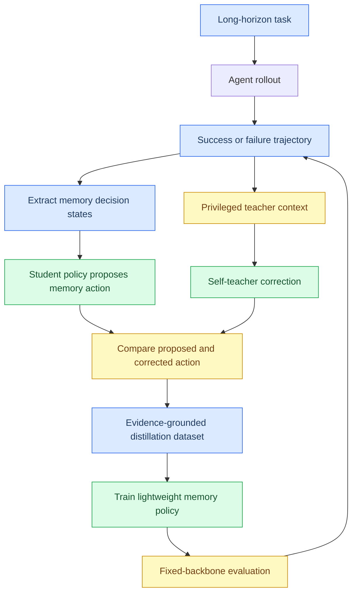
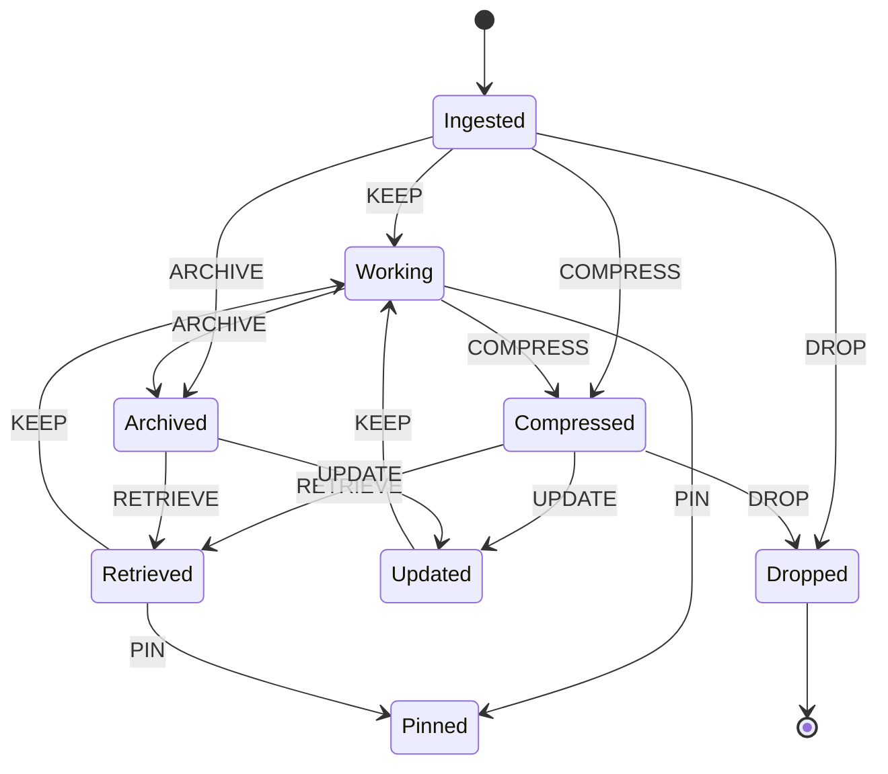

# FASD-Mem 顶会论文蓝图

_面向长链路智能体的成功/失败感知自蒸馏记忆策略论文框架，版本日期：2026-05-16。_

---

## 1. 论文定位

这篇论文的核心目标不是提出一个更大的 agent，也不是直接做 GRPO，而是把长链路智能体中的上下文管理问题单独抽象为一个可训练、可迁移、可验证的外部记忆策略学习问题。论文主张：许多 long-horizon agent 的失败并不完全来自推理能力不足，而是来自证据生命周期管理失败，包括早期关键证据被摘要抹掉、失败日志被丢弃、后续需要的状态没有回读、以及错误记忆污染上下文。

论文方法可以命名为 `FASD-Mem`，全称是 `Failure- and Success-Aware Self-Distillation for Agent Memory`。它把成功轨迹作为 demonstration，把失败轨迹中的工具反馈和环境反馈作为 rich feedback，让一个带有额外轨迹信息和原始证据指针的 self-teacher 生成或修正 memory tool action，再把这些动作蒸馏给轻量 context manager policy。整个最小版本不使用 GRPO，只使用轨迹采样、teacher correction 和 action-level self-distillation。

### 1.1 推荐标题

| 类型 | 标题 |
|---|---|
| 主推标题 | FASD-Mem: Failure- and Success-Aware Self-Distillation for Long-Horizon Agent Memory |
| 更强调低资源 | Learning What to Remember without Reinforcement Learning: Self-Distilled Memory Policies for Long-Horizon Agents |
| 更强调证据 | Evidence-Preserving Self-Distillation for Transferable Agent Memory Policies |
| 更像 ACL/EMNLP | Teaching Agents What to Remember: Self-Distilled Context Management for Long-Horizon Tool Use |

主推标题比较稳，因为它同时表达了方法、信号来源和任务场景，不会过早把贡献限定在“不用 RL”上。

### 1.2 目标会议风格

| 目标 venue | 推荐叙事重点 |
|---|---|
| ICLR / NeurIPS / ICML | 方法形式化、on-policy distillation、泛化和消融 |
| ACL / EMNLP | 长上下文、RAG/记忆、工具调用和证据保真 |
| ICLR Workshop / NeurIPS Workshop | 系统原型、benchmark、低资源 agent memory |

如果实验结果强，主会叙事应当集中在“memory action policy learning”这一抽象上，而不是把论文写成某个工程系统的报告。

## 2. 一句话贡献

`FASD-Mem` 将长链路 agent 的上下文管理从昂贵且不稳定的端到端强化学习问题，转化为一个可验证的自蒸馏记忆动作学习问题：成功轨迹提供 demonstration，失败轨迹提供 rich feedback，原始证据指针提供 grounding，轻量策略学习何时保留、压缩、归档、回读和固定信息。

## 3. 摘要草稿

Long-horizon language agents must decide not only what action to take, but also what evidence to preserve across many turns. Existing context management strategies, including sliding windows, periodic summaries, and retrieval-augmented memory, often lose exact evidence, introduce summary distortion, or fail to recover earlier observations when they become relevant later. We introduce `FASD-Mem`, a failure- and success-aware self-distillation framework for training transferable memory policies without reinforcement learning. Instead of fine-tuning the main agent, `FASD-Mem` treats context management as a lightweight tool policy over evidence lifecycle actions such as `KEEP`, `COMPRESS`, `ARCHIVE`, `RETRIEVE`, `UPDATE`, `DROP`, and `PIN`. Successful trajectories are used as demonstrations, while failed trajectories provide rich feedback from tools and environments. A privileged self-teacher conditions on outcomes, raw evidence pointers, and trajectory diagnostics to correct the current policy's memory actions; a student policy is then trained on its own state distribution through action-level distillation. Across fixed-backbone evaluations on multi-hop QA, text environments, and tool-use traces, the proposed framework is designed to improve evidence recall and task success under constrained context budgets while reducing token usage. The central claim is that low-cost, evidence-grounded memory policy learning can recover much of the benefit expected from long-horizon RL, while remaining easier to train, inspect, and transfer.

这个 abstract 目前是论文蓝图版本，结果部分应在实验完成后替换成真实数字。

## 4. 核心研究问题

论文应该围绕三个研究问题展开，而不是泛泛讨论 agent memory。

| 编号 | 研究问题 | 对应实验 |
|---|---|---|
| RQ1 | 在固定 backbone 和固定 token budget 下，学习得到的 memory policy 是否优于 sliding window、summary-only、RAG 和 rule policy？ | 主实验 |
| RQ2 | 成功轨迹和失败轨迹的 self-distillation 是否比普通 action SFT 更有效？ | SFT vs offline distillation vs on-policy distillation |
| RQ3 | 这种 memory policy 是否能跨任务、跨环境、跨预算迁移？ | HotpotQA -> ALFWorld / ScienceWorld / coding traces，16K -> 8K |

顶会论文最需要避免的问题是“系统看起来很复杂，但结论不清楚”。因此，主张要聚焦到一个可检验的命题：

```text
在主 agent 不变、上下文预算不变、检索组件不变的情况下，
只替换 context manager，
self-distilled memory policy 能比强非 RL baseline 更好地保存和回读关键证据。
```

## 5. 论文贡献列表

### 5.1 贡献一：把 agent memory 形式化为 evidence lifecycle control

论文不把 memory 当作一个普通向量库或摘要缓存，而是把每条信息建模为带有 `summary`、`metadata`、`raw_pointer`、`state` 和 `utility` 的 memory item。策略动作不是生成最终答案，而是控制证据生命周期。

动作空间为：

```text
KEEP, COMPRESS, ARCHIVE, RETRIEVE, UPDATE, DROP, PIN
```

这个抽象具备迁移性，因为它不依赖 HotpotQA、ALFWorld、ScienceWorld 或 coding 任务的私有动作，而是描述长链路智能体都会遇到的上下文管理操作。

### 5.2 贡献二：提出 failure/success-aware self-distillation

论文借鉴 `Self-Distillation Enables Continual Learning` 的 demonstration-conditioned teacher 思路，以及 `Reinforcement Learning via Self-Distillation` 的 feedback-conditioned teacher 思路，但把输出对象从最终回答或 token continuation 改成 memory tool action。成功轨迹不直接作为离线 SFT 标签，而是让当前 policy 在相同状态上先生成自己的 memory action，再由看到成功轨迹和 raw evidence 的 teacher 修正。失败轨迹也不只给 0 reward，而是利用工具错误、环境反馈、支持证据缺失等信息生成具体 correction。

### 5.3 贡献三：提出 evidence-grounded correction schema

每条 teacher correction 必须绑定可回溯证据：

```text
turn_id
memory_id
raw_evidence_id
bad_action
correct_action
verifiable_reason
```

这个设计是论文的重要防线。它让方法区别于普通 reflection 或泛泛的 LLM critique，避免 teacher 生成无法验证的事后解释。

### 5.4 贡献四：建立固定 backbone 的 memory policy 评测协议

论文的实验不应该让更强模型、更长上下文或更多工具调用混进主结论。主实验协议应当固定：

```text
same agent backbone
same context budget
same retriever
same environment
same evaluation split
only replace memory/context manager
```

这样才能证明提升来自 memory policy，而不是来自模型能力或上下文长度。

## 6. 方法总览



方法分为四层：外部记忆操作系统、轨迹诊断、self-teacher correction、轻量 policy distillation。第一层保证证据不会被摘要彻底吞掉，第二层把成功和失败轨迹转成可训练状态，第三层利用额外上下文生成更优动作，第四层训练一个可以部署到新任务上的 context manager。

## 7. 形式化定义

给定一个长链路任务 episode，在第 `t` 步，主 agent 观测到状态 `o_t`，上下文管理器维护 memory store `M_t` 和 working context `C_t`。每个 memory item `m_i` 包含：

```json
{
  "id": "mem_034",
  "type": "test_failure",
  "summary": "The target test failed because the API returned 200 instead of 401.",
  "raw_pointer": "archive/ep001/tool_pytest_003.txt",
  "metadata": {
    "files": ["src/auth/middleware.py"],
    "symbols": ["test_auth_expired_token"],
    "token_count": 1842
  },
  "state": "working",
  "utility": 0.0
}
```

Memory policy 的输入是：

```text
s_t = task goal, recent context, memory item, budget state, retrieval state
```

策略输出是：

```text
a_t in {KEEP, COMPRESS, ARCHIVE, RETRIEVE, UPDATE, DROP, PIN}
```

学生策略为：

```text
pi_theta(a_t | s_t)
```

self-teacher 看到额外信息 `z_t`：

```text
z_t = outcome, success trajectory, failure feedback, raw evidence, diagnostics
```

teacher 策略为：

```text
pi_T(a_t | s_t, z_t)
```

训练目标可以从轻到重分为三种：

```text
Action CE:
  L = - log pi_theta(a_T | s_t)

KL distillation:
  L = KL(pi_T(. | s_t, z_t) || pi_theta(. | s_t))

Risk-aware action loss:
  L = CE + lambda_forbid * I(forbidden action) + lambda_ground * I(missing evidence pointer)
```

低资源版本建议先使用 action-level CE，因为它不需要保存 teacher logits，也不依赖对大模型 logits 的访问。

## 8. 成功轨迹和失败轨迹如何进入训练

### 8.1 成功轨迹

成功轨迹的作用不是提供一个应当逐字模仿的 action 序列，而是提供“哪些 evidence lifecycle decision 最终被证明有用”的额外上下文。流程如下：

```text
successful episode
-> extract states where memory decisions were made
-> current student proposes its own action at each state
-> teacher sees successful trajectory and raw evidence
-> teacher corrects or confirms the student's action
-> train student on corrected action
```

这种设计比普通 SFT 更贴近 student 自己的状态分布。普通 SFT 学的是旧轨迹做过什么，而 self-distillation 学的是当前 policy 在相似状态下哪里会犯错、应该如何修正。

### 8.2 失败轨迹

失败轨迹的作用是提供 rich feedback。失败不是只有 `reward = 0`，而是包含可诊断信号，例如 missing supporting fact、invalid action、repeated action、pytest stack trace、工具输出冲突、或最终答案缺少证据。

失败样本生成 correction 的流程如下：

```text
failed episode
-> identify memory-related failure
-> locate raw evidence that was dropped, over-compressed, or not retrieved
-> construct teacher context with feedback and evidence pointer
-> teacher outputs corrected memory action
-> train student on evidence-grounded correction
```

这使失败轨迹可以成为密集监督来源，而不是在 RL 里只贡献一个粗粒度负奖励。

## 9. 训练算法草稿

```text
Algorithm 1: Failure- and Success-Aware Self-Distillation for Memory Policies

Input:
  initial memory policy pi_0
  fixed agent backbone A
  training tasks D
  teacher model T
  evidence archive E

for iteration k = 1..K:
  collect episodes using A + pi_k
  for each episode tau:
    store raw observations, tool outputs, actions, and outcomes in E
    extract memory decision states S_tau
    for each state s in S_tau:
      sample or decode student action a_s ~ pi_k(. | s)
      build teacher context z from outcome, diagnostics, and raw evidence
      ask T to produce corrected action a_T and verifiable reason
      reject correction if raw evidence pointer is missing or invalid
      add (s, a_s, a_T, evidence_ids, metadata) to distillation set
  train pi_{k+1} on accumulated or recent corrected actions
  evaluate pi_{k+1} on held-out tasks with no privileged teacher context

Output:
  distilled memory policy pi_K
```

论文实现时可以先用 batch iteration，而不是每一轮都重新训练模型。比如先用 rule policy 采集第一批轨迹，再训练 `pi_1`，然后用 `pi_1` 重新采样形成 on-policy distillation 数据。

## 10. 数据格式

每条训练样本对应一次 memory action 决策，而不是一个完整答案。

```json
{
  "sample_id": "hotpotqa_ep014_t05_mem022",
  "episode_id": "hotpotqa_ep014",
  "split": "train",
  "state": {
    "task_goal": "Answer the multi-hop question using the provided documents.",
    "recent_context": "The agent has read two distractor paragraphs and one likely supporting paragraph.",
    "budget_pressure": 0.73
  },
  "memory_item": {
    "id": "mem022",
    "type": "retrieved_doc",
    "summary": "Paragraph about the film's director and release year.",
    "raw_pointer": "archives/hotpotqa_ep014/context_4.txt",
    "metadata": {
      "token_count": 912,
      "entities": ["director_name", "film_title"]
    }
  },
  "student_action": "ARCHIVE",
  "teacher_action": "KEEP",
  "correction": {
    "raw_evidence_id": "ctx_4_sent_2",
    "bad_action": "ARCHIVE",
    "correct_action": "KEEP",
    "verifiable_reason": "The paragraph contains one of the two supporting facts needed for the final answer."
  }
}
```

为了后期兼容 Hugging Face Datasets 和 slime，所有样本都应保留 `sample_id`、`episode_id`、`split`、`memory_id`、`raw_evidence_id`、`covered/uncovered/unseen` 和 `budget`。

## 11. 实验设计

### 11.1 主实验设置

主实验必须固定主 agent，只替换 memory manager。建议第一个版本使用三个任务族：

| 任务族 | 价值 | 主要指标 |
|---|---|---|
| HotpotQA | 多跳证据保留和回读，HF 加载方便 | EM/F1、supporting fact recall、token cost |
| ALFWorld | 长链路行动记忆和避免重复动作 | success rate、invalid action rate、repeated action rate |
| ScienceWorld | 程序性记忆和科学状态跟踪 | score、state fact recall、procedure recall |

如果时间允许，再加入 coding trace 或小型 repo task。coding 任务更贴近你的长期目标，但工程评测成本更高，适合作为第四个 task family。

### 11.2 Baseline

Baseline 要分层，避免只打弱基线。

| 类别 | Baseline | 作用 |
|---|---|---|
| 弱基线 | No memory | 测最小能力 |
| 弱基线 | Sliding window | 测最近上下文是否足够 |
| 弱基线 | Periodic summary / summary-only | 测摘要失真 |
| 检索基线 | BM25 / embedding RAG top-k | 测普通检索记忆 |
| 系统基线 | Rule context manager | 测手写规则是否已经足够 |
| 学习基线 | Action SFT | 测普通监督学习 |
| 学习基线 | Offline distillation | 测不重新采样当前 policy 的蒸馏 |
| 你的方法 | On-policy FASD-Mem | 主方法 |
| 你的方法 | FASD-Mem + utility rerank | 加运行时 utility 的增强版 |
| 上界 | Teacher direct inference | 测 teacher 本身能力 |
| 上界 | Full raw context oracle | 测压缩前理论上限 |

最关键的强基线是 `Rule context manager`、`RAG top-k`、`Action SFT` 和 `Offline distillation`。如果只超过 sliding window 和 summary-only，论文说服力不够。

### 11.3 指标

论文应同时报告任务结果、记忆质量和成本。

| 指标 | 含义 |
|---|---|
| `task_success_rate` | 任务是否完成 |
| `answer_em_f1` | QA 任务准确率 |
| `env_score` | ALFWorld / ScienceWorld 分数 |
| `evidence_recall` | 关键原始证据是否被保留或能回读 |
| `symbol_recall` | 文件名、实体名、状态变量、测试名是否保留 |
| `retrieve_precision` | 回读内容是否被后续使用 |
| `memory_pollution_rate` | 错误或过时记忆进入上下文的比例 |
| `compression_ratio` | token 压缩比例 |
| `peak_context_tokens` | 峰值上下文长度 |
| `total_input_tokens` | 总输入 token 成本 |
| `failure_recovery_rate` | 从失败反馈中恢复的比例 |
| `cross_task_generalization` | 跨任务迁移结果 |

### 11.4 主结果表模板

| Method | HotpotQA EM | HotpotQA SF Recall | ALFWorld SR | ScienceWorld Score | Evidence Recall | Tokens ↓ |
|---|---:|---:|---:|---:|---:|---:|
| No memory | TBD | TBD | TBD | TBD | TBD | TBD |
| Sliding window | TBD | TBD | TBD | TBD | TBD | TBD |
| Summary-only | TBD | TBD | TBD | TBD | TBD | TBD |
| RAG top-k | TBD | TBD | TBD | TBD | TBD | TBD |
| Rule policy | TBD | TBD | TBD | TBD | TBD | TBD |
| Action SFT | TBD | TBD | TBD | TBD | TBD | TBD |
| Offline distillation | TBD | TBD | TBD | TBD | TBD | TBD |
| FASD-Mem | TBD | TBD | TBD | TBD | TBD | TBD |
| FASD-Mem + utility | TBD | TBD | TBD | TBD | TBD | TBD |
| Teacher direct | TBD | TBD | TBD | TBD | TBD | TBD |
| Full raw context | TBD | TBD | TBD | TBD | TBD | TBD |

这个表里的 `TBD` 必须保留，不能提前编造实验数字。论文写作时可以先用这张表锁定实验结构。

## 12. 消融实验

消融实验是这篇论文能否像顶会论文的关键。

| 消融 | 要回答的问题 | 预期观察 |
|---|---|---|
| w/o failure trajectories | 失败反馈是否真的有用？ | failure recovery 和 task success 下降 |
| w/o success trajectories | demonstration 是否帮助稳定学习？ | action quality 和泛化下降 |
| w/o raw evidence pointer | evidence grounding 是否必要？ | summary distortion 和幻觉记忆上升 |
| w/o on-policy proposals | 是否只是普通 SFT？ | 分布偏移导致 eval 下降 |
| w/o forbidden action constraint | DROP 风险是否可控？ | must-preserve violation 上升 |
| teacher 7B vs 14B vs API | teacher ICL 能力是否影响蒸馏？ | 小 teacher correction 噪声更高 |
| student classifier vs 0.5B vs 1.5B | 小模型是否足够？ | 动作空间窄时小模型可能接近 LLM |
| 4K / 8K / 16K budget | 方法是否在受限上下文下更有价值？ | 预算越小，相对收益越明显 |
| train HotpotQA, test ALFWorld | 是否跨任务迁移？ | 部分动作泛化，任务特定类型需适配 |

最重要的消融是 `w/o raw evidence pointer` 和 `w/o on-policy proposals`。前者证明不是普通摘要，后者证明不是普通 SFT。

## 13. 相关工作组织

相关工作建议分为五组，不要按论文逐篇流水账。

### 13.1 Long-context and context compression

这一组讨论长上下文、prompt compression、trajectory compression、summary memory 和可回读压缩。你的定位是：这些方法主要解决“放多少 token”，而本文解决“证据生命周期如何被策略化管理”。

### 13.2 Retrieval-augmented and external memory agents

这一组讨论 RAG、episodic memory、agent memory store、MemGPT 类系统。你的定位是：传统外部记忆依赖检索相似度或规则，而本文训练一个显式 memory action policy。

### 13.3 Self-distillation and on-policy distillation

这里引用 `Reinforcement Learning via Self-Distillation` 和 `Self-Distillation Enables Continual Learning`。你的区别是：已有方法主要蒸馏 answer token 或 general policy，而本文蒸馏的是 memory tool action，并要求 correction 绑定 raw evidence。[^1][^2]

### 13.4 Long-horizon agent evaluation

这一组讨论 HotpotQA、ALFWorld、ScienceWorld、coding agent traces、SWE 类 benchmark。你的定位是：这些任务通常评估最终成功率，而本文额外评估 evidence recall、memory pollution 和 token budget。

### 13.5 Reinforcement learning for agents

这一组讨论 GRPO、PPO、RLVR 和 agent RL。你的定位要谨慎：本文不否定 RL，而是证明在低资源场景下，memory policy 的关键学习信号可以先通过 self-distillation 获得。后续 GRPO 可以作为扩展，而不是最小闭环的必要条件。

## 14. 论文结构

### 14.1 Introduction

Introduction 应该按四段推进。

第一段讲问题：长链路 agent 的上下文不是无限的，失败经常来自证据丢失、摘要失真和无法回读。这里不要只说“context window 太小”，而要说“上下文管理是一个决策问题”。

第二段讲现有方法不足：sliding window 丢早期证据，summary-only 会扭曲精确实体和状态，RAG top-k 不知道任务阶段，rule policy 难迁移，端到端 RL 成本高且 credit assignment 粗。

第三段提出方法：将 memory management 建模为 evidence lifecycle policy，用成功和失败轨迹进行 self-distillation，teacher 看到 outcome、raw evidence 和诊断，student 只看到部署时可用状态。

第四段列贡献和实验结论：固定 backbone、固定预算下，方法目标是超过强非 RL baseline，并在 evidence recall、token reduction 和 cross-task transfer 上展示优势。

### 14.2 Method

Method 按以下顺序写：

1. Memory item and evidence archive
2. Memory action space
3. Failure/success-aware self-teacher
4. Distillation objective
5. Inference-time deployment

### 14.3 Experiments

Experiments 按以下顺序写：

1. Task families and splits
2. Baselines
3. Metrics
4. Main results
5. Ablations
6. Transfer and budget stress tests
7. Qualitative analysis

### 14.4 Discussion

Discussion 应该主动承认限制：teacher 质量依赖 ICL，过小 teacher 可能不可靠；如果任务没有可回溯 evidence，方法收益会下降；完整 agent 能力仍然受主 backbone 限制；端到端 RL 可能进一步提升，但不是本文最小闭环的一部分。

## 15. 关键图表计划

| 图表 | 内容 | 目的 |
|---|---|---|
| Figure 1 | FASD-Mem 总流程图 | 让读者一眼看到成功/失败轨迹如何变成训练信号 |
| Figure 2 | Memory item lifecycle 状态机 | 解释 KEEP/COMPRESS/ARCHIVE/RETRIEVE 等动作 |
| Figure 3 | Success vs failure self-teacher prompt 差异 | 解释方法核心 |
| Table 1 | 主实验结果 | 证明超过强 baseline |
| Table 2 | 消融实验 | 证明每个模块必要 |
| Table 3 | 迁移实验 | 证明可迁移 |
| Figure 4 | Token budget vs task success 曲线 | 证明低预算收益 |
| Figure 5 | Case study | 展示 raw evidence pointer 如何避免 summary distortion |

### 15.1 Memory lifecycle 状态机



## 16. Reviewer 可能会问什么

### 16.1 这是不是普通 SFT？

不是。普通 SFT 直接模仿成功轨迹中的 action；`FASD-Mem` 让当前 policy 在自己的状态分布上先生成 action，再由带有 demonstration、feedback 和 raw evidence 的 teacher 修正。因此训练分布更接近部署时的 policy-induced states。

实验上必须通过 `Action SFT` 和 `Offline distillation` 两个 baseline 来证明这点。

### 16.2 这是不是数据泄漏？

训练阶段 teacher 可以看到训练 episode 的 outcome、工具反馈和 raw evidence，但评测阶段 teacher 不参与，student 只能看到部署时可用状态。对于 held-out test，teacher correction 不允许看到 gold answer。HotpotQA 中可以在训练集使用 supporting fact 生成 correction，但 test/unseen 只用于评测。

### 16.3 不做 GRPO 会不会不够强？

论文不声称 self-distillation 永远优于 RL，而是证明对于 memory action policy 这个窄动作空间，成功/失败轨迹中的 dense supervision 已经能超过强非 RL baseline。GRPO 可以作为后续扩展或上界，不是本文成立的必要条件。

### 16.4 方法会不会只在小模型或特定任务有效？

实验需要显式包含 teacher size、student size、cross-task 和 cross-budget 分析。论文应当预期 teacher 需要足够 ICL 能力，student 可以更小，因为 student 学的是窄动作空间，而不是完整推理能力。

### 16.5 为什么不直接用长上下文模型？

长上下文不能自动解决证据选择、状态更新和 memory pollution。论文的关键比较应当是在相同 context budget 下比较不同 memory manager，并报告 token cost、evidence recall 和 task success。可以加入 `Full raw context oracle` 作为上界，但不把它当公平 baseline。

## 17. 最小可发表版本

如果资源有限，最小版本可以这样收敛：

```text
Dataset:
  HotpotQA + ALFWorld small split

Policy:
  rule policy bootstrap
  action SFT baseline
  FASD-Mem action-level self-distillation

Teacher:
  7B/14B/API model 生成 evidence-grounded correction

Student:
  classifier or Qwen2.5-0.5B/1.5B context policy

Metrics:
  task success
  evidence recall
  retrieve precision
  token usage
  forbidden action rate

Main claim:
  Under fixed agent and token budget, self-distilled memory policy improves evidence preservation and task success over rule, RAG, summary, and action SFT baselines.
```

这个版本不需要 GRPO，也不需要训练完整 agent。它足以支撑一篇 workshop 或强技术报告。如果结果明显超过强 baseline，并且跨任务迁移成立，就有机会扩展成主会论文。

## 18. 8 周执行计划

| 周期 | 目标 | 产物 |
|---|---|---|
| 第 1 周 | 固定 memory schema 和 action space | schema、rule policy、archive store |
| 第 2 周 | 跑通 HotpotQA adapter | episode_eval、context_action 数据 |
| 第 3 周 | 生成 teacher correction | correction jsonl、过滤器 |
| 第 4 周 | 训练 Action SFT 和 FASD-Mem v0 | 两个 student policy |
| 第 5 周 | 跑主实验和 action 指标 | main result table v0 |
| 第 6 周 | 接 ALFWorld 或 ScienceWorld | 交互式环境结果 |
| 第 7 周 | 做消融和迁移 | ablation、budget stress |
| 第 8 周 | 写论文初稿 | abstract、method、experiments、case study |

## 19. 写作时的核心表述

可以反复使用的论文主句：

```text
We study context management as an evidence lifecycle control problem.
```

```text
The main agent is kept fixed; only the memory policy is learned.
```

```text
Successful trajectories provide demonstrations, while failed trajectories provide rich feedback.
```

```text
The teacher is privileged during training, but the student uses only deploy-time information.
```

```text
Raw evidence pointers turn memory distillation from free-form reflection into verifiable supervision.
```

```text
Our goal is not to replace reinforcement learning, but to show that many long-horizon memory failures can be addressed before policy-gradient training is needed.
```

## 20. 和已有文档的关系

这份论文蓝图依赖两个已有文档：

| 文档 | 用途 |
|---|---|
| `research-automation/context-manager-rl-slime-plan.md` | 工程系统、HF 评测、后期 slime 扩展 |
| `research-automation/reports/self-distillation-rl-continual-learning-report.md` | SDPO/SDFT 理论来源和方法启发 |

当前论文版本刻意不把 slime-GRPO 作为主线。slime 应该放在 future work 或 appendix 的扩展路线中，以免论文主贡献被审稿人理解成“GRPO 没做完”。

## 21. 参考来源

[^1]: `Reinforcement Learning via Self-Distillation`, arXiv:2601.20802. https://arxiv.org/abs/2601.20802
[^2]: `Self-Distillation Enables Continual Learning`, arXiv:2601.19897. https://arxiv.org/abs/2601.19897
[^3]: `ALFWorld: Aligning Text and Embodied Environments for Interactive Learning`, arXiv:2010.03768. https://arxiv.org/abs/2010.03768
[^4]: `ScienceWorld: Is your Agent Smarter than a 5th Grader?`, arXiv:2203.07540. https://arxiv.org/abs/2203.07540
[^5]: HotpotQA project page. https://hotpotqa.github.io/
[^6]: HotpotQA Hugging Face dataset. https://huggingface.co/datasets/hotpotqa/hotpot_qa
