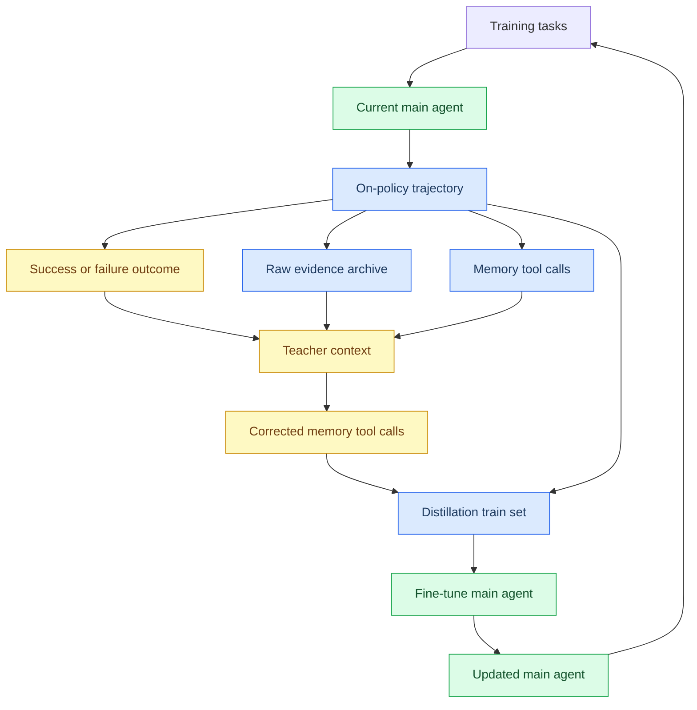

# Self-Distilled Memory Tool Use 主模型训练论文蓝图

_版本 B：训练主 agent backbone 学会主动调用 memory tools。日期：2026-05-16。_

---

## 1. 不要混淆

| 维度 | 版本 A：外部上下文管理器 | 版本 B：主模型 memory-tool policy |
|---|---|---|
| 训练谁 | 外部 `context manager` / 轻量 `memory policy` | 主 agent backbone |
| 推理时谁做 memory action | 外部 policy | 主 agent 自己调用 memory tools |
| 主 claim | 只替换记忆管理策略也能提升长链路表现 | self-distillation 能教会主 agent 更好地使用 memory tools |
| 最强 baseline | RAG / rule policy / action SFT | vanilla SFT / ReAct SFT / tool-call SFT |
| 归因难度 | 低，因为主 agent 固定 | 高，因为主 agent 行为整体改变 |
| 资源需求 | 低，可用 classifier 或 0.5B-1.5B policy | 中高，通常需要 7B/14B 级 agent 微调 |

本文档只描述版本 B。它的核心不是外部模块替换，而是让主 agent 在长链路任务中把记忆管理作为一种 tool-use 能力学进去。

## 2. 论文定位

推荐标题是 `Self-Distilled Memory Tool Use for Long-Horizon Language Agents`。这篇论文研究的是：当主 agent 已经具备工具调用能力时，能否通过成功/失败轨迹驱动的 on-policy self-distillation，让它学会在长链路中主动决定何时保存、压缩、归档、回读和固定证据。

版本 B 和版本 A 的根本区别是训练对象不同。版本 A 训练外部 policy，主 agent 不变；版本 B 训练主 agent 本身，让 memory tool call 成为 ReAct / tool-use trace 的一部分。推理时，主 agent 会输出类似 `memory.keep`、`memory.compress`、`memory.retrieve` 的工具调用，然后再基于返回结果继续完成任务。

这篇论文的主 claim 也不同。它不是证明“换一个外部 context manager 就够了”，而是证明：在同一个 base LLM、同样训练预算、同样轨迹数据下，success/failure-aware on-policy self-distillation 比 vanilla SFT、ReAct SFT 和普通 tool-call SFT 更能教会主 agent 稳定使用 memory tools。

## 3. 一句话贡献

本文将长链路记忆管理建模为主 agent 的 memory-tool use policy，并提出一种 success/failure-aware on-policy self-distillation 流程：当前 agent 先在自己的轨迹分布上调用 memory tools，teacher 基于成功示范、失败反馈和 raw evidence 修正这些 tool calls，再把修正后的 memory tool behavior 蒸馏回主 agent。

## 4. Abstract 草稿

Long-horizon language agents increasingly rely on tools, yet they often lack a learned policy for managing their own evidence across many turns. When faced with long documents, tool outputs, environment observations, or test failures, agents may summarize away exact details, forget earlier constraints, or fail to retrieve evidence before making irreversible decisions. We propose `Self-Distilled Memory Tool Use`, a training framework that teaches the main language agent to invoke memory tools during long-horizon problem solving. The agent is equipped with actions such as `memory.keep`, `memory.compress`, `memory.archive`, `memory.retrieve`, `memory.update`, `memory.drop`, and `memory.pin`. Instead of training from static expert traces alone, the current agent first produces on-policy trajectories and memory tool calls. A privileged teacher then observes successful demonstrations, failure feedback, trajectory diagnostics, and raw evidence pointers to correct the agent's memory tool decisions. The agent is fine-tuned on these corrected tool-use trajectories through action-level and token-level self-distillation. Under matched base models, data, and training budgets, this framework is designed to test whether on-policy memory-tool distillation improves task success, evidence recall, failure recovery, and cross-task retention over vanilla SFT, ReAct SFT, tool-call SFT, and offline distillation. The central hypothesis is that long-horizon memory behavior can be learned as a tool-use skill, rather than left to prompt engineering or external retrieval alone.

实验结果完成前，abstract 中所有效果性语句都必须保持为假设或评测目标，不能提前写具体提升数字。

## 5. Research Questions

| 编号 | 问题 | 实验回答方式 |
|---|---|---|
| RQ1 | 主 agent 经过 memory-tool self-distillation 后，是否比 vanilla SFT、ReAct SFT 和 tool-call SFT 更会管理长链路证据？ | 主训练方式对比 |
| RQ2 | on-policy 轨迹修正是否优于直接模仿成功轨迹？ | on-policy self-distillation vs offline SFT |
| RQ3 | 失败轨迹中的 rich feedback 是否能提升 failure recovery 和 evidence recall？ | w/o failure feedback 消融 |
| RQ4 | 主 agent 学会 memory tools 后，是否会损害已有任务能力或产生 catastrophic forgetting？ | continual / retention evaluation |
| RQ5 | 训练得到的 memory-tool behavior 是否能迁移到未见任务、未见环境或更紧 token budget？ | transfer 与 budget stress test |

版本 B 的核心评估对象是主 agent 的行为变化，而不是外部 memory manager 的独立准确率。

## 6. 核心贡献

### 6.1 Memory management as tool-use learning

本文把记忆管理显式加入主 agent 的工具集合。主 agent 不只调用任务工具，例如 `search`、`read_file`、`run_test` 或 `env_step`，还需要调用 memory tools：

```text
memory.keep
memory.compress
memory.archive
memory.retrieve
memory.update
memory.drop
memory.pin
```

这些工具调用成为训练序列的一部分。模型要学的不只是“回答任务”，还包括在回答前如何维护证据、何时回读原文、何时保留失败日志、何时避免重复检索。

### 6.2 On-policy self-distillation for memory tool calls

普通 SFT 直接模仿专家轨迹，容易产生分布偏移：训练时模型看到的是专家状态，部署时模型会落到自己产生的状态。本文让当前主 agent 先生成自己的 memory tool calls，再由 teacher 修正这些调用。训练样本来自 agent 自己会到达的状态，因此更接近部署分布。

### 6.3 Failure-aware dense supervision

失败轨迹不只提供 `0` reward。pytest 失败、missing supporting fact、invalid environment action、repeated loop、tool output contradiction 都可以成为 teacher correction 的依据。teacher 的输出必须指向具体 memory tool call：

```text
bad_call: memory.compress(mem_034)
correct_call: memory.retrieve(mem_034)
reason: exact assertion was needed before editing
raw_evidence_id: pytest_003_line_17
```

这让失败样本变成 dense tool-use supervision。

### 6.4 Retention-aware agent post-training

因为版本 B 会更新主 agent 参数，论文必须评估是否伤害已有能力。贡献不应只看新任务成功率，还要看 base capabilities retention、general instruction following、普通 tool-use 能力和跨任务表现。

## 7. 方法总览



推理时没有 teacher。训练后的主 agent 自己决定是否调用 memory tools，并使用 memory tool 返回的摘要、原文片段或检索结果继续推理。

## 8. Memory tool 接口

版本 B 需要把 memory action 设计成主 agent 可学习的工具调用，而不是外部 classifier 的标签。建议工具接口如下：

```json
{
  "tool": "memory.compress",
  "arguments": {
    "memory_id": "mem_034",
    "must_preserve": ["test_auth_expired_token", "expected 401", "actual 200"],
    "summary": "Expired-token auth test returned 200 instead of 401.",
    "raw_pointer_required": true
  }
}
```

推荐的最小工具集合：

| Tool | 用途 |
|---|---|
| `memory.keep(memory_id)` | 保留到当前 working context |
| `memory.compress(memory_id, must_preserve, summary)` | 生成压缩表示并保留关键字段 |
| `memory.archive(memory_id)` | 移出 working context，但保留可回读指针 |
| `memory.retrieve(query_or_memory_id)` | 回读原始证据或相关 memory |
| `memory.update(memory_id, patch)` | 修正或合并旧记忆 |
| `memory.drop(memory_id)` | 删除低风险内容 |
| `memory.pin(memory_id)` | 固定关键约束、目标或证据 |

训练时，输出格式应和目标 agent 已支持的 tool-call schema 一致。如果使用 Qwen 系列或 OpenAI-style tool calling，需要单独做 chat template 和 loss mask 检查。

## 9. 训练目标

### 9.1 Action-level tool-call distillation

最小版本只训练 memory tool call 的动作和参数：

```text
L_tool = - log p_theta(correct_tool_name, correct_arguments | trajectory_prefix)
```

训练样本是 teacher 修正后的工具调用。非 memory 文本可以用 loss mask 屏蔽，避免模型过度学习环境文本或 teacher 解释。

### 9.2 Token-level self-distillation

如果 teacher 和 student 共享同一模型架构，或者可以保存 teacher logits，可以使用 token-level distillation：

```text
L_KL = KL(p_T(. | prefix, privileged_context) || p_theta(. | prefix))
```

其中 privileged context 包含 outcome、failure feedback、successful demonstration 和 raw evidence pointer。student 推理时不能看到这些额外信息。

### 9.3 Mixed objective

建议首版使用混合目标：

```text
L = L_task_trace + lambda_tool * L_tool + lambda_format * L_format
```

其中 `L_task_trace` 保持基础 ReAct/tool-use 能力，`L_tool` 学 memory tools，`L_format` 保证 JSON/tool-call 格式合法。首版不加入 policy gradient。

## 10. 成功轨迹和失败轨迹如何用

### 10.1 成功轨迹

成功轨迹作为 demonstration-conditioned teacher context。流程是：

```text
successful trajectory
-> current agent replays prefix and proposes memory tool call
-> teacher sees full successful trajectory and evidence usage
-> teacher confirms or corrects the proposed call
-> train main agent on corrected memory tool call
```

关键不是让模型逐字复制成功轨迹，而是在当前 agent 的状态分布上学习哪些 memory tool calls 会让后续任务成功。

### 10.2 失败轨迹

失败轨迹提供 rich feedback。流程是：

```text
failed trajectory
-> diagnose memory-related failure
-> locate bad or missing memory tool call
-> teacher sees failure feedback and raw evidence
-> teacher writes corrected tool call
-> train main agent to emit corrected call in the same prefix state
```

例如 coding trace 中，如果模型在修改代码前没有回读 pytest 原始断言，teacher 可以把原本的 `memory.archive` 修正为 `memory.retrieve` 或 `memory.pin`。

## 11. 数据格式

每条样本建议保存完整上下文、原始 agent 行为和 teacher correction。

```json
{
  "sample_id": "tool_ep021_t014",
  "episode_id": "ep021",
  "split": "train",
  "base_model": "Qwen2.5-7B-Instruct",
  "trajectory_prefix": [
    {"role": "system", "content": "You are a long-horizon tool-using agent."},
    {"role": "user", "content": "Fix the failing auth test."},
    {"role": "assistant", "tool_call": {"name": "run_test", "arguments": {"cmd": "pytest tests/test_auth.py"}}},
    {"role": "tool", "content": "AssertionError: expected 401, got 200"}
  ],
  "student_tool_call": {
    "name": "memory.archive",
    "arguments": {"memory_id": "mem_pytest_003"}
  },
  "teacher_tool_call": {
    "name": "memory.pin",
    "arguments": {
      "memory_id": "mem_pytest_003",
      "must_preserve": ["test_auth_expired_token", "expected 401", "actual 200"]
    }
  },
  "correction": {
    "failure_type": "missing_test_evidence",
    "raw_evidence_id": "pytest_003_line_17",
    "verifiable_reason": "The exact assertion is needed before editing middleware behavior."
  },
  "metadata": {
    "task_family": "coding_trace",
    "covered": false,
    "budget": 16000
  }
}
```

如果训练框架支持多轮 loss mask，只有 `teacher_tool_call` 对应 token 和必要的 continuation 应计算 loss。

## 12. 实验设计

### 12.1 主实验设置

版本 B 的公平比较必须固定：

```text
same base LLM
same training data source
same number of training tokens
same tool schema
same inference budget
same evaluation split
different training method
```

建议任务族：

| 任务族 | 作用 | 首要指标 |
|---|---|---|
| HotpotQA / multi-hop QA | 测 evidence retrieval 与 supporting fact recall | EM/F1、supporting fact recall |
| ALFWorld | 测交互式行动记忆和避免循环 | success rate、repeated action rate |
| ScienceWorld | 测程序性记忆和状态跟踪 | score、procedure recall |
| Coding traces | 测测试失败、文件路径、符号和 raw logs | pass@1、test evidence recall |

### 12.2 Baseline

| Baseline | 含义 | 目的 |
|---|---|---|
| Base LLM zero-shot / few-shot | 不做训练 | 下限 |
| Vanilla SFT | 训练任务答案或完整轨迹 | 测普通微调 |
| ReAct SFT | 训练 reasoning + tool-use trace | 测常规 agent SFT |
| Tool-call SFT | 训练全部工具调用，包括 memory tools | 测普通工具模仿 |
| Action SFT | 只训练 memory action 标签 | 测静态标签学习 |
| Offline self-distillation | teacher 修正离线轨迹，不重新采样当前 agent | 测非 on-policy 蒸馏 |
| On-policy self-distillation | 本文主方法 | 主方法 |
| Teacher direct inference | teacher 直接推理 | 上界 |

版本 B 的强 baseline 不是 RAG 或 rule policy，而是各种主模型训练方式。RAG/rule 可以作为系统组件，但不是最核心的训练 baseline。

### 12.3 指标

| 指标 | 含义 |
|---|---|
| `task_success_rate` | 任务最终成功率 |
| `pass_at_1` | coding 或可验证任务一次成功率 |
| `memory_tool_call_accuracy` | memory tool name 与参数是否正确 |
| `memory_tool_format_validity` | JSON/tool-call 格式合法率 |
| `evidence_recall` | 关键证据是否被保留或回读 |
| `retrieve_before_answer_rate` | 回答或编辑前是否回读关键证据 |
| `failure_recovery_rate` | 从失败反馈中恢复的比例 |
| `repeated_action_rate` | 重复无效动作比例 |
| `catastrophic_forgetting` | 原有能力下降幅度 |
| `general_tool_use_retention` | 非 memory 工具调用能力保持 |
| `token_cost` | 推理 token 成本 |

### 12.4 主结果表模板

| Method | QA EM | ALFWorld SR | ScienceWorld Score | Coding pass@1 | Evidence Recall | Forgetting |
|---|---:|---:|---:|---:|---:|---:|
| Base LLM | TBD | TBD | TBD | TBD | TBD | TBD |
| Vanilla SFT | TBD | TBD | TBD | TBD | TBD | TBD |
| ReAct SFT | TBD | TBD | TBD | TBD | TBD | TBD |
| Tool-call SFT | TBD | TBD | TBD | TBD | TBD | TBD |
| Action SFT | TBD | TBD | TBD | TBD | TBD | TBD |
| Offline self-distillation | TBD | TBD | TBD | TBD | TBD | TBD |
| On-policy self-distillation | TBD | TBD | TBD | TBD | TBD | TBD |
| Teacher direct | TBD | TBD | TBD | TBD | TBD | TBD |

所有数字必须来自真实实验，初稿中统一保留 `TBD`。

## 13. 消融实验

| 消融 | 回答的问题 | 预期观察 |
|---|---|---|
| w/o success demonstrations | 成功轨迹是否有帮助 | memory call 泛化下降 |
| w/o failure feedback | 失败反馈是否提供 dense supervision | failure recovery 下降 |
| w/o raw evidence pointer | grounding 是否必要 | 错误 tool-call correction 上升 |
| w/o on-policy resampling | 是否只是普通离线 SFT | 部署表现下降 |
| memory tools only vs full trace | 只训 memory call 是否足够 | 可能保留基础能力更好 |
| 7B vs 14B teacher | teacher ICL 能力是否影响训练 | 小 teacher 噪声更高 |
| 7B vs 14B student | 主 agent 规模是否影响内化 | 大 student 更稳但成本更高 |
| loss mask ablation | 是否需要只训工具调用 token | 不 masking 可能污染普通回复能力 |

版本 B 的关键消融是 `w/o on-policy resampling` 和 `loss mask ablation`。前者证明不是普通 SFT，后者证明训练没有破坏主模型的非 memory 行为。

## 14. Retention 与安全边界

因为主 agent 参数会改变，版本 B 必须报告 retention。至少需要三个评测组：

| 评测组 | 目的 |
|---|---|
| Base instruction following | 检查普通问答、格式遵循是否下降 |
| General tool use | 检查 search/read/test/env_step 等非 memory 工具是否退化 |
| No-memory tasks | 检查模型是否过度调用 memory tools |

还需要统计 dangerous memory behavior：

```text
unnecessary_memory_call_rate
drop_critical_evidence_rate
retrieve_loop_rate
invalid_tool_json_rate
hallucinated_memory_id_rate
```

这些指标是版本 B 比版本 A 更复杂的地方。

## 15. Reviewer 可能会问什么

### 15.1 这和普通 tool-call SFT 有什么区别？

普通 tool-call SFT 模仿静态轨迹；本文让当前 agent 先在自己的状态分布上产生 memory tool call，然后用带成功/失败信息的 teacher 修正。因此训练目标针对的是当前 agent 真实会犯的 memory 错误。实验上要用 `Tool-call SFT` 和 `Offline self-distillation` 对比。

### 15.2 teacher correction 是否泄漏答案？

训练集可以使用 outcome、工具反馈和 raw evidence 生成 correction，但 held-out test 不能被 teacher 处理后再评测。对于 HotpotQA，测试集 gold answer 和 supporting facts 不能进入训练 correction；对于 coding，private test 结果不能进入 teacher prompt。

### 15.3 为什么不使用外部 context manager？

版本 B 的目标不同。它研究的是主 agent 是否能内化 memory tool-use skill，让记忆操作成为 agent 行为的一部分。外部 context manager 可以作为系统 baseline 或对照论文，但不是本篇的核心训练对象。

### 15.4 是否会遗忘原有能力？

这是版本 B 的主要风险。论文必须报告 retention，并使用 loss mask、混合训练数据和较小 learning rate 控制退化。如果 forgetting 严重，主结论不能只看目标任务成功率。

### 15.5 不做 GRPO 是否合理？

合理。本文检验的是 self-distillation 能否先提供稳定、密集、可验证的 memory-tool supervision。GRPO 可以在后续作为进一步优化，但不是证明主 agent 能学会 memory tool-use 的必要条件。

## 16. 最小可发表版本

最低成本版本如下：

```text
Base model:
  Qwen2.5-7B-Instruct or similar open 7B agent model

Teacher:
  14B/API model for correction generation

Tasks:
  HotpotQA + one interactive/coding trace subset

Training methods:
  vanilla SFT
  ReAct SFT
  tool-call SFT
  offline self-distillation
  on-policy self-distillation

Metrics:
  task success
  memory tool-call accuracy
  evidence recall
  failure recovery
  catastrophic forgetting
```

如果资源不足，先做 LoRA / QLoRA 和 action-level tool-call distillation，不做 teacher logits。只有当 tool-call SFT 和 offline self-distillation 都被超过时，版本 B 的 claim 才比较稳。

## 17. 和已有文档的关系

| 文档 | 关系 |
|---|---|
| `research-automation/reports/self-distillation-rl-continual-learning-report.md` | SDPO/SDFT 的理论来源 |
| `research-automation/context-manager-rl-slime-plan.md` | memory tool schema、HF 评测和后期 slime 扩展来源 |
| `research-automation/paper-drafts/external-context-manager-paper-blueprint.md` | 对照版本：外部 policy，不更新主 agent |
| `research-automation/paper-drafts/fasd-mem-top-conference-paper-blueprint.md` | 早期混合草稿，后续不再作为唯一论文框架 |

## 18. 参考来源

[^1]: `Reinforcement Learning via Self-Distillation`, arXiv:2601.20802. https://arxiv.org/abs/2601.20802
[^2]: `Self-Distillation Enables Continual Learning`, arXiv:2601.19897. https://arxiv.org/abs/2601.19897
[^3]: `ALFWorld: Aligning Text and Embodied Environments for Interactive Learning`, arXiv:2010.03768. https://arxiv.org/abs/2010.03768
[^4]: `ScienceWorld: Is your Agent Smarter than a 5th Grader?`, arXiv:2203.07540. https://arxiv.org/abs/2203.07540
[^5]: HotpotQA project page. https://hotpotqa.github.io/
[^6]: HotpotQA Hugging Face dataset. https://huggingface.co/datasets/hotpotqa/hotpot_qa
