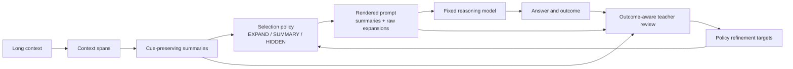

# Learning When to Expand: Progressive Evidence Disclosure for Long-Context Reasoning

## Abstract

Long-context reasoning systems often face a difficult trade-off: fully expanded raw evidence preserves details but wastes limited context budget, while compressed summaries are cheaper but may omit facts that are critical for answering a question. Existing compression and retrieval pipelines usually decide which context to show, but they rarely model a more specific control problem: when is a summary insufficient, and when should the system disclose the underlying raw evidence? We introduce Progressive Evidence Disclosure, a summary-first framework for long-context reasoning. The system first converts long contexts into cue-preserving summaries, then a learned selection policy decides for each span whether to `EXPAND` it into raw evidence, keep it as `SUMMARY`, or mark it as `HIDDEN`. A budget-aware renderer resolves these local decisions into a global prompt under a fixed token budget, and a fixed main model produces the final answer. We train the selection policy with two outcome-aware routes: Review-SFT, where a hindsight reviewer directly emits corrected span states, and OPD-style on-policy distillation, where the original selection prompt and policy output are augmented with the correct answer and a grounded rationale. The main reasoning model, retriever, summary generator, token budget, and evaluator are fixed; only the selection policy changes. In draft experiments on HotpotQA, 2WikiMultiHopQA, and Qasper, we target roughly three-point gains over static SFT under matched budgets, while reporting all numbers as provisional until measured.

## 1. Introduction

Large language models can process increasingly long contexts, but long context alone does not guarantee reliable reasoning. In many tasks, the failure mode is not merely that the answer is outside the model window. The relevant information is technically present, yet buried among irrelevant paragraphs, compressed into a vague summary, or rendered at a level of detail that is insufficient for the downstream question. A multi-hop question may require an exact entity, number, relation, or source sentence. A summary can preserve the topic while losing the precise evidence needed for a final answer.

This paper studies a narrow but important control problem in long-context reasoning. Given a long input represented first as compressed summaries, can a model learn when those summaries are insufficient and raw evidence should be disclosed? We call this problem Progressive Evidence Disclosure. The key design choice is to avoid treating raw evidence and summaries as static alternatives. Instead, the system starts from a summary-first view and learns an escalation policy. For each candidate span, the policy can disclose raw text, retain only the summary, or omit the span entirely.

This framing differs from general context compression. A compressor tries to reduce the input while preserving as much relevant content as possible. Progressive disclosure asks when the compressed view itself should be considered inadequate. It also differs from retrieval and reranking. A retriever decides which span enters the candidate set; our policy decides how a selected span should be rendered under a fixed budget. The same span may be harmless as a summary in one task but require raw disclosure in another.

The central hypothesis is that long-context reasoning can benefit from learning summary insufficiency rather than always expanding more context. A cue-preserving summary should act as a pointer to raw evidence, not as a final replacement for that evidence. For example, a poor summary of "Dosage changed from 5mg to 50mg" might say "The trial procedure changed", which hides the reason to inspect the raw text. A better summary says "Dosage changed; exact values omitted", which preserves enough cues for an expansion policy to decide that raw evidence may be necessary.

We train the disclosure policy with outcome-aware refinement. After the main model answers a task, a teacher reviewer sees the summary-level context, the disclosed raw evidence, the model answer, and the train-split outcome. The reviewer proposes corrections such as "this summary should have been expanded because the question asks for exact dosage values" or "this raw expansion wasted budget because the summary already contained the needed relation." The reviewer is not assumed to identify objective useful spans. Instead, it provides policy-improvement targets, and the final validity of these targets is evaluated through held-out task performance.

Our contributions are threefold. First, we formulate summary-first long-context reasoning as a progressive disclosure problem rather than a memory management or general useful-information selection problem. Second, we introduce a learned selection policy over `EXPAND`, `SUMMARY`, and `HIDDEN` span states, where `EXPAND` is an escalation from summary to raw evidence and budget-aware rendering handles competition among spans. Third, we propose two outcome-aware policy refinement routes, Review-SFT and OPD-style on-policy distillation, that use success and failure feedback to improve span-state decisions while keeping the main reasoning model, retriever, summaries, and token budget fixed.

## 2. Related Work

Long-context reasoning has inspired a wide range of approaches that increase model context length, retrieve external documents, compress prompts, or build agent memory systems. Progressive Evidence Disclosure is complementary to these directions but asks a more specific question: when does a summary become insufficient and need raw evidence?

Prompt compression methods such as LLMLingua and LongLLMLingua reduce the number of tokens passed to the model. Their goal is to remove or compress tokens while preserving downstream performance. Progressive disclosure starts from compressed summaries but introduces a control layer that can selectively restore raw evidence when the compressed representation is too coarse. This makes the problem budget-sensitive but not identical to compression.

Retrieval-augmented generation and reranking systems decide which documents or passages to place in the model context. These methods are usually evaluated by whether the selected passages contain supporting evidence. Our setting fixes the candidate spans and studies how they should be rendered: as raw evidence, summary evidence, or no evidence. The most important experiments therefore hold the retrieved spans fixed and vary only the disclosure policy.

Retrieve-and-compress systems such as RECOMP combine selection and compression after retrieval. They show that retrieved text can often be condensed before generation. Progressive disclosure studies the failure case of that assumption. If a summary contains the right topic but omits exact values, relations, or provenance, the policy should learn to expand the raw span.

Incremental exposure and context scheduling methods expose information over multiple steps rather than in one static prompt. Progressive Evidence Disclosure fits this family but focuses on summary-to-raw escalation. The policy does not need to maintain long-term persistent memory, write new memories, or solve forgetting. It only decides how much detail from existing context candidates should be disclosed for the current reasoning task.

Recent RAG control systems also improve efficiency through iterative summarization, sentence-level structure, graph traversal, decomposition, compact offline restructuring, or question-centric retrieval. These methods are important comparison points, but they often modify retrieval, reasoning decomposition, or document structure. Our intended comparison is budget-normalized: when possible, we hold retrieval and candidate spans fixed and vary only rendering; when a baseline requires a different pipeline, we report token, latency, and retrieval differences explicitly rather than attributing all gains to disclosure.

Agent memory work studies storage, consolidation, retrieval, and long-term personalization. This paper deliberately avoids that broader claim. A context span in our setting is not a memory item, and the policy is not a memory manager. The contribution is a learned disclosure policy for fixed long-context inputs.

## 3. Problem Formulation

Let a task instance contain a question or instruction `q` and a long context `C`. The context is segmented into candidate spans `S = {s_1, ..., s_n}`. Each span `s_i` has raw text `r_i` and a cue-preserving summary `u_i`. The summary is intended to preserve entity cues, relation cues, and omission cues that indicate what kinds of details are hidden in the raw span.

The disclosure policy `pi_theta` observes the task, span summary, span metadata, and current budget state. For each span it predicts an action from:

| State | Rendering behavior | Interpretation |
|---|---|---|
| `EXPAND` | Render raw text `r_i` | The summary is insufficient; raw evidence should be disclosed. |
| `SUMMARY` | Render summary `u_i` | The summary is sufficient for the current task. |
| `HIDDEN` | Render nothing | The span is not needed under the current budget. |

The rendered prompt is constructed from all selected summaries and raw expansions under a token budget `B`. A fixed main model `M` receives the rendered prompt and produces an answer. The policy is successful if it improves final task performance while preserving supporting evidence and controlling token cost.

The key distinction is that `EXPAND` is not a static label for "important span." It is a budget-sensitive escalation action. A span can be important but not require raw disclosure if the summary already contains the necessary evidence. Conversely, a short raw span may be worth expanding because a summary omits an exact number, date, entity, or relation.

Although training targets are defined per span, inference is not an unconstrained independent classification problem. Each span has a rendering cost: `SUMMARY` costs the summary tokens, `EXPAND` costs the raw tokens, and `HIDDEN` costs zero. The renderer receives policy scores and solves a budget allocation problem. The initial implementation uses a deterministic greedy allocator that prioritizes `EXPAND` actions by confidence margin and expansion cost; an exact knapsack-style allocator is included as an analysis variant for smaller candidate sets. This makes the local policy compatible with global budget constraints while keeping the trainable object simple.

## 4. Method

### 4.1 Summary-First Context

Progressive disclosure begins by converting the long context into summary-first form. The system segments the context into passages, sentences, retrieved chunks, or document sections depending on the dataset. Each span receives a cue-preserving summary. This summary is not meant to replace raw evidence permanently. It is a compact preview that tells the policy what kind of information the raw span contains and what details may be omitted.

The summary generator should preserve three minimal cues. Entity cues indicate which people, places, documents, variables, or objects appear in the span. Relation cues indicate what relation or event connects those entities. Omission cues indicate whether exact values, quotations, dates, formulas, or source-specific details are present in the raw span but not fully expressed in the summary.

For example, the raw sentence "Dosage changed from 5mg to 50mg after the second trial" should not be summarized as "The trial procedure changed." That summary removes the expansion cue. A better summary is "Dosage changed after the second trial; exact values omitted." The policy can then learn that a question asking for dosage values should trigger `EXPAND`.

### 4.2 Progressive Expansion Policy

The disclosure policy maps each summary-level span representation to a span state. The minimal input includes the task question, span summary, span type, source identifier, token budget state, and previous selection decisions. In the simplest implementation, the policy is a small classifier or a lightweight language model trained with cross-entropy over `EXPAND`, `SUMMARY`, and `HIDDEN`. The main reasoning model is not updated.

The rendering rule is deterministic:

```text
EXPAND -> render raw_text
SUMMARY -> render summary_text
HIDDEN  -> render nothing
```

The resulting prompt is passed to the fixed reasoning model. This makes the experimental attribution clean: if performance changes, the cause should be the disclosure policy rather than a stronger main model, a different retriever, or a larger budget.

### 4.3 Budget-Aware Rendering

The renderer converts state scores into a prompt under budget. This step is intentionally separate from the learned policy. The policy estimates whether a span should be expanded, kept as summary, or hidden; the renderer enforces global feasibility when too many spans compete for the same context window. The default resolver first reserves mandatory prompt tokens and task instructions, then adds high-confidence `SUMMARY` spans, and finally upgrades selected summaries to raw evidence while budget remains. Upgrades are ranked by a normalized expansion score:

```text
score_i = margin_i(EXPAND over SUMMARY) / max(1, raw_tokens_i - summary_tokens_i)
```

For analysis, we also evaluate an oracle-free knapsack resolver using policy logits as utilities and token costs as weights. This addresses the main budget-coupling concern without changing the paper identity: the learned component remains a disclosure policy, while the renderer is a deterministic budget controller.

### 4.4 End-to-End Workflow

Figure 1 summarizes the proposed workflow. The system first constructs summary-level context, then selects raw expansions, runs the fixed reasoning model, and uses outcome-aware review to refine the policy.



## 5. Outcome-Aware Policy Refinement

The selection policy is refined after selection-answer rollouts. A rollout consists of the summary-first context, the policy's span-state map, the rendered prompt, the fixed main model answer, and the task outcome on the training split. When the answer is wrong, the reviewer identifies selection decisions that may have hidden necessary evidence or wasted budget. When the answer is correct, the reviewer can confirm useful expansions or identify unnecessary raw disclosures.

The teacher is a hindsight reviewer, not a truth oracle. It does not need to read the entire raw long context in one prompt. Instead, it performs batched summary-level review. It can inspect the summary, selected raw evidence, outcome feedback, gold answer on the training split, and optional contrastive runs where different disclosure decisions led to different outcomes. This gives the teacher outcome privilege and contrastive privilege without requiring longer context than the student at inference time.

Each accepted teacher correction must be source-grounded. It should quote the relevant summary, quote the raw evidence when available, name the source identifier, and give a verifiable reason. A correction such as "pay more attention to evidence next time" is not accepted as training data. A valid correction has the form: "Span `doc4_sent2` should be `EXPAND` because the summary says exact dosage values are omitted and the question asks for the exact dosage."

In the first implementation, the reviewer can be an LLM teacher or a human annotator following the same schema. Gold answers and verifier outcomes are used only on the training split to create policy-improvement targets; held-out evaluation never exposes gold answers to the reviewer. Every correction is passed through a validator that checks state validity, source identifiers, quoted evidence, and whether the reason is grounded in the cited span. We log reviewer cost as tokens per correction, accepted correction rate, rejected correction rate, and, when multiple teachers are used, agreement over `EXPAND / SUMMARY / HIDDEN`.

We use two complementary training routes.

**Route A: Review-SFT.** The reviewer directly emits a corrected span-state map. The selection policy is trained to generate that corrected map from the same summary-level state it saw during rollout, optionally augmented with the answer outcome. This route is simple and stable:

```text
L_review = - log pi_theta(z_review | q, U, budget_state)
```

where `z_review` is the corrected span-state JSON.

**Route B: OPD-style on-policy distillation.** The reviewer does not only produce an offline corrected label. Instead, we keep the original selection prompt and the policy's original selection output, then append the answer outcome, correct answer, and a grounded rationale explaining why specific spans should be `EXPAND`, `SUMMARY`, or `HIDDEN`. In the first implementation, this route falls back to cross-entropy on the corrected selection output. In the Slime implementation, it can be upgraded to OPD-style distillation by computing teacher log probabilities or top-k teacher distributions under the hindsight prompt and distilling them back to the policy.

```text
L_opd = CE_or_OPD(z_teacher | selection_prompt, z_policy, hindsight)
```

The combined objective is:

```text
L_total = L_review + lambda_opd L_opd + lambda_replay L_replay + lambda_kl KL(pi_theta || pi_ref)
```

If the policy is implemented as a language model that emits selection JSON, the loss is applied only to response tokens. Future variants can add preference learning or group-relative reinforcement learning, but those are not necessary for the first version of the paper.

It is important that teacher targets are not described as ground-truth usefulness labels. They are improvement signals. The method is validated only if the resulting policy improves held-out answer accuracy, evidence recall, and token efficiency.

Cross-entropy is the first training objective because the output action space is small, auditable, and easy to compare against rule and static-SFT baselines. Preference learning and reinforcement learning are natural extensions when the budget allocator creates strong interactions among spans, but they should be introduced only after the simpler action-supervision baseline is established.

## 6. Experiments

The experimental protocol is designed to answer one question: under the same summaries, the same main model, the same candidate spans, and the same token budget, does a learned selection policy improve long-context reasoning?

### 6.1 Datasets

We propose three main datasets. HotpotQA tests multi-hop evidence selection and supporting fact preservation. 2WikiMultiHopQA tests relation-chain reasoning over multiple entities. Qasper tests question answering over long scientific documents, where summaries can easily hide exact evidence needed for answers. LongBench, MuSiQue, coding traces, legal documents, and biomedical tasks are left for supplementary experiments or future work.

### 6.2 Baselines

The baselines are chosen to separate compression, retrieval, static expansion, and learned selection.

| Baseline | Description | Main question answered |
|---|---|---|
| Summary-only | Use only cue-preserving summaries. | Are summaries alone sufficient? |
| Full raw / top-k raw | Render raw text for selected spans until budget is exhausted. | Is always expanding raw better? |
| Sliding window | Use the most recent or fixed-window context. | Does simple locality solve the task? |
| BM25 / frozen dense top-k | Retrieve spans with a fixed retriever. | Is retrieval alone enough? |
| LLMLingua / LongLLMLingua | Compress context with prompt compression. | Is general compression enough? |
| ReSP-style retrieve-summarize-plan | Iteratively summarize and plan before answering. | Does iterative summarization control solve expansion? |
| SentGraph-style sentence graph selection | Use sentence-level structure for evidence control. | Does explicit structure outperform rendering control? |
| Graph/decomposition RAG variants | Use graph traversal, decomposition, or compact restructuring. | Are retrieval/decomposition changes necessary? |
| Question-centric RAG | Reformulate or retrieve with question-centered units. | Does question-centric retrieval remove need for expansion? |
| Rule selection | Choose `EXPAND / SUMMARY / HIDDEN` using omission cues, lexical overlap, and budget rules. | Is a simple heuristic enough? |
| Static selection SFT | Train on non-iterative labels without answer outcomes. | Is outcome-aware refinement necessary? |
| Review-SFT | Train on reviewer-corrected span-state maps. | Does direct hindsight correction help? |
| OPD-distilled selection | Train on original policy selections plus outcome/rationale, with CE fallback or OPD loss. | Does on-policy distillation improve beyond Review-SFT? |
| Ours | Review-SFT + OPD-style selection training. | Does learned expansion improve reasoning? |
| Oracle supporting-fact expansion | Expand known supporting facts on train/dev analysis only. | What is the approximate upper bound? |

### 6.3 Main Result Table

The following table uses draft assumed numbers for manuscript shaping. They should be replaced by measured values before submission. The key assumption is that the full method improves by about three absolute F1 points over static selection SFT under matched budgets.

| Method | HotpotQA EM | HotpotQA F1 | 2Wiki EM | 2Wiki F1 | Qasper F1 | Token budget used |
|---|---:|---:|---:|---:|---:|---:|
| Summary-only | 41.0 | 54.0 | 39.5 | 52.0 | 35.0 | 0.48B |
| Full raw / top-k raw | 42.4 | 55.1 | 40.6 | 53.0 | 35.8 | 0.99B |
| Sliding window | 39.8 | 52.7 | 38.0 | 50.8 | 34.2 | 0.92B |
| BM25 / frozen dense top-k | 42.8 | 55.4 | 41.1 | 53.6 | 36.0 | 0.74B |
| LLMLingua / LongLLMLingua | 43.3 | 56.0 | 41.8 | 54.2 | 36.7 | 0.55B |
| Rule selection | 44.0 | 56.9 | 42.5 | 55.1 | 37.4 | 0.58B |
| Static selection SFT | 44.8 | 57.6 | 43.1 | 55.8 | 38.0 | 0.58B |
| Review-SFT | 46.2 | 59.0 | 44.6 | 57.2 | 39.4 | 0.59B |
| OPD-distilled selection | 47.0 | 59.8 | 45.5 | 58.0 | 40.1 | 0.59B |
| Ours: Review-SFT + OPD | 47.8 | 60.6 | 46.1 | 58.8 | 40.9 | 0.60B |
| Oracle supporting-fact expansion | 50.4 | 63.2 | 48.9 | 61.4 | 43.1 | 0.62B |

Interpretation target: compared with static selection SFT, the combined method is assumed to improve HotpotQA F1 by +3.0, 2Wiki F1 by +3.0, and Qasper F1 by +2.9 while using a similar token budget. These are provisional draft numbers, not final experimental claims.

### 6.4 Budget Sweep And Cost Analysis

Because the method is motivated by limited context budgets, the main result should include budget-sweep curves rather than a single budget point. For each dataset, we evaluate multiple token budgets while keeping the same candidate spans and summary generator. We report answer quality, evidence recall, token usage, and latency. For teacher review, we report corrections per example, teacher tokens per correction, accepted correction rate, and the break-even point where training-time review cost is offset by inference-time token savings or answer-quality gains.

| Budget | Method | Answer EM/F1 | Evidence recall | Token usage | Latency | Review cost |
|---:|---|---:|---:|---:|---:|---:|
| 1k | Summary-only | 49.5 | 41.0 | 0.98k | 1.0x | 0 |
| 1k | Ours | 52.4 | 46.1 | 0.99k | 1.1x | 1.8k tokens/ex |
| 2k | Summary-only | 52.0 | 45.8 | 1.96k | 1.0x | 0 |
| 2k | Ours | 55.2 | 52.3 | 1.98k | 1.1x | 1.8k tokens/ex |
| 4k | Summary-only | 54.0 | 50.6 | 3.88k | 1.0x | 0 |
| 4k | Ours | 57.1 | 57.8 | 3.91k | 1.1x | 1.8k tokens/ex |

### 6.5 Transfer Evaluation

To test whether the disclosure policy is portable, we train on one dataset and evaluate on another without updating the main model, retriever, or summary generator. A strong result would show that the policy learns general summary-insufficiency cues rather than memorizing dataset-specific supporting fact patterns.

| Train data | Test data | Answer EM/F1 | Evidence recall | Expansion precision | Token budget |
|---|---|---:|---:|---:|---:|
| HotpotQA | 2WikiMultiHopQA | 56.7 | 55.9 | 62.0 | 4k |
| HotpotQA | Qasper | 39.2 | 50.4 | 59.5 | 4k |
| 2WikiMultiHopQA | HotpotQA | 58.9 | 56.1 | 61.7 | 4k |
| Qasper | HotpotQA | 57.8 | 54.2 | 60.1 | 4k |

### 6.6 Killer Experiment 1: Same Summary, Different Expansion Policy

This experiment fixes the summary generator, candidate spans, retriever, main model, prompt template, and token budget. The only variable is the selection policy. We compare summary-only prompting, rule-based selection, static selection training, Review-SFT, OPD-distilled selection, and the combined policy. If the learned policy improves answer quality and evidence recall under the same budget, the main claim is supported.

| Expansion policy | Answer EM/F1 | Supporting evidence recall | Missed expansion rate | Unnecessary expansion rate | Token budget used |
|---|---:|---:|---:|---:|---:|
| Summary-only | 54.0 | 50.6 | 43.2 | 0.0 | 3.88k |
| Rule selection | 56.9 | 53.8 | 35.0 | 18.5 | 3.90k |
| Static selection SFT | 57.6 | 54.9 | 31.8 | 17.2 | 3.89k |
| Review-SFT | 59.0 | 56.9 | 27.4 | 15.1 | 3.90k |
| OPD-distilled selection | 59.8 | 57.4 | 24.8 | 14.5 | 3.90k |
| Review-SFT + OPD | 60.6 | 58.1 | 22.5 | 13.8 | 3.91k |

### 6.7 Killer Experiment 2: Expansion Is Not Reranking

This experiment fixes the selected spans and changes only rendering. The same spans are shown either as summaries or as raw expansions. This tests whether the gain comes from deciding when raw evidence is needed rather than from simply selecting better spans.

| Rendering condition | Selected spans fixed? | Answer EM/F1 | Evidence recall | Token cost |
|---|---|---:|---:|---:|
| SUMMARY rendering | Yes | 54.0 | 50.6 | 1.0x |
| EXPAND rendering | Yes | 57.5 | 58.4 | 1.9x |
| Learned mixed rendering | Yes | 60.6 | 58.1 | 1.2x |

### 6.8 Ablations

The ablations test the main assumptions behind the method.

| Variant | HotpotQA F1 | Evidence recall | Missed expansion | Unnecessary expansion | Diagnostic |
|---|---:|---:|---:|---:|---|
| Full method | 60.6 | 58.1 | 22.5 | 13.8 | Reference. |
| w/o omission cues | 58.0 | 53.6 | 33.1 | 13.0 | Summaries must preserve expansion cues. |
| w/o outcome feedback | 57.9 | 54.2 | 32.5 | 15.8 | Review needs answer-level feedback. |
| w/o OPD route | 59.0 | 56.9 | 27.4 | 15.1 | OPD adds on-policy correction beyond direct SFT. |
| w/o Review-SFT route | 58.8 | 56.2 | 28.1 | 15.6 | Direct corrected maps stabilize OPD. |
| w/o contrastive runs | 59.3 | 56.5 | 27.0 | 14.8 | Correct/wrong selection pairs improve review. |
| Greedy renderer only | 60.1 | 57.6 | 23.4 | 14.0 | Greedy is close but not always optimal. |
| Knapsack renderer | 60.7 | 58.2 | 22.3 | 13.7 | Small gain indicates limited budget coupling. |
| w/o reviewer validation | 57.2 | 53.9 | 31.0 | 21.8 | Noisy hindsight labels hurt. |
| Random expansion under same budget | 55.8 | 52.1 | 37.6 | 29.4 | Gains do not come from arbitrary raw expansion. |

These ablation numbers are draft assumptions for the first manuscript version. The expected qualitative pattern is more important than the exact values at this stage: removing outcome feedback, omission cues, or validation should hurt evidence recall and increase missed expansions; removing OPD should reduce the roughly three-point gain over static SFT.

### 6.9 Review And OPD Quality

We separately evaluate the quality and cost of the two training routes.

| Training data | Accepted targets | Rejected targets | Avg review tokens | Span-state accuracy | Downstream F1 |
|---|---:|---:|---:|---:|---:|
| Static SFT labels | 100% | 0% | 0 | 64.0 | 57.6 |
| Review-SFT labels | 72.0% | 28.0% | 1.6k | 69.8 | 59.0 |
| OPD CE fallback | 68.5% | 31.5% | 1.9k | 70.9 | 59.8 |
| OPD teacher-logprob | 65.2% | 34.8% | 2.3k | 71.6 | 60.6 |

The review stage is judged by source-grounding rate, accepted correction rate, and whether training on the accepted corrections improves held-out answers. OPD is judged by whether preserving the original on-policy selection prompt and adding hindsight rationale improves over direct Review-SFT.

### 6.10 Metrics

Answer quality is measured by dataset-standard exact match and F1 when available. Evidence preservation is measured by supporting evidence recall, exact-span preservation, and whether the rendered prompt contains the evidence required by the gold explanation or supporting-fact annotation. Disclosure quality is measured by expansion precision, expansion recall, missed expansion rate, unnecessary expansion rate, and token budget usage. Budget quality is measured by budget violation rate, raw-upgrade utility per token, latency, and budget-sweep area under the curve. Teacher quality is measured by accepted correction rate, rejection reasons, cost per accepted target, and agreement when multiple reviewers are used. Summary quality is treated as an input audit rather than a contribution: we report cue preservation rate only to make sure the fixed summaries provide enough expansion cues.

## 7. Limitations

Progressive Evidence Disclosure depends on summary quality, but summary generation is not the contribution of this paper. We treat the summary generator as a fixed upstream component and audit only the minimum condition required by the disclosure policy: summaries must preserve cues that make raw expansion discoverable. If the summary removes all cues that would indicate a need for raw evidence, the policy cannot reliably decide when to expand.

The teacher review process can be subjective. We do not claim that teacher corrections are objective labels of useful information. They are training signals whose value must be judged by held-out performance. To reduce drift and self-confirmation, accepted corrections should include source identifiers, quoted evidence, and verifiable reasons, and each policy iteration should be evaluated on a fixed held-out split.

The first version uses a simple cross-entropy objective and a deterministic budget-aware renderer. This may not capture all interactions among spans under a tight budget. We therefore report greedy-versus-knapsack rendering and leave preference learning or reinforcement learning as extensions after the supervised disclosure baseline is established.

The first version focuses on question answering and document reasoning tasks. It does not claim to solve long-term memory, persistent storage, personalization, or agentic state management. Those settings may benefit from the same disclosure idea, but they introduce additional variables that would weaken the clean attribution of the first paper.

## 8. Conclusion

This paper reframes a common long-context failure mode as a disclosure problem. Instead of asking a model to consume fully expanded raw evidence or rely entirely on compressed summaries, we ask it to learn when a summary is insufficient and raw evidence should be disclosed. Progressive Evidence Disclosure keeps the main model, retriever, summaries, and budget fixed, and trains only a lightweight selection policy over `EXPAND`, `SUMMARY`, and `HIDDEN`. Review-SFT provides direct corrected span-state supervision, while OPD-style on-policy distillation turns the model's own selection attempts into hindsight training examples. Held-out task performance determines whether those targets are useful. The resulting paper studies a specific but important control problem in summary-first long-context reasoning: learning when to expand.

## References To Fill

This Markdown draft keeps citation slots informal. The LaTeX version should use the verified bibliography entries already collected for prompt compression, long-context reasoning, retrieval-augmented generation, retrieve-and-compress systems, incremental context exposure, and outcome-aware policy refinement.
