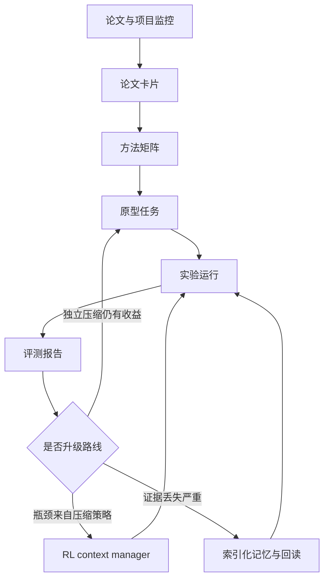

# 自动化科研流程

## 目标

围绕“长上下文压缩在 RL / coding agent 中的应用”，建立一个能持续迭代的科研流程。流程必须同时服务三个目标：

1. 跟踪前沿：持续吸收 LongCodeZip、ACON、ContextBudget、Context-Folding、Memex(RL)、LoCoEval 等方向。
2. 形成原型：优先实现独立式、代码感知、可回溯的上下文压缩模块。
3. 量化决策：通过统一指标判断是否进入 RL context manager 阶段。

## 总体架构

## 阶段 0：研究问题固化

产物：

- 明确压缩对象：代码块、repo 切片、对话历史、工具输出、测试日志。
- 明确约束：目标压缩比、最大上下文预算、延迟预算、是否必须保留原始证据。
- 明确第一批 benchmark：代码理解层优先，其次 repo conversation / SWE 层。

准入标准：

- `config.yaml` 中的 `research_questions` 和 `evaluation_metrics` 已填写。
- `backlog.md` 中至少有一个 P0 原型任务。

## 阶段 1：论文与证据自动归档

输入：

- arXiv / OpenReview / ACL Anthology / GitHub / 作者主页。
- 本地调研报告 `C:\Users\admin\Downloads\deep-research-report.md`。

流程：

1. 新论文进入 `paper-card.md`。
2. 摘出方法类别、压缩对象、是否保留原文证据、训练范式、公开代码、复现实验。
3. 给每篇论文打标签：`code-aware`、`extractive`、`retrieval-memory`、`rl-policy`、`benchmark`。
4. 把可复现实验转入 `backlog.md`。

完成标准：

- 每张论文卡片都有“可借鉴点”和“风险/不可复现点”。
- 每个进入 backlog 的实验都有对应论文卡片来源。

## 阶段 2：独立式代码感知压缩器

优先实现：

- 函数级粗筛：保留相关文件、符号、函数边界。
- block 级细筛：裁剪低相关实现细节，但保留调用关系和错误上下文。
- 工具输出压缩：对测试失败、日志、diff 做结构化摘要。
- 指针机制：每段摘要必须能指回原文位置、文件路径或 run artifact。

建议基线：

- 无压缩。
- 简单截断。
- 摘要式压缩。
- LongCodeZip 风格代码感知抽取。
- ACON 风格 guideline 压缩。

完成标准：

- 压缩后任务成功率不低于无压缩基线的 95%。
- token 使用下降至少 30%。
- 关键文件名、符号名、失败栈、用户约束可被回读。

## 阶段 3：证据归档与回读层

核心原则：

- working context 只保留结构摘要和指针。
- 原始证据进入外部归档。
- agent 可以按需 retrieve，而不是依赖不可逆摘要。

最小实现：

- `archive_id`：唯一证据块标识。
- `source`：文件路径、论文 URL、工具输出、对话片段。
- `summary`：短摘要。
- `anchors`：文件名、函数名、测试名、错误码、commit/hash。
- `raw_text`：原始证据或可恢复位置。

完成标准：

- 评测报告中记录“摘要回答”和“回读回答”的差异。
- 每次失败都能判断是压缩损失、检索失败，还是模型推理失败。

## 阶段 4：评测与路线决策

关键指标：

- `compression_ratio`：原始 tokens / 压缩后 tokens。
- `task_success_rate`：任务成功率。
- `evidence_recall`：关键证据是否仍可找回。
- `symbol_recall`：文件名、函数名、类名、测试名保留率。
- `latency_delta`：压缩流程引入或节省的延迟。
- `cost_delta`：调用成本变化。
- `failure_attribution`：失败归因分布。

升级到 RL 的条件：

- 独立压缩器已经稳定，但不同任务需要明显不同压缩策略。
- 固定规则无法决定何时压缩、何时回读、何时折叠。
- benchmark 已稳定，且能给出稠密过程奖励或可靠偏好标签。

暂缓 RL 的条件：

- 失败主要来自证据索引质量。
- 压缩器还无法稳定保留代码结构。
- benchmark 过小，无法区分策略收益和随机波动。

## 每周运行节奏

周一：

- 更新论文/项目监控列表。
- 从 backlog 选一个 P0/P1 实验。

周二到周四：

- 跑原型或复现实验。
- 填写实验卡片。
- 记录失败样例。

周五：

- 生成评测报告。
- 更新方法矩阵和 backlog 优先级。
- 判断是否推进到下一阶段。

