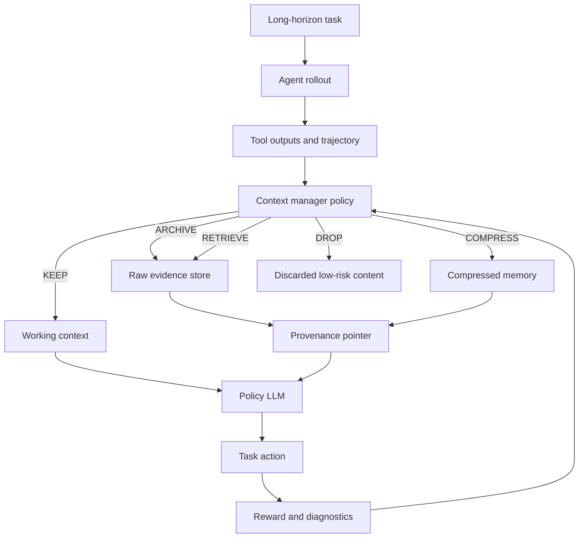

# Awesome-AI-Memory 论文调研报告

调研日期：2026-05-16  
来源仓库：[IAAR-Shanghai/Awesome-AI-Memory](https://github.com/IAAR-Shanghai/Awesome-AI-Memory)  
本地缓存：`research-automation/reports/awesome-ai-memory-readme-cache.md`

## 1. 执行摘要

Awesome-AI-Memory 是一个面向 LLM memory / agent memory 的综述型仓库。README 标注其收录约 399 篇论文和 104 个开源项目，范围覆盖外部显式记忆、短期/长期记忆、episodic/semantic/procedural memory、RAG 作为记忆访问机制、写入/更新/遗忘/压缩/检索等记忆操作、多智能体共享记忆、记忆评测与开源系统。

对你当前想做的“RL agent 长链路压缩 / 多工具智能体记忆管理”来说，这个仓库最重要的结论是：

1. 研究前沿正在从“被动检索 + summary”转向“可学习的记忆操作策略”。
2. RL 方向的关键不是训练一个普通 summarizer，而是训练 `ADD / UPDATE / DELETE / FILTER / RETRIEVE / COMPRESS / DISCARD` 等上下文动作。
3. 长链路场景里，单纯压缩会丢证据；更强路线是“工作上下文压缩 + 原文证据归档 + 可回读检索”。
4. 评测核心已经逐渐固定在 LoCoMo、LongMemEval、MemoryAgentBench、LifelongAgentBench、ALFWorld、HotpotQA、BigCodeBench、CodeIF-Bench 等任务上。
5. 与 coding agent 最相关的子线包括 AHE、CODEMEM、CodeComp、MEMRES、AdaExplore、MemRL 等，它们都强调工具/执行反馈、代码结构、失败经验和长期轨迹复用。

## 2. 仓库知识图谱

仓库把 AI memory 定义为“模型参数内隐知识 + 外部显式存储”的组合，目标是突破有限 context window，使 LLM 能跨会话、跨时间、跨多阶段任务持续利用历史经验。

### 2.1 核心对象

| 对象 | 含义 | 对你的方向的关系 |
|---|---|---|
| Short-term memory | 当前上下文窗口内的活跃信息 | 对应 working context / trajectory window |
| Long-term memory | 跨会话持久保存的信息 | 对应外部 evidence store / experience memory |
| Episodic memory | 带时间顺序和事件上下文的交互历史 | 对应 rollout trace、tool logs、debug history |
| Semantic memory | 从 episodic memory 中抽象出的稳定事实 | 对应任务约束、用户偏好、代码架构事实 |
| Procedural memory | 行动模式、技能、策略 | 对应可迁移 agent policy、修复策略、tool-use pattern |

### 2.2 核心操作

仓库列出的 memory operations 对你的 RL action space 很有参考价值：

```text
Writing / Add
Retrieval
Updating
Forgetting
Compression
Routing
Conflict resolution
Archiving
Lifecycle promotion / eviction
```

如果要做 RL agent compression，建议把这些映射成可训练动作：

```text
KEEP, DROP, COMPRESS, ARCHIVE, RETRIEVE, PIN, UPDATE, FORGET
```

这样训练出来的是“上下文治理策略”，而不是某个任务特化摘要器。

## 3. 论文谱系总览

### 3.1 Survey / 基础综述

| 论文 | 链接 | 核心观点 |
|---|---|---|
| Rethinking Memory in AI: Taxonomy, Operations, Topics, and Future Directions | [arXiv](https://arxiv.org/abs/2505.00675) | 把 AI memory 按对象、形式、时间维度组织，强调 integration、updating、indexing、forgetting、retrieval、compression。 |
| A Survey on the Memory Mechanism of Large Language Model based Agents | [arXiv](https://arxiv.org/abs/2404.13501) | 系统整理 LLM agent memory 的设计与评测，适合作为 related work 起点。 |
| Memory in the Age of AI Agents | [arXiv](https://arxiv.org/abs/2504.10233) | 明确区分 agent memory、LLM memory、RAG、context engineering，并把 memory policy 分成 prompting、fine-tuning、RL。 |
| Externalization in LLM Agents | [arXiv](https://arxiv.org/abs/2604.08224) | 把 memory、skills、protocols、harness 都看作 agent externalization，适合支撑“压缩不只是 prompt trick”的论证。 |
| Beyond the Context Window | [arXiv PDF](https://arxiv.org/pdf/2603.04814) | 比较 fact-based memory 与 long-context LLM 的成本/性能；结论支持长交互中外部记忆的成本优势。 |

结论：这些 survey 的共同趋势是，memory 不再只是 RAG，而是完整系统栈：storage、processing、retrieval、control、evaluation。

## 4. 与 RL Agent 压缩最相关的论文

### 4.1 Memory-R1

论文：[Memory-R1: Enhancing Large Language Model Agents to Manage and Utilize Memories via Reinforcement Learning](https://arxiv.org/pdf/2508.19828v4)

核心思想：

- 用 RL 训练 agent 主动管理外部记忆。
- 系统分为 Memory Manager 和 Answer Agent。
- Memory Manager 学 `ADD / UPDATE / DELETE` 等结构化操作。
- Answer Agent 负责过滤检索到的记忆并回答。
- README 摘要指出其只用 152 个训练样本，就在 LoCoMo、MSC、LongMemEval 上超过强 baseline，体现数据效率和泛化。

对你的启发：

- 可迁移 RL 压缩不应直接学“怎么总结文本”，而应学“什么时候写、改、删、取”。
- coding agent 可对应为：记录失败测试、更新 bug 假设、删除过期探索分支、检索原始日志。

建议 baseline：

- Full context
- RAG memory
- static summary memory
- Mem0 / Zep / LangMem
- rule-based CRUD memory

### 4.2 AgeMem / Agentic Memory

论文：[Agentic Memory: Learning Unified Long-Term and Short-Term Memory Management for Large Language Model Agents](https://arxiv.org/pdf/2601.01885)

核心思想：

- 把 LTM 和 STM 管理直接并入 agent policy。
- 通过 tool-based actions 操作长期与短期记忆，例如 Add、Update、Filter。
- 使用 step-wise GRPO 和三阶段训练：LTM construction、STM control、integrated reasoning。
- README 摘要称其在 ALFWorld、HotpotQA 等长链路 benchmark 上超过 LangMem、Mem0 等强基线。

对你的启发：

- 这篇非常贴近“RL agent compression”。
- 它不是只压缩历史，而是让 policy 学会长期记忆构建、短期上下文控制和最终推理的联合协调。
- 你的三阶段 pipeline 可以参考：

```text
Stage 1: 训练长期记忆写入/更新
Stage 2: 训练短期上下文筛选/压缩
Stage 3: 联合训练任务推理 + memory actions
```

### 4.3 AtomMem

论文：[AtomMem: Learnable Dynamic Agentic Memory with Atomic Memory Operation](https://arxiv.org/pdf/2601.08323)

核心思想：

- 把 agentic memory 管理建模成 sequential decision-making。
- 把 memory process 拆成 atomic CRUD 操作。
- 用 GRPO 学任务对齐的 memory operation policy。
- 在 HotpotQA、2WikiMultihopQA、Musique 等长上下文多跳任务上优于静态 memory baseline。

对你的启发：

- 如果你要做“压缩动作可迁移”，AtomMem 的抽象比任务专用 summarizer 更好。
- 对 coding agent 可以把 CRUD 扩展为：

```text
CREATE: 新增设计决策 / 失败模式 / 文件依赖
READ: 检索相关证据
UPDATE: 修正旧假设
DELETE: 删除错误路径或过期计划
```

### 4.4 Fine-Mem

论文：[Fine-Mem: Fine-Grained Feedback Alignment for Long-Horizon Memory Management](https://arxiv.org/pdf/2601.08435)

核心思想：

- 面向 long-horizon memory management 的 RL 框架。
- 用 Chunk-level Step Reward 缓解稀疏奖励。
- 用 Evidence-Anchored Reward Attribution 把全局 reward 归因到具体 memory operation。
- README 摘要称其在 Memalpha、MemoryAgentBench 上超过强 baseline，并在不同模型间有更好适应性。

对你的启发：

- 这篇解决的是你 GRPO 项目中也遇到的核心问题：长轨迹 credit assignment。
- 对 coding agent，奖励应锚定到证据：

```text
是否保留失败测试名
是否保留相关文件路径
是否能回读原始 stack trace
是否避免重复错误修复
```

### 4.5 MemBuilder

论文：[MemBuilder: Reinforcing LLMs for Long-Term Memory Construction via Attributed Dense Rewards](https://arxiv.org/pdf/2601.05488)

核心思想：

- 训练 LLM 主动构建多维记忆：Core、Episodic、Semantic、Procedural。
- 提出 Attributed Dense Rewards Policy Optimization，解决稀疏奖励和记忆组件贡献归因。
- 用 session-level QA 生成即时反馈，并按记忆组件贡献加权梯度。

对你的启发：

- 可以把 coding agent 的 memory 分成四类：

```text
Core: 用户/项目不变约束
Episodic: 工具调用、测试、debug trace
Semantic: repo 架构、API 关系、业务规则
Procedural: 已验证有效的修复策略
```

这比一个扁平 vector store 更适合 long horizon。

### 4.6 MemRL

论文：[MemRL: Self-Evolving Agents via Runtime Reinforcement Learning on Episodic Memory](https://arxiv.org/pdf/2601.03192)

核心思想：

- 不微调 LLM 权重，而是在运行时通过 episodic memory 自我演化。
- 使用 Intent-Experience-Utility triplet 和 Q-value 风格 utility update。
- README 摘要称其在 HLE、BigCodeBench、ALFWorld 上超过 MemP 和 RAG。

对你的启发：

- 这是“可迁移 RL memory”的强例子，因为优化对象是外部 memory utility，而不是目标 LLM 权重。
- 很适合你的工程目标：让 frozen policy + runtime memory 学会复用成功/失败经验。

### 4.7 TreeMem

论文：[Tree-based Credit Assignment for Multi-Agent Memory System](https://arxiv.org/abs/2605.04811)

核心思想：

- 多个 memory agent 包括 builder、summarizer、retrieval。
- 对每个 agent 的输出扩展成多条后续分支，用 Monte Carlo averaging 从最终 reward 估计中间动作贡献。
- 把粗粒度终局奖励转成细粒度优化信号。

对你的启发：

- 你的 DeepResearch Agent 里有多 agent 编排，TreeMem 可作为多 agent memory credit assignment 的论文支撑。
- 可用于训练：规划器、压缩器、检索器、评审器各自的贡献归因。

## 5. 轨迹压缩 / 上下文压缩相关论文

### 5.1 Active Context Compression

论文：[Active Context Compression: Autonomous Memory Management in LLM Agents](https://arxiv.org/pdf/2601.07190)

核心思想：

- 把 memory management 作为主动决策问题。
- agent 决定保留、总结、丢弃或外部化哪些上下文。
- 对比 passive truncation 和 naive summarization。

价值：

- 这篇的表述最直接对齐“RL agent compression”。
- 可作为你论文动机里的直接相关工作。

### 5.2 MEMENTO

论文：[MEMENTO: Teaching LLMs to Manage Their Own Context](https://arxiv.org/abs/2604.02141)

核心思想：

- 将长推理 trace 分块，并把每块压成 dense intermediate mementos。
- 后续推理从 mementos 接续，而不是从完整 trace 接续。
- 目标是降低 context length、KV cache、计算成本，同时保持 reasoning quality。

价值：

- 更偏 reasoning trace compression，而不是外部 memory。
- 可作为 summary-style trajectory compression baseline。

### 5.3 MemoBrain

论文：[MemoBrain: Executive Memory as an Agentic Brain for Reasoning](https://arxiv.org/pdf/2601.08079)

核心思想：

- 把 executive memory 作为 tool-augmented agent 的协作模块。
- 设计 Trajectory Folding 和 Selective Flush。
- 在 GAIA、WebWalker、BrowseComp-Plus 等任务上提升长程推理。

价值：

- 很贴近你想做的“长链路轨迹折叠”。
- 它提示压缩对象应是依赖结构和 reasoning progress，而不是纯文本长度。

### 5.4 SimpleMem

论文：[SimpleMem: Efficient Lifelong Memory for LLM Agents](https://arxiv.org/pdf/2601.02553)

核心思想：

- 三阶段：Semantic Structured Compression、Recursive Memory Consolidation、Adaptive Query-Aware Retrieval。
- 在 LoCoMo 上提升 F1，并显著降低 token 消耗。

价值：

- 可以作为非 RL、工程友好 baseline。
- 如果你的 RL 方法不能明显超过 SimpleMem 这类强规则/结构化压缩，会被质疑训练是否必要。

### 5.5 StreamMeCo

论文：[StreamMeCo: Long-Term Agent Memory Compression for Efficient Streaming Video Understanding](https://arxiv.org/abs/2604.09000)

核心思想：

- 面向 streaming video 的长期 memory graph compression。
- 用 edge-aware pruning、isolated-node sampling 和 time-decayed retrieval 抵消压缩损失。

价值：

- 虽然不是 coding，但它的“图压缩 + 时间衰减检索”适合迁移到工具轨迹图。

## 6. 可回溯证据 / 图结构记忆相关论文

### 6.1 SEEM

论文：[Structured Episodic Event Memory](https://arxiv.org/pdf/2601.06411)

核心思想：

- 双层记忆：Graph Memory Layer 存静态事实，Episodic Memory Layer 存叙事进展。
- 每个 memory 都有 provenance pointer 指回原始交互。
- 用 Reverse Provenance Expansion 从碎片证据恢复连贯上下文。

价值：

- 非常适合作为“压缩但不丢原文”的论文依据。
- 对 coding agent 来说，provenance pointer 可以对应文件路径、行号、tool_call_id、test log hash。

### 6.2 EviMem

论文：[EviMem: Evidence-Gap-Driven Iterative Retrieval for Long-Term Conversational Memory](https://arxiv.org/abs/2604.27695)

核心思想：

- 检测 evidence gap，并通过 query rewriting 做闭环迭代检索。
- LaceMem 使用 coarse-to-fine evidence diagnosis。
- 在 LoCoMo 的 temporal / multi-hop 任务上提升并降低延迟。

价值：

- 如果压缩后 agent 信息不足，系统不应猜，而应检测 gap 并主动 retrieve。
- 这能直接转成 coding agent 策略：修改代码前若缺原始失败栈或 API 签名，先回读。

### 6.3 MemORAI

论文：[MemORAI: Memory Organization and Retrieval via Adaptive Graph Intelligence](https://arxiv.org/abs/2605.01386)

核心思想：

- selective memory filtering + dual-layer compression。
- provenance-enriched multi-relational knowledge graph。
- Query-adaptive Dynamic Weighted PageRank。

价值：

- 对“共享记忆 + 可审计来源”很有启发。
- 你的 DeepResearch Agent 的 SQLite + 向量索引可以升级成 provenance graph。

### 6.4 MAGMA

论文：[MAGMA: A Multi-Graph based Agentic Memory Architecture for AI Agents](https://arxiv.org/pdf/2601.03236)

核心思想：

- 用 semantic、temporal、causal、entity 多张图组织记忆。
- 检索时使用 intent-aware Adaptive Traversal Policy。
- README 摘要称其在 LoCoMo、LongMemEval 上超过 Nemori、A-MEM 等系统，同时降低延迟和 token 消耗。

价值：

- 对多智能体 shared memory 很重要：不同视图解决不同查询类型。
- coding agent 可对应：

```text
semantic graph: 代码含义 / 模块职责
temporal graph: 修改历史 / debug 顺序
causal graph: 失败原因 -> 修复动作 -> 测试结果
entity graph: 文件 / 函数 / 类 / issue / test
```

## 7. Coding Agent / 工具调用相关论文

### 7.1 Agentic Harness Engineering

论文：[Agentic Harness Engineering: Observability-Driven Automatic Evolution of Coding-Agent Harnesses](https://arxiv.org/abs/2604.25850)

核心思想：

- 面向 coding-agent harness 的自动演化。
- 在 component、experience、decision 层做闭环优化。
- 将大量轨迹压缩成可用证据，通过 self-prediction 和 outcome verification 改进 agent。
- README 摘要强调跨模型迁移。

价值：

- 这是仓库里与你两个项目最贴近的 coding agent 论文之一。
- 它把“轨迹压缩”用于 coding-agent harness 进化，而不是只用于回答 QA。

### 7.2 CODEMEM

论文：[CODEMEM: AST-Guided Adaptive Memory for Repository-Level Iterative Code Generation](https://arxiv.org/pdf/2601.02868)

核心思想：

- 面向 repo-level iterative code generation 的 memory management。
- Code Context Memory 用 AST-guided selection 动态更新和合并 repo context。
- Code Session Memory 用 AST-based change analysis 组织历史 diff，检测冲突和遗忘。
- README 摘要称其在 CodeIF-Bench、CoderEval 上提升 instruction following 并减少交互轮数。

价值：

- 这是 coding agent long-horizon compression 的强 baseline。
- 它支持你的观点：代码压缩必须结构感知，不能只做自然语言摘要。

### 7.3 CodeComp

论文：[CodeComp: Structural KV Cache Compression for Agentic Coding](https://arxiv.org/abs/2604.10235)

核心思想：

- 面向 agentic coding 的结构化 KV cache compression。
- 用静态程序分析和 code property graph 保留结构关键 token。
- 可集成进 SGLang pipeline，不改模型。

价值：

- 这是“内部 KV 压缩 + 代码结构”的方向。
- 如果你的方法是外部 memory/context 压缩，可把 CodeComp 作为另一条路线的对照。

### 7.4 MEMRES

论文：[MEMRES: A Memory-Augmented Resolver with Confidence Cascade for Agentic Python Dependency Resolution](https://arxiv.org/abs/2604.16941)

核心思想：

- 面向 Python dependency resolution 的 memory-augmented agent。
- 使用 error-pattern knowledge base、自演化记忆和 confidence cascade。
- 把 LLM 作为最后兜底，而不是每一步都调用。

价值：

- 适合支撑“工具调用压缩与稳定部署”。
- agent 的历史错误模式应进入 procedural memory。

### 7.5 AdaExplore

论文：[AdaExplore: Failure-Driven Adaptation and Diversity-Preserving Search for Efficient Kernel Generation](https://arxiv.org/abs/2604.16625)

核心思想：

- 从 repeated execution failures 中蒸馏 reusable validity-rule memories。
- 用树结构候选、局部修复和结构再生成保持搜索多样性。

价值：

- 对你的 GRPO / pass@k / failure analysis 很有启发。
- “失败即记忆”比只记录成功轨迹更重要。

## 8. 检索、重排与记忆访问

### 8.1 MemReranker

论文：[MemReranker: Reasoning-Aware Reranking for Agent Memory Retrieval](https://arxiv.org/abs/2605.06132)

核心思想：

- 0.6B / 4B 级 reasoning-aware reranker。
- 使用 Elo/Bradley-Terry calibration、BCE pointwise distillation、InfoNCE contrastive fine-tuning。
- 在 LoCoMo、LongMemEval 上达到强检索效果，并接近更大的闭源模型排序质量。

价值：

- 对你的系统而言，检索器本身就是 baseline。
- 如果压缩记忆不能被正确检索，RL policy 再好也没用。

### 8.2 MemRouter

论文：[MemRouter: Memory-as-Embedding Routing for Long-Term Conversational Agents](https://arxiv.org/abs/2604.27692)

核心思想：

- 将 memory routing 做成 embedding-level 路由问题。
- 强调在固定检索/QA backbone 下提升 memory manager latency 和准确率。

价值：

- 可用于多 memory source 的路由：repo memory、test memory、user memory、tool memory。

### 8.3 Memanto

论文：[Memanto: Typed Semantic Memory with Information-Theoretic Retrieval for Long-Horizon Agents](https://arxiv.org/abs/2604.22085)

核心思想：

- 13 类 typed semantic memory schema。
- 信息论检索，不依赖知识图谱。
- 内置 conflict resolution 和 temporal versioning。

价值：

- 强调 memory schema，比无结构 vector store 更稳定。

## 9. 基准与评测体系

### 9.1 必看 benchmark

| Benchmark | 链接 | 评测内容 | 适用性 |
|---|---|---|---|
| LoCoMo | [ACL 2024](https://aclanthology.org/2024.acl-long.747.pdf) | 长期对话记忆、事件总结、多模态对话生成 | 记忆系统通用核心基准 |
| LongMemEval | [arXiv](https://arxiv.org/pdf/2410.10813) | chat assistant 长期交互记忆，indexing/retrieval/reading 三阶段 | 评估可回溯记忆与检索能力 |
| MemoryAgentBench | [arXiv](https://arxiv.org/pdf/2507.05257) | retrieval、test-time learning、long-range understanding、conflict resolution | 最贴近 agent memory |
| LifelongAgentBench | [arXiv](https://arxiv.org/pdf/2505.11942) | lifelong agent 任务 | 适合评估持续学习 |
| Mem2ActBench | [arXiv](https://arxiv.org/pdf/2601.12432) | 长期记忆用于 task-oriented autonomous agents | 适合 tool-use memory |
| AMemGym | [arXiv](https://arxiv.org/pdf/2602.16099) | long-horizon conversation 中在线 memory policy 评测 | 适合 RL memory policy |
| AgentLongBench | [arXiv](https://arxiv.org/pdf/2602.00298) | 环境 rollout 生成长上下文，32K 到 4M token | 适合压测 context growth |
| LongBench / LongBench v2 | [LongBench](https://arxiv.org/abs/2308.14508), [LongBench v2](https://arxiv.org/pdf/2412.15204) | 长文本理解与推理 | 适合作为非 agent 长上下文补充 |
| SCBench | [arXiv](https://arxiv.org/abs/2412.10319) | KV cache 生命周期：生成、压缩、检索、加载 | 适合内部压缩路线对照 |

### 9.2 你的任务应补充的指标

仓库里的 memory benchmark 多集中在对话和 QA；你的 coding / multi-tool RL 还需要额外指标：

```text
pass@1 / pass@k
unseen split success
compression ratio
peak context tokens
total input tokens
tool-call count
trajectory length
evidence recall
symbol recall
test failure preservation
retrieve precision / recall
memory write precision
memory conflict rate
latency and cost
failure attribution
```

尤其要把数据分成：

```text
covered / uncovered / unseen
```

否则 memory 系统很容易被训练集泄漏污染。

## 10. 开源系统与工程基线

仓库列出 100+ 开源项目。与工程 baseline 最相关的包括：

| 系统 | 链接 | 用途 |
|---|---|---|
| Zep | [GitHub](https://github.com/getzep/zep) | 长期记忆服务，适合作为工业 memory baseline |
| Letta / MemGPT | [GitHub](https://github.com/letta-ai/letta) | LLM operating system / archival memory 经典路线 |
| Mem0 | [GitHub](https://github.com/mem0ai/mem0) | 生产级长期记忆，许多论文把它作为 baseline |
| LangMem | [GitHub](https://github.com/langchain-ai/langmem) | LangChain 生态 memory baseline |
| MemoryOS | [GitHub](https://github.com/BAI-LAB/MemoryOS) | 分层记忆操作系统路线 |
| MIRIX | [GitHub](https://github.com/Mirix-AI/MIRIX) | 多模态/多源长期记忆系统 |
| MemOS | [GitHub](https://github.com/MemTensor/MemOS) | memory operating system 风格 |
| TiMem | [GitHub](https://github.com/TiMEM-AI/timem) | temporal memory consolidation |
| Headroom | [GitHub](https://github.com/chopratejas/headroom) | 工具输出/上下文压缩 + 可回读 CCR，适合作为你工程基线 |

## 11. 与你两个项目的映射

### 11.1 Agentic-GRPO-LongHorizon 对应论文

| 你的模块 | 对应论文 |
|---|---|
| Baseline-SFT -> GRPO 三阶段 pipeline | AgeMem、AtomMem、MemReader、SWE-TRACE |
| 多轮工具调用 + user simulator | MemoryAgentBench、Mem2ActBench、AgentLongBench、tau-bench 方向 |
| pass@k / covered-uncovered-unseen | SWE-bench / MemoryAgentBench 评测范式 |
| group reward 饱和 / credit assignment | Fine-Mem、TreeMem、MemBuilder、MEDS |
| 长 trajectory 下显存/上下文压力 | MEMENTO、Active Context Compression、CodeComp |
| loss mask / assistant token 对齐 | agent RL 工程问题，论文里常弱化，但你可作为系统贡献 |

### 11.2 DeepResearch Agent 对应论文

| 你的模块 | 对应论文 |
|---|---|
| 多 agent DAG 编排 | TreeMem、Governed Collaborative Memory、Federation over Text |
| Red-Blue 对抗修复 | Reflexion、Self-Refine、STORM、memory safety 系列 |
| L1/L2/L3 压缩 | SimpleMem、MemORAI、SEEM、EviMem |
| SQLite + vector index | Zep、Mem0、LangMem、MemoryOS |
| 去重/矛盾检测 | Memanto、StageMem、HiMem、MAGE |
| Bootstrap CI / LLM judge | MemoryAgentBench、LoCoMo、LongMemEval 评测体系 |

## 12. 建议的论文阅读顺序

如果目标是“RL agent 长链路上下文压缩”，建议按下面顺序读：

1. [Memory in the Age of AI Agents](https://arxiv.org/abs/2504.10233)  
   先建立 taxonomy。

2. [Memory-R1](https://arxiv.org/pdf/2508.19828v4)  
   看可迁移 RL memory operation。

3. [Agentic Memory / AgeMem](https://arxiv.org/pdf/2601.01885)  
   看 LTM + STM 统一进 policy 的 GRPO 路线。

4. [AtomMem](https://arxiv.org/pdf/2601.08323)  
   看 CRUD atomic operation 的动作空间设计。

5. [Fine-Mem](https://arxiv.org/pdf/2601.08435)  
   看 long-horizon credit assignment 和 evidence-anchored reward。

6. [MemBuilder](https://arxiv.org/pdf/2601.05488)  
   看 dense reward 和多维记忆构建。

7. [Active Context Compression](https://arxiv.org/pdf/2601.07190)  
   看主动压缩/保留/外部化上下文。

8. [SEEM](https://arxiv.org/pdf/2601.06411)  
   看 provenance pointer 和原文回溯。

9. [CODEMEM](https://arxiv.org/pdf/2601.02868)  
   看 repo-level coding memory。

10. [AHE](https://arxiv.org/abs/2604.25850)  
    看 coding-agent harness 的轨迹压缩与自演化。

## 13. 如果你要写论文，baseline 怎么选

### 13.1 系统 baseline

```text
No memory / full context
Sliding window / truncation
Periodic summary memory
RAG / BM25 memory
Mem0
Zep
LangMem
Headroom / CCR
SimpleMem
Memory-R1 / AgeMem / AtomMem if reproducible
CODEMEM for coding tasks
```

### 13.2 方法 baseline

| 方法类别 | baseline |
|---|---|
| 被动上下文管理 | full context、sliding window、summary |
| 检索记忆 | BM25、embedding RAG、Mem0、Zep |
| 结构化记忆 | schema memory、graph memory、SEEM、MAGMA |
| RL memory control | Memory-R1、AgeMem、AtomMem、Fine-Mem |
| coding memory | CODEMEM、CodeComp、Headroom、LongCodeZip |

### 13.3 评测任务组合

最小组合：

```text
LoCoMo
LongMemEval
MemoryAgentBench
ALFWorld or WebShop
BigCodeBench / CodeIF-Bench / CoderEval
自建 multi-tool rollout benchmark
```

如果要证明可迁移：

```text
跨任务: QA -> tool-use -> coding
跨模型: 7B -> 14B/32B -> API model
跨预算: 8K / 16K / 32K / 64K
跨仓库: train repos 与 test repos disjoint
跨工具: search/read/test/edit 不同工具组合
```

## 14. 可落地研究方向

我建议把你的方向命名为：

> Evidence-Preserving RL Context Management for Long-Horizon Tool-Using Agents

系统结构：



核心贡献可以写成：

1. 通用 memory action space：`KEEP / COMPRESS / ARCHIVE / RETRIEVE / UPDATE / DROP / PIN`。
2. evidence-preserving compression：压缩 working context，但原始证据可回读。
3. fine-grained reward attribution：把成功/失败归因到具体 memory operation。
4. coding/tool-use benchmark：覆盖工具输出、测试日志、repo 结构、长 trajectory。
5. transfer evaluation：跨任务、跨模型、跨预算、跨仓库。

## 15. 最终判断

Awesome-AI-Memory 里的论文显示，agent memory 研究正在从“长期记忆库”走向“可学习的上下文控制器”。对你来说，最值得抓的不是单篇方法，而是这条组合路线：

```text
RL memory operations
+ evidence-preserving compression
+ graph/provenance memory
+ coding/tool-use trajectory benchmark
+ rigorous leakage-aware evaluation
```

如果只做一个压缩器，容易被 LongLLMLingua、SimpleMem、Headroom、CODEMEM 这类方法夹住。更有研究价值的是做一个可迁移的 RL context manager：它学会在长链路任务中何时保留、何时压缩、何时归档、何时回读，并且用可回溯证据避免 summary-only memory 的失真。

